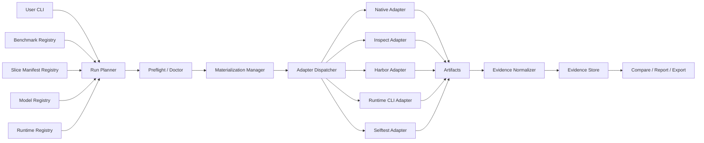

# Architecture & Decisions

> **Status:** ACCEPTED (vNext v0.3, 2026-06-19) — aligned with [`docs/context/concept-hld.md`](context/concept-hld.md) v0.3; implementation tracked in [`docs/roadmap.md`](roadmap.md)
> **Supersedes:** vNext v0.2 (ACCEPTED 2026-05-29, Core-first) — preserved as `legacy_static` context only
> **Source of truth for product:** [`docs/context/concept-hld.md`](context/concept-hld.md) §0–§16
> **Scope:** Public-first, evidence-based benchmark × model × runtime evaluation control plane.

## 1. Product Shape (v0.3)

BenchEval is an **evaluation control plane**, not a benchmark author. It answers:

> Given a benchmark (or slice), a model, and a runtime/scaffold, what happened when we ran it, how expensive was it, and what evidence supports the result?

```text
benchmark/slice × model × runtime/scaffold × harness adapter → normalized evidence panel
```

The Core-8/Core-16 private suites are **demoted to `selftest`**: an internal lane that proves the adapter / materialization / evidence / report plumbing works. They are no longer the product surface and are never weighted into public-benchmark comparisons. They are **not deleted** (423 green tests + Core-16 wiring are retained as regression coverage for the control plane itself).

## 2. Four-Axis Identity (non-negotiable)

BenchEval separates four concepts. Collapsing them is a bug.

```text
model_id     = the model / provider endpoint used for generation
runtime_id   = the agent scaffold/host driving the task (claude-code, codex-cli, inspect-api, harbor-agent, mini-swe-agent, native-api)
harness_kind = the benchmark execution harness / environment manager (harbor, swebench-native, bfcl-native, inspect, local-harness)
adapter_id   = the BenchEval glue mapping run spec ↔ native harness ↔ evidence
```

The existing CLI `--backend {local,inspect,harbor}` flag is **not** runtime identity. It is kept for the `selftest`/Core compatibility path; the new primary axis is `--benchmark/--slice/--runtime/--model`.

## 3. System Diagram



## 4. Stack Selection

| Component | Choice | Rationale |
|-----------|--------|-----------|
| Language | **Python 3.12** | Already set; matches Inspect ecosystem. |
| Package manager | **`uv`** | Already set (`pyproject.toml`). |
| Build backend | **hatchling** | Already set. |
| Config format | **YAML** | Human-diffable, lintable, versioned. `config/*.yaml`. |
| Validation | **Pydantic v2** | Already in deps. Used for `BenchmarkContract`, `SliceManifest`, `RuntimeProfile`, `ModelProfile`, extended `EvidenceRecord`. `frozen=True, extra="forbid"` per repo convention. |
| CLI | **argparse** (`bencheval` entrypoint) | Already set; extend `cli.py`, don't replace. |
| Evidence store | **JSONL** (primary) + **Parquet/DuckDB** (analytics) | JSONL now; DuckDB/Parquet via existing `analytics` extra (`duckdb`, `pyarrow`) and `export.py`. **No database** — this is a CLI tool. |
| Harness adapters | **External binaries, not vendored** | Harbor = external CLI (`uv tool install harbor`) + Docker; Inspect = optional `eval` extra; native = subprocess. Core library stays dependency-light (no `eval` requirement for core). |
| Orchestration (heavy) | **Inspect AI** (optional `eval` extra) + **Harbor** (external) | Provider abstraction + sandbox; never reimplement benchmark semantics. |
| Local sandbox | **Docker** | Default for E1 coding + defensive tasks. |
| Terminal/verifier-heavy | **Harbor** (optional E2) | POC; not mandatory for all tasks. |
| Testing | **pytest** | Already set. |
| Lint | **ruff** (E/F/I/W, line 100) | Already set. Type-check via ruff; no pyright in repo. |
| Secret store | **`.env` only** | `config/models.yaml` must stay non-secret (AGENTS.md rule). |

## 5. Component Responsibilities

| Component | Responsibility | Status | Module(s) |
|---|---|---|---|
| Benchmark Registry | Catalog runnable benchmarks, adapters, source, license, native harness, metrics, caveats. | **Extend** existing `benchmark_registry.py` (catalog -> executable contract) + `config/benchmarks.yaml` (81 entries). | `benchmark_registry.py` |
| Slice Manifest Registry | Typed `smoke`/`lite`/`full`/`custom` instance lists with budget + labels. | **New typed layer** over existing `manifest.py` + `config/manifests/*.txt`. | `manifest.py` (+ new `slice_manifest.py`) |
| Model Registry | Model identity, provider, pricing, context limits, version capture. | **Promote** existing `config/models.yaml` + `pricing/` + `models.py` (`ModelFamily`, `RunStamp`). | `models.py`, `pricing.py` |
| Runtime Registry | CLI/API/scaffold runtime profiles + capability/safety metadata. | **New.** `runtime_registry.py` + `config/runtimes/*.yaml`. | new |
| Run Planner | Build concrete plan from benchmark + slice + model + runtime; budget envelope. | **Extend** existing `planner.py`. | `planner.py` |
| Preflight / Doctor | Harness install, runtime auth, disk, Docker/Harbor, env vars, budget. | **Extend** existing `doctor.py` + `scripts/run_provider_smoke.sh`. | `doctor.py` |
| Materialization Manager | Ephemeral workspaces, fetch images/repos/datasets, cleanup. | **Extend** existing `lifecycle.py` + `workspace_staging.py`. | `lifecycle.py`, `workspace_staging.py` |
| Adapter Dispatcher | Route (runtime, harness) → adapter. | **New** dispatch layer over existing `executor.py` + `backends.py`. | `executor.py`, new dispatcher |
| Adapters | Native / Inspect / Harbor / Runtime-CLI / Selftest. | `inspect_adapter.py`, `harbor_adapter.py`, `runner.py` exist; add native + runtime-CLI + selftest. | adapters |
| Evidence Normalizer | Convert native output → `EvidenceRecord` preserving native artifacts. | **Extend** `evidence.py`. | `evidence.py` |
| Evidence Store | Run configs, attempts, scores, costs, logs, diffs, artifacts, verifier output. | JSONL now (`sink.py`); Parquet/DuckDB via `export.py`. | `evidence.py`, `sink.py`, `export.py` |
| Compare/Report/Export | Markdown/JSON/HTML reports + cross-run comparisons. | **Exists** (`report.py`, `compare.py`, `evidence_compare.py`, `export.py`). | as listed |
| Selftest (Core-8/16) | Internal regression of the control-plane plumbing itself. | **Reposition** existing selftest under `config/selftest/core-8` + `core-16` + verifiers. | `task_contract.py`, `task_registry.py`, `admission.py` |
| Dashboard | UI over stored evidence. | **Post-MVP** (non-goal now). | — |

## 6. Execution Profiles

| Profile | Name | Used for | Runtime |
|---------|------|----------|---------|
| E0 | Inspect Stateless | Structured output, single tool calls | Inspect only (model-only) |
| E1 | Inspect Local Sandbox | Coding, repo tests, local defensive tasks | Inspect + Docker |
| E2 | Harbor Sandbox | Terminal, multi-step verifier-heavy | Harbor (external CLI + Docker) |
| E3 | Calibration External | Public benchmark micro-slices | Adapter-backed; **never weighted** |
| E4 | Stretch Sandbox | Expensive quarterly / offensive-restricted | Harbor/cloud; explicit safety review |

Dry-run planner sets `requires_harbor=true` when any selected task profile includes E2; `requires_sandbox=true` when E1 or E2 present.

## 7. Data Contracts

### 7.1 Benchmark Contract (`config/benchmarks.yaml`)

Existing 81-entry YAML registry is the authoritative catalog. Schema: `BenchmarkCatalog`/`BenchmarkEntry` in `benchmark_registry.py` (Pydantic, `frozen=True, extra="forbid"`). Fields: id, name, aliases, category, tier (`calibration`/`stretch`/`reference_only`), adapter_status (`cataloged`/`adapter_pending`/`manifest_available`/`unverified`), recommended_backend, recommended_profile, task_count, public_indexed, contamination_risk, single_mode_required, safety_review (`standard`/`dual_use`/`offensive_restricted`), source_url, notes.

### 7.2 Slice Manifest (new typed layer)

```yaml
schema_version: "0.1"
slice:
  id: "swe-bench-verified-smoke-10"
  benchmark_id: "swe-bench-verified"
  purpose: "adapter_smoke"           # adapter_smoke | rough_regression | benchmark_native_claim | runtime_comparison | model_comparison
  selection_policy: "fixed_instance_ids"
  instances_source: "config/manifests/swebench-verified-smoke-10.txt"  # plain-text id list (existing)
  valid_for: ["adapter_validation", "rough_regression"]
  invalid_for: ["frontier_model_promotion"]
budget:
  max_instances: 10
  max_wall_clock_sec_per_instance: 900
  max_total_cost_usd: 50
labels:
  contamination_warning: true
  public_benchmark: true
```

Plain-text manifests in `config/manifests/*.txt` remain the instance source; the typed YAML wraps them with budget + labels.

### 7.3 Runtime Profile (`config/runtimes/<id>.yaml`)

Per HLD §6.2. Pydantic `RuntimeProfile`: id, kind, display_name, lifecycle, supported_platforms, supported_harnesses, model_binding, launch (command_template, working_dir_policy, env vars, timeout), capabilities, safety (network_default, workspace_boundary, forbidden_features), versioning (version_command, config_hash_inputs). Required profiles: `claude-code`, `codex-cli`, `inspect-api`, `harbor-agent`, `mini-swe-agent`, `native-api`.

### 7.4 EvidenceRecord v0.3 — additive extension (no breaking change)

`EvidenceRecord` is a **public export** (AGENTS.md fact). v0.3 **extends, does not restructure**, the v0.2 flat schema. New optional fields (default to keep v0.2 rows valid):

```python
class EvidenceRecord(BaseModel):
    # --- v0.2 (unchanged, frozen contract) ---
    run_id, task_id, model_id, execution_profile, backend
    primary_pass, partial_score, cost_usd, latency_sec
    failure_labels, artifact_paths, verifier_log_path, adapter_metadata, created_at
    # --- v0.3 additive (optional, default empty/None) ---
    benchmark_id: str | None = None
    benchmark_version: str | None = None
    slice_id: str | None = None
    adapter_id: str | None = None
    harness_kind: str | None = None
    harness_version: str | None = None
    runtime_id: str | None = None
    runtime_version: str | None = None
    runtime_kind: str | None = None
    runtime_config_hash: str | None = None
    steps: int | None = None
    token_usage: dict[str, int] | None = None
    native_score: dict[str, JsonValue] | None = None
    contamination_label: str | None = None
    reward_hack_risk_label: str | None = None
    verifier_integrity_label: str | None = None
    cleanup_result: str | None = None
    interpretation_label: str | None = None   # adapter_smoke | rough_regression | ...
```

Nested `run`/`model`/`runtime`/`attempt`/`artifacts`/`integrity` blocks from HLD §9.3 are **not** adopted as the on-disk shape (would break v0.2 readers); they remain a *report projection* only.

## 8. Adapter Rule

Adapters **prefer native harnesses**. Allowed:

1. **Native wrapper** — call official runner, parse native result files, preserve raw artifacts.
2. **Harbor wrapper** — for Harbor-native / terminal-agent tasks (Terminal-Bench 2.0).
3. **Inspect wrapper** — where Inspect adds provider/tool orchestration without reimplementing semantics.
4. **Compatibility shim** — only when no usable runner exists; must be explicitly labeled.

**Forbidden:** copying public benchmark instances into custom Core tasks and treating them as BenchEval-native. (Maintenance debt + obscures native semantics.)

## 9. Budget Classes

| Class | Max cost | Max wall time | Max steps | Notes |
|-------|---------:|--------------:|----------:|-------|
| B0 | $0.05 | 60s | 4 | E0 structured/tool tasks |
| B1 | $0.25 | 180s | 10 | Simple coding |
| B2 | $2.00 | 300s | 20 | Agentic / defensive Core upper bound |
| B3 | explicit | explicit | explicit | Stretch only |

Exceeding envelope → failure label `budget_exceeded` (distinct from `wrong_solution`).

## 10. Failure Taxonomy (must be distinguishable)

`harness_failure` · `runtime_launch_failure` · `runtime_auth_failure` · `runtime_permission_block` · `runtime_output_unparseable` · `runtime_context_overflow` · `runtime_tool_failure` · `runtime_config_drift` · `runtime_budget_exceeded` · `materialization_failure` · `model_wrong_solution` · `adapter_error` · `model_output_invalid` · `budget_exceeded`.

Preflight/infrastructure failures **abort without evidence**. Post-preflight adapter failures write `EvidenceRecord` with `primary_pass=false` and the relevant failure label. Verifier remains scoring authority when a candidate artifact exists.

## 11. Scoring & Reporting

- **Preserve native metrics.** If Terminal-Bench reports pass rate + CI, keep it. If SWE-bench reports resolved instances, keep it. BenchEval adds an operational layer: cost, latency, token usage, runtime/harness/adapter/model versions, failure class, cleanup status, artifact paths, caveats.
- **No universal weighted score by default.** Side-by-side only. A user-defined weighted portfolio may exist later as a labeled local-decision policy object, never as a benchmark-native score.
- **Interpretation labels** on every report: `adapter_smoke` · `rough_regression` · `benchmark_native_claim` · `runtime_comparison` · `model_comparison` · `contaminated_or_legacy` · `defensive_security_only` · `offensive_restricted`.

## 12. Security Boundary

- **Allowed (Core/defensive):** local toy patching, authorization repair, alert triage JSON, regression tests, local prompt-injection resistance (no network, no exfiltration), vulnerability *reproduction* against **pre-patch** code in a sandbox with sanitizers (CyberGym defensive slice).
- **Stretch (offensive-restricted, explicit safety review, never Core-weighted, no live targets):** ExploitGym full exploit generation, BountyBench Exploit tasks, CyberGym PoC generation against unpatched code.
- **Forbidden:** exploit generation against live targets, real-target attack chains, offensive CyberGym-style PoC reproduction as weighted tasks.

## 13. Verification Gates

### 13.1 Adapter Admission

A benchmark adapter cannot be marked `manifest_available`/runnable unless: native harness invocation ≥1 instance; version capture (benchmark/harness/adapter/runtime/model); evidence completeness (raw result, stdout/stderr, verifier logs, artifacts, run config); failure separation; cleanup replay without deleting evidence; ≥1 smoke manifest; dry-run accuracy; caveat labels attached.

### 13.2 Runtime Admission

A runtime cannot be marked production-ready unless: noninteractive launch; version capture; workspace isolation; config isolation (no global mutation unless allowed); known/controllable network; artifact extraction; budget enforcement; failure mapping to standard classes.

### 13.3 Report Validity

A report cannot claim model/runtime superiority unless: benchmark id identical; slice id identical; adapter version identical; harness version identical or explicitly waived; runtime-config difference = intended variable; model-config difference = intended variable; failed/invalid attempts reported not dropped; caveat labels shown.

## 14. VETOs (unchanged where still relevant)

- Mixing Calibration/Stretch/selftest tasks into weighted public-benchmark totals.
- LLM-as-judge for authoritative `primary_pass`.
- Live internet in MVP tasks.
- Statistical significance claims from smoke/lite slices alone.
- Breaking the v0.2 `EvidenceRecord` flat contract (additive only).
- Deleting Core-8/16 (reposition as `selftest`, do not nuke).
- Vendoring Harbor as a Python dependency (external CLI only).

## 15. Risk Assessment

| Risk | Severity | Mitigation |
|---|---|---|
| Runtime/model conflation | High | Four-axis identity §2; CLI enforces `--runtime` distinct from `--backend`. |
| EvidenceRecord break | High | Additive-only v0.3; v0.2 rows stay valid. |
| Harbor unavailable / Docker absent | High | Doctor gates; mockllm-style deterministic stand-in for adapter-smoke; never claim live success. |
| Public benchmark contamination | High | Caveat labels; prefer fresh benchmarks for promotion; contaminated = smoke/trend only. |
| Reward-hackable verifiers | High | Preserve native result + label verifier-integrity risk; no promotion on one score. |
| Cost overrun | High | Default smoke slices; dry-run budgets; per-run + per-instance hard caps. |
| Cyber scope creep | High | Defensive-only in normal lanes; offensive behind Stretch + safety review. |
| CLI runtimes mutate global config | Medium | Ephemeral home/workspace; config hash capture. |
| Native harness drift | High | Pin benchmark repo version, image digest, harness version, adapter version. |
| Adapter maintenance burden | Medium | Native wrappers only; no task reimplementation. |

## 16. Tech Debt (acknowledged)

- `--backend {local,inspect,harbor}` kept as selftest/Core compatibility path while `--runtime` becomes primary. Migrate callers over P1–P2; remove the collapse only after adapters prove out.
- Plain-text manifests (`config/manifests/*.txt`) coexist with typed `SliceManifest` YAML wrappers until all slices migrated.
- `summary.py` legacy `SummaryRow` pipeline preserved for historical JSONL rollups; not comparable to vNext evidence without migration note (AGENTS.md fact).
- No DB: JSONL is the store of record; DuckDB/Parquet is a derived analytics export, not transactional.
- No pyright in repo; type discipline via ruff + Pydantic runtime validation.

## 17. Module map (current → v0.3)

| Concern | Existing module | v0.3 action |
|---|---|---|
| Benchmark catalog | `benchmark_registry.py`, `config/benchmarks.yaml` | Extend to executable contract (adapters, slices, caveats). |
| Tasks (selftest) | `task_contract.py`, `task_registry.py`, `config/selftest/core-8\|16` | Selftest lane (P9.2). |
| Manifests | `manifest.py`, `config/manifests/*.txt`, `lifecycle.py` | Add typed `SliceManifest` wrapper. |
| Models | `models.py`, `pricing.py`, `config/models.yaml`, `config/pricing/` | Promote to `ModelRegistry`. |
| Runtime | — | **New** `runtime_registry.py`, `config/runtimes/*.yaml`. |
| Planner | `planner.py` | Extend to four-axis plan + budget envelope. |
| Doctor | `doctor.py`, `scripts/run_provider_smoke.sh` | Extend to runtime + harness + slice checks. |
| Executor | `executor.py`, `backends.py`, `runner.py` | Add adapter dispatcher over (runtime, harness). |
| Adapters | `inspect_adapter.py`, `harbor_adapter.py` | Add native + runtime-CLI + selftest adapters. |
| Evidence | `evidence.py`, `sink.py` | Additive v0.3 fields. |
| Report/compare/export | `report.py`, `compare.py`, `evidence_compare.py`, `export.py` | Add runtime/model comparison + interpretation labels. |
| CLI | `cli.py` | Add `--benchmark/--slice/--runtime`; keep `--task/--manifest/--backend` for selftest. |
