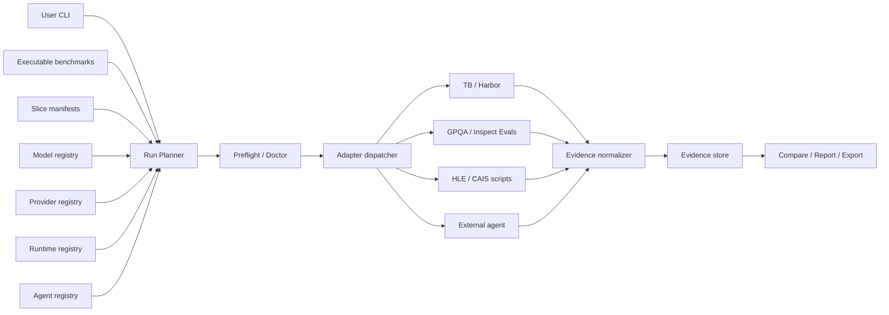

# Architecture & Decisions

> **Status:** ACCEPTED (vNext v0.3, revised 2026-07-14 for product-spine prune); implementation tracked in [`docs/roadmap.md`](roadmap.md)
> **Supersedes:** vNext v0.2 (ACCEPTED 2026-05-29, Core-first) — preserved as `legacy_static` context only
> **Operator contract / product SoT:** root [`README.md`](../README.md), this file, and [`docs/api/internal-contracts.md`](api/internal-contracts.md). [`docs/context/concept-hld.md`](context/concept-hld.md) is a **historical design ledger**, not live CLI instructions.
> **Scope:** Defined benchmarks → (runtime XOR agent)? → model via provider → evidence.

## 0. Product Principles

1. **Simple spine.** Product path is `benchmark → (runtime|agent)? → model → evidence`. Runtime and agent are mutually exclusive scaffolds; omit both for the executable model-only paths (GPQA/HLE).
2. **Defined benchmarks only.** Live execution is limited to config-declared executable adapters.
3. **Official-first execution.** Prefer official distributions, runners, and scorers. BenchEval normalizes evidence; it does not reimplement benchmark semantics unless upstream has no usable feedback path (then label it as fallback).
4. **Config-first expansion.** New slices/runtimes/models/agents/providers on an existing adapter family are YAML/manifest work.
5. **Runtime-owned environments.** Benchmarks and selected runtimes own sandboxes/containers. BenchEval does not ship a separate Docker plane.
6. **Evidence over claims.** Reports preserve native artifacts and caveats; smoke ≠ full benchmark claim; green tests are not live proof.

## 1. Product Shape (v0.3)

BenchEval is a thin evaluation control plane:

> Given a **defined** benchmark (or slice), an optional runtime XOR agent, a provider-bound model, what happened, how expensive was it, and what evidence supports the result?

```text
benchmark/slice  →  (runtime | agent)?  →  model via provider  →  EvidenceRecord + artifacts
```

**Tier-0 executable software (gate count = 4):** `terminal-bench`, `gpqa-diamond`, `hle`, `bfcl-v4`. Catalog lists `swe-bench-verified` as non-executable until its official evaluate path is wired (`bfcl-v4` was admitted 2026-08-24 on the diagnostic-labeled dev-box lifecycle demonstration `run-20260824-040631-228703-4756f857` plus the registered `passed` run `run-20260824-045622-854659-a46ae44d`), plus `swe-bench-pro`, `cybergym`, and `exploitgym` as `adapter_pending`.

**Production v1 live-proof set (pilot minimum):** `terminal-bench` runtime comparison (claude-code vs codex-cli). `gpqa-diamond` / `hle` / `bfcl-v4` are Tier-0 executable software; treat live claims as `adapter_smoke` until Phase B evidence is recorded. `swe-bench-verified` remains non-executable until official evaluation is wired.

**Admitted scaffolds:** runtimes `claude-code`, `codex-cli`; agent `momo`; providers `bytellm`, `ollama-cloud`.

## 2. Identity axes

```text
benchmark_id / slice_id  = what is being evaluated
model_id / provider_id   = model + how it is reached
runtime_id XOR agent_id  = optional scaffold (never both; both null = model-only)
adapter_id = BenchEval adapter selected by config
harness_kind = derived run-plan/evidence metadata declared by the adapter, not benchmark YAML
```

CLI: `bencheval run <bench>/<slice> --model <id> [--runtime|--agent] [--provider bytellm]`. `--dry-run` = phase 1 only; `-y` skips the continue prompt.

## 3. System Diagram

Full layered set: **[`docs/diagrams/`](diagrams/README.md)** — start at [system overview](diagrams/system-overview.md).


```mermaid
flowchart LR
    U[User CLI] --> BP[Run Planner]
    BR[Executable benchmarks] --> BP
    SM[Slice manifests] --> BP
    MR[Model registry] --> BP
    PR[Provider registry] --> BP
    RR[Runtime registry] --> BP
    AG[Agent registry] --> BP

    BP --> PF[Preflight / Doctor]
    PF --> AD[Adapter dispatcher]

    AD --> A1[TB / Harbor]
    AD --> A2[GPQA / Inspect Evals]
    AD --> A3[HLE / CAIS scripts]
    AD --> A4[External agent]

    A1 --> EN[Evidence normalizer]
    A2 --> EN
    A3 --> EN
    A4 --> EN
    EN --> ES[Evidence store]
    ES --> CP[Compare / Report / Export]
```

## 4. Stack Selection

| Component | Choice | Rationale |
|-----------|--------|-----------|
| Language | **Python 3.12** | Already set; matches Inspect ecosystem. |
| Package manager | **`uv`** | Already set (`pyproject.toml`). |
| Build backend | **hatchling** | Already set. |
| Config format | **YAML** | Human-diffable, lintable, versioned. `config/*.yaml`. |
| Validation | **Pydantic v2** | Already in deps. Used for `BenchmarkContract`, `SliceManifest`, `RuntimeProfile`, `ModelProfile`, extended `EvidenceRecord`. `frozen=True, extra="forbid"` per repo convention. |
| CLI | **argparse** (`bencheval` entrypoint) | Already set; extend `cli.py`, don't replace. |
| Evidence store | **JSONL** (primary) + **Parquet/DuckDB** (analytics) | JSONL now; DuckDB/Parquet via existing `analytics` extra (`duckdb`, `pyarrow`) and `export.py`. **No database** — this is a CLI tool. |
| Harness adapters | **External binaries, not vendored** | Harbor = external CLI (`uv tool install harbor`) and may use Docker internally; Inspect = optional `eval` extra; native/external-command = subprocess. Core library stays dependency-light (no `eval` requirement for core). |
| Orchestration (heavy) | **Inspect AI** (optional `eval` extra) + **Harbor** (external) | Provider abstraction + sandbox; never reimplement benchmark semantics. |
| Sandbox ownership | **Runtime-owned** | BenchEval does not ship a Docker plane. Official benchmark runtimes own containers/images when they require them. |
| Terminal/verifier-heavy | **Harbor or external command profiles** | Optional E2 paths; not mandatory for all tasks. |
| Testing | **pytest** | Already set. |
| Lint | **ruff** (E/F/I/W, line 100) | Already set. Type-check via ruff; no pyright in repo. |
| Secret store | **`.env` only** | `config/models.yaml` must stay non-secret (AGENTS.md rule). |

## 5. Component Responsibilities

| Component | Responsibility | Status | Module(s) |
|---|---|---|---|
| Benchmark Registry | Catalog runnable benchmarks, adapters, source, license, native harness, metrics, caveats. | **Extend** existing `benchmark_registry.py` (catalog -> executable contract) + `config/benchmarks.yaml` (**8** product entries). | `benchmark_registry.py` |
| Slice Manifest Registry | Typed `smoke`/`lite`/`full`/`custom` instance lists with budget + labels. | Product slices keep instance ids inline; `manifest.py` remains for optional large/generated external lists. | `manifest.py` (+ `slice_manifest.py`) |
| Model Registry | Model identity, provider, pricing, context limits, version capture. | **Promote** existing `config/models.yaml` + `pricing/` + `models.py` (`ModelFamily`, `RunStamp`). | `models.py`, `pricing.py` |
| Runtime Registry | Admitted runtimes (`claude-code`, `codex-cli`) + capability metadata. | `runtime_registry.py` + `config/runtimes/*.yaml`. | `runtime_registry.py` |
| Agent Registry | Admitted agents (`momo`); XOR with runtime on the plan. | `agent_registry.py` + `config/agents/*.yaml`. | `agent_registry.py` |
| Provider Registry | Admitted providers (`bytellm`, `ollama-cloud`). | `provider_registry.py` + `config/providers/*.yaml`. | `provider_registry.py` |
| Run Planner | Build `RunPlan` from benchmark + slice + model + (runtime\|agent) + provider. | `benchmark_plan.py` (phase 1 of `run`). | `benchmark_plan.py` |
| Preflight / Doctor | Runtime/provider env checks before live runs (never prints secrets). | `doctor.py`. | `doctor.py` |
| Materialization Manager | Cleanup policy + adapter-owned ephemeral dirs. | `lifecycle.py` (`CleanupPolicy`); adapters own workspace layout. | `lifecycle.py` |
| Adapter Dispatcher | Route plan → adapter (runtime XOR agent XOR model-only). | `control_plane_executor.py`. | `control_plane_executor.py` |
| Adapters | Harbor TB, GPQA, HLE, BFCL; the SWE diagnostic module remains non-executable; SWE-Pro / ExploitGym / CyberGym are pending. | Tier-0 executable set in YAML. | `terminal_bench_harbor.py`, `gpqa_adapter.py`, `hle_adapter.py`, `bfcl_native_adapter.py`; the SWE diagnostic module and pending adapter modules |
| Evidence Normalizer | Convert native output → `EvidenceRecord`. | `evidence.py`. | `evidence.py` |
| Evidence Store | Evidence JSONL + optional Parquet/DuckDB export. | `evidence.py`, `export.py`. | as listed |
| Compare/Report/Export | Markdown/JSON reports + cross-run comparisons + run bundles. | `report.py`, `evidence_compare.py`, `export.py`, `run_bundle.py`. | as listed |
| Dashboard | UI over stored evidence. | **Post-MVP** (non-goal now). | — |

## 6. Execution Profiles

Live product paths use upstream-owned harnesses: Harbor/Docker for Terminal-Bench, Inspect Evals for GPQA, and the CAIS scripts for HLE. Historical E0–E4 labels below are planning vocabulary only — Inspect is a benchmark harness, not an admitted product runtime.

| Profile | Name | Used for | Notes |
|---------|------|----------|-------|
| E0 | Model-only / API | Official model-only benchmark harness | GPQA / HLE |
| E1 | Runtime sandbox | Coding / repo tests under admitted runtime | Runtime-owned |
| E2 | Terminal / harness sandbox | Terminal, multi-step verifier-heavy | Harbor for TB; harness-owned |
| E3 | Calibration external | Public micro-slices | Adapter-backed; never Core-weighted |
| E4 | Stretch sandbox | Expensive official-harness runs | Explicit review; research unless admitted |

Dry-run planning reports `requires_harbor` / `requires_sandbox` when needed. Those flags are operator preflight signals, not a BenchEval-owned Docker plane.

## 7. Data Contracts

### 7.1 Benchmark Contract (`config/benchmarks.yaml`)

Existing product YAML registry is the authoritative catalog (**8** entries; **4** Tier-0 executable). Schema: `BenchmarkCatalog`/`BenchmarkEntry` in `benchmark_registry.py` (Pydantic, `frozen=True, extra="forbid"`). Fields: id, name, aliases, category, tier (`calibration`/`stretch`/`reference_only`), adapter_status (`cataloged`/`adapter_pending`/`manifest_available`/`unverified`), recommended_backend, recommended_profile, task_count, public_indexed, contamination_risk, single_mode_required, source_url, notes, `default_slice`, `adapter_id`, and `executable`. Ops manuals: `docs/ops/benchmarks/`. `harness_kind` is deliberately **not** configurable in benchmark YAML: the adapter implementation declares the official runner kind used for planning and evidence metadata. New harness families need a Python adapter + executor wiring + official score ingestion; config-only expansion applies when reusing an existing adapter family.

### 7.2 Slice Manifest (new typed layer)

```yaml
schema_version: "0.1"
slice:
  id: "swe-bench-verified-smoke-10"
  benchmark_id: "swe-bench-verified"
  purpose: "adapter_smoke"           # adapter_smoke | rough_regression | benchmark_native_claim | runtime_comparison | model_comparison
  selection_policy: "fixed_instance_ids"
  instances:
    - django__django-11099
    - sympy__sympy-18087
  valid_for: ["adapter_smoke", "rough_regression"]
  invalid_for: ["model_comparison"]
budget:
  max_instances: 10
  max_wall_clock_sec_per_instance: 900
  max_total_cost_usd: 50
labels:
  contamination_warning: true
  public_benchmark: true
```

Product slice YAML keeps small fixed instance lists inline. Large generated manifests can still use `instances_source`, but no product benchmark depends on a separate `*-smoke.txt` file.

### 7.3 Runtime Profile (`config/runtimes/<id>.yaml`)

Per HLD §6.2. Pydantic `RuntimeProfile`: id, kind, display_name, lifecycle, supported_platforms, supported_harnesses, model_binding, launch (command_template, working_dir_policy, env vars, timeout), capabilities, safety (network_default, workspace_boundary, forbidden_features), versioning (version_command, config_hash_inputs). **Admitted profiles now:** `claude-code`, `codex-cli`. Agents live under `config/agents/` (`momo`); providers under `config/providers/` (`bytellm`, `ollama-cloud`).

### 7.4 EvidenceRecord v0.3 — additive extension (no breaking change)

`EvidenceRecord` is a **public export** (AGENTS.md fact). v0.3 **extends, does not restructure**, the v0.2 flat schema. New optional fields (default to keep v0.2 rows valid):

```python
class EvidenceRecord(BaseModel):
    # --- v0.2 (unchanged, frozen contract) ---
    run_id, task_id, model_id, execution_profile, backend
    primary_pass, partial_score, cost_usd, latency_sec
    failure_labels, artifact_paths, verifier_log_path, adapter_metadata, created_at
    # --- v0.3 additive (optional, default empty/None) ---
    benchmark_id: str | None = None
    benchmark_version: str | None = None
    slice_id: str | None = None
    adapter_id: str | None = None
    harness_kind: str | None = None
    harness_version: str | None = None
    runtime_id: str | None = None
    runtime_version: str | None = None
    runtime_kind: str | None = None
    runtime_config_hash: str | None = None
    agent_id: str | None = None
    provider_id: str | None = None
    provider_config_hash: str | None = None
    judge_model_id: str | None = None
    instance_id: str | None = None
    steps: int | None = None
    token_usage: dict[str, int] | None = None
    native_score: dict[str, JsonValue] | None = None
    normalized_score: float | None = None
    contamination_label: str | None = None
    reward_hack_risk_label: str | None = None
    verifier_integrity_label: str | None = None
    cleanup_result: str | None = None
    interpretation_label: str | None = None   # adapter_smoke | rough_regression | ...
    failure_class: str | None = None
    attempt_validity: str | None = None       # valid | invalid
    invalid_reason: str | None = None
    counts_toward_pass_at_k: bool | None = None
    physical_launch_id: str | None = None
    logical_attempt_number: int | None = None
    runtime_output_cap: int | None = None
```

Nested `run`/`model`/`runtime`/`attempt`/`artifacts`/`integrity` blocks from HLD §9.3 are **not** adopted as the on-disk shape (would break v0.2 readers); they remain a *report projection* only.

## 8. Adapter Rule

Adapters **prefer native harnesses**. Product v1 allowed shapes:

1. **Native wrapper** — call the official runner/scorer, parse its result files, and preserve raw artifacts (GPQA/HLE today; future adapters must meet the same bar).
2. **Harbor wrapper** — Harbor-native terminal tasks (Terminal-Bench 2.1).
3. **External agent wrapper** — admitted agent profiles (`momo`) via `external_agent_adapter.py`.

Deferred / not product: Inspect-as-runtime wrappers. Compatibility shims must be explicitly labeled `adapter_smoke`.

**Forbidden:** copying public benchmark instances into custom Core tasks and treating them as BenchEval-native.

## 9. Budget Classes

| Class | Max cost (run total) | Max wall time (per instance) | Notes |
|-------|---------:|--------------:|-------|
| B0 | $0.05 | 60s | E0 structured/tool tasks |
| B1 | $0.25 | 180s | Simple coding |
| B2 | $2.00 | 300s | Agentic / defensive Core upper bound |
| B3 | explicit | explicit | Stretch only |

Class values are classification ceilings, and the slice's own envelope is always the effective cap (bands mirror the class defaults, so a slice never classifies into a class whose ceiling it exceeds; B3's zero defaults declare no standard envelope). Per-instance wall-clock and run-total wall-clock are **separate `RunPlan` fields**: `max_wall_clock_sec_per_instance` bounds each attempt and `max_wall_clock_sec` bounds the whole run (`per-instance × instances`); adapters must never derive one from the other. Serialized schema-"0.3" plans written before the per-instance field existed derive it from the run total on load (the pre-field contract allowed one attempt to consume the whole envelope). The aggregate model-only harnesses (GPQA, HLE) execute every sample in one subprocess chain and are therefore bounded by the **run-total** envelope; per-instance wall is not enforceable inside an aggregate process and evidence records this as `per_instance_wall_enforcement=unavailable_aggregate_harness`. Observed steps are recorded retrospectively in evidence only — no max-step envelope is claimed or enforced. For the aggregate model-only adapters (GPQA, HLE, BFCL) no provider metering is captured: the cost envelope is an unenforced planning estimate and `cost_usd=0.0` in evidence means *unmeasured*, not zero spend. Exceeding an enforced envelope → failure label `budget_exceeded` (distinct from `wrong_solution`).

## 10. Failure Taxonomy (must be distinguishable)

`harness_failure` · `runtime_launch_failure` · `runtime_auth_failure` · `runtime_permission_block` · `runtime_output_unparseable` · `runtime_context_overflow` · `runtime_tool_failure` · `runtime_config_drift` · `runtime_budget_exceeded` · `runtime_output_cap_reached` · `runtime_no_progress_stall` · `runtime_wall_clock_timeout` · `materialization_failure` · `model_wrong_solution` · `model_output_invalid` · `adapter_error` · `budget_exceeded` · `wrong_solution` · `operator_interrupted` · `interrupted_by_harness` · `config_failed` · `remote_infra_failure` · `evidence_corrupt` · `duplicate_launch`. (Canonical source: `FailureLabel` in `domain.py`.)

Preflight/infrastructure failures **abort without evidence**. Post-preflight adapter failures write `EvidenceRecord` with `primary_pass=false` and the relevant failure label. Verifier remains scoring authority when a candidate artifact exists.

External runtime launch and tool failures are separate: `runtime_launch_failure` means BenchEval could not start or materialize the runtime process; `runtime_tool_failure` means the runtime/tool process launched and returned an unsuccessful status. Output caps are recorded as `runtime_output_cap_reached`; when both output and total token counts are present, the output count is authoritative, otherwise total count is the fallback.

## 11. Scoring & Reporting

- **Preserve native metrics.** Keep the official metrics emitted by each admitted harness (for example Terminal-Bench verifier results, Inspect GPQA accuracy, and HLE judged answers). BenchEval adds an operational layer: cost, latency, token usage, runtime/harness/adapter/model/provider versions and hashes, judge identity, failure class, cleanup status, artifact paths, and caveats.
- **No universal weighted score by default.** Side-by-side only. A user-defined weighted portfolio may exist later as a labeled local-decision policy object, never as a benchmark-native score.
- **Interpretation labels** on every report: `adapter_smoke` · `rough_regression` · `benchmark_native_claim` · `runtime_comparison` · `model_comparison` · `contaminated_or_legacy` · `defensive_security_only`.

## 12. Security Boundary

- **Allowed (Core/defensive):** local toy patching, authorization repair, alert triage JSON, regression tests, local prompt-injection resistance (no network, no exfiltration), vulnerability *reproduction* against **pre-patch** code in a sandbox with sanitizers (CyberGym defensive slice).
- **Stretch (never Core-weighted, no live targets):** ExploitGym full exploit generation, BountyBench Exploit tasks, CyberGym PoC generation against unpatched code. Official harness and operator-host policy apply; BenchEval does not add a separate policy layer.
- **Forbidden:** exploit generation against live targets, real-target attack chains, offensive CyberGym-style PoC reproduction as weighted tasks.

## 13. Verification Gates

### 13.1 Adapter Admission

A benchmark adapter cannot claim Tier-1 live proof or Tier-2 readiness unless: native harness invocation ≥1 instance; version capture (benchmark/harness/adapter/runtime/model/provider and any judge); evidence completeness (raw result, stdout/stderr, verifier logs, artifacts, run config); failure separation; cleanup replay without deleting evidence; ≥1 typed slice with instance ids; dry-run accuracy; caveat labels attached. Tier-0 `executable: true` remains a software capability claim only.

### 13.2 Runtime Admission

A runtime cannot be marked production-ready unless: noninteractive launch; version capture; workspace isolation; config isolation (no global mutation unless allowed); known/controllable network; artifact extraction; budget enforcement; failure mapping to standard classes.

### 13.3 Report Validity

A report cannot claim model/runtime superiority unless: benchmark id identical; slice id identical; adapter version identical; harness version identical or explicitly waived; runtime-config difference = intended variable; model-config difference = intended variable; failed/invalid attempts reported not dropped; caveat labels shown.

## 14. VETOs (unchanged where still relevant)

- Mixing Calibration/Stretch tasks into weighted public-benchmark totals without caveats.
- BenchEval-authored or ad hoc LLM-as-judge for authoritative `primary_pass`. An upstream benchmark's official judge (HLE) is allowed only when its exact model identity and native judged artifact are bound into evidence.
- Live internet in MVP tasks.
- Statistical significance claims from smoke/lite slices alone.
- Breaking the v0.2 `EvidenceRecord` flat contract (additive only).
- Reintroducing fake runtimes (e.g. `native-api`) for model-only paths — use null `runtime_id` / `agent_id`.
- Vendoring Harbor as a Python dependency (external CLI only).

## 15. Risk Assessment

| Risk | Severity | Mitigation |
|---|---|---|
| Runtime/model conflation | High | Four-axis identity §2; CLI enforces `--runtime` distinct from `--backend`. |
| EvidenceRecord break | High | Additive-only v0.3; v0.2 rows stay valid. |
| Harbor unavailable / Docker absent | High | Doctor gates; local injected-runner tests remain diagnostic only; live acceptance stays blocked. |
| Public benchmark contamination | High | Caveat labels; prefer fresh benchmarks for promotion; contaminated = smoke/trend only. |
| Reward-hackable verifiers | High | Preserve native result + label verifier-integrity risk; no promotion on one score. |
| Cost overrun | High | Default smoke slices; dry-run budgets; per-run + per-instance hard caps. |
| Cyber scope creep | High | Defensive-only in normal lanes; offensive behind Stretch + safety review. |
| CLI runtimes mutate global config | Medium | Ephemeral home/workspace; config hash capture. |
| Native harness drift | High | Pin benchmark repo version, image digest, harness version, adapter version. |
| Adapter maintenance burden | Medium | Native wrappers only; no task reimplementation. |

## 16. Tech Debt (acknowledged)

- Plain-text manifests remain supported only for optional large/generated lists; product slices store small fixed ids inline.
- No DB: JSONL is the store of record; DuckDB/Parquet is a derived analytics export, not transactional.
- No pyright in repo; type discipline via ruff + Pydantic runtime validation.
- Historical sections under `docs/context/` deliberately preserve pre-prune design decisions and are labeled non-operational; the live product contract is README + this architecture + `docs/api/internal-contracts.md` + `docs/diagrams/`.

## 17. Module map (current)

| Concern | Module | Notes |
|---|---|---|
| Benchmark catalog | `benchmark_registry.py`, `config/benchmarks.yaml` | **8** catalog rows; **4** Tier-0 executable. |
| Slices / manifests | `slice_manifest.py`, `manifest.py`, `config/slices/` | Typed slice wrappers + inline instance lists; legacy manifest parser for generated lists. |
| Config root / bundle | `paths.py` | Checkout, `BENCHEVAL_HOME`, and packaged-wheel config resolution and validation. |
| Models / pricing | `models.py`, `pricing.py`, `config/models.yaml` | Non-secret model routes. |
| Runtime / agent / provider | `runtime_registry.py`, `agent_registry.py`, `provider_registry.py` | Admitted YAML under `config/{runtimes,agents,providers}/`. |
| Plan (phase 1) | `benchmark_plan.py` | `RunPlan`; runtime XOR agent; provider default `bytellm`. |
| Doctor | `doctor.py` | Preflight; never prints secrets. |
| Structured preflight | `preflight_report.py`, `scripts/write_preflight.py` | `preflight_v1` artifacts; `private`/`public` visibility modes. |
| Redaction | `redaction.py` | Shared fail-closed scrub pipeline (strings, JSON values/keys, env secrets) used by public bundles and public preflight. |
| Execute (phase 2) | `control_plane_executor.py` | Dispatches to product adapters. |
| Adapters | `terminal_bench_harbor.py`, `gpqa_adapter.py`, `hle_adapter.py`, `bfcl_native_adapter.py`, `external_agent_adapter.py` | Executable TB/GPQA/HLE/BFCL paths; the SWE diagnostic module is retained but demoted. |
| Evidence | `evidence.py` | Additive agent, provider launch, and judge-model provenance. |
| Live run registry | `live_run_manifest.py` | Append-only run identity and evidence/report/bundle references. |
| Report / compare / export | `report.py`, `evidence_compare.py`, `export.py`, `run_bundle.py` | `export-run --redaction public\|private`. |
| CLI | `cli.py` | `list`, `run`, `catalog`, `doctor`, evidence surface. |
