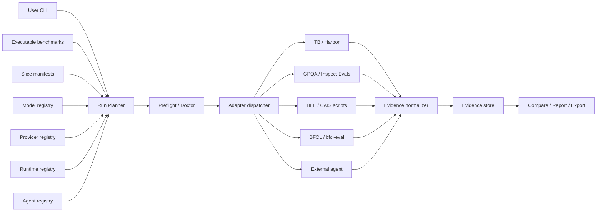

# Architecture & Decisions

> **Status:** ACCEPTED (vNext v0.3, reconciled 2026-08-25 after BFCL/HLE Tier-1 admission); implementation tracked in [`docs/roadmap.md`](roadmap.md)
> **Supersedes:** vNext v0.2 (ACCEPTED 2026-05-29, Core-first) — preserved as `legacy_static` context only
> **Operator contract / product SoT:** root [`README.md`](../README.md), this file, and [`docs/api/internal-contracts.md`](api/internal-contracts.md). [`docs/context/concept-hld.md`](context/concept-hld.md) is a **historical design ledger**, not live CLI instructions.
> **Scope:** Defined benchmarks → (runtime XOR agent)? → model via provider → evidence.

## 0. Product Principles

1. **Simple spine.** Product path is `benchmark → (runtime|agent)? → model → evidence`. Runtime and agent are mutually exclusive scaffolds; omit both for the executable model-only paths (GPQA/HLE/BFCL).
2. **Defined benchmarks only.** Live execution is limited to config-declared executable adapters.
3. **Official-first execution.** Prefer official distributions, runners, and scorers. BenchEval normalizes evidence; it does not reimplement benchmark semantics unless upstream has no usable feedback path (then label it as fallback).
4. **Config-first expansion.** New slices/runtimes/models/agents/providers on an existing adapter family are YAML/manifest work.
5. **Runtime-owned environments.** Benchmarks and selected runtimes own sandboxes/containers. BenchEval does not ship a separate Docker plane.
6. **Evidence over claims.** Reports preserve native artifacts and caveats; smoke ≠ full benchmark claim; green tests are not live proof.

## 1. Product Shape (v0.3)

BenchEval is a thin evaluation control plane:

> Given a **defined** benchmark (or slice), an optional runtime XOR agent, a provider-bound model, what happened, how expensive was it, and what evidence supports the result?

```text
benchmark/slice  →  (runtime | agent)?  →  model via provider  →  EvidenceRecord + artifacts
```

**Tier-0 executable software (gate count = 4):** `terminal-bench`, `gpqa-diamond`, `hle`, `bfcl-v4`. Catalog lists `swe-bench-verified` as non-executable until its official evaluate path is wired (`bfcl-v4` was admitted 2026-08-24 on the diagnostic-labeled dev-box lifecycle demonstration `run-20260824-040631-228703-4756f857` plus the registered `passed` run `run-20260824-045622-854659-a46ae44d`), plus `swe-bench-pro`, `cybergym`, and `exploitgym` as `adapter_pending`.

**Live-proof status:** `bfcl-v4` and `hle` hold registered Tier-1 evidence. `terminal-bench` and `gpqa-diamond` remain Tier-0 software only; the pilot target is a Terminal-Bench runtime comparison (`claude-code` vs `codex-cli`) plus a GPQA native-harness smoke. No benchmark is called Tier-2 until its benchmark-specific checklist is complete. `swe-bench-verified` remains non-executable until official generation and evaluation are one evidence-bound lifecycle.

**Admitted scaffolds:** runtimes `claude-code`, `codex-cli`; agent `momo`; providers `bytellm`, `ollama-cloud`.

## 2. Identity axes

```text
benchmark_id / slice_id  = what is being evaluated
model_id / provider_id   = model + how it is reached
runtime_id XOR agent_id  = optional scaffold (never both; both null = model-only)
adapter_id = BenchEval adapter selected by config
harness_kind = derived run-plan/evidence metadata declared by the adapter, not benchmark YAML
```

CLI: `bencheval run <bench>/<slice> --model <id> [--runtime|--agent] [--provider bytellm]`. `--dry-run` = phase 1 only; `-y` skips the continue prompt.

## 3. System Diagram

Full layered set: **[`docs/diagrams/`](diagrams/README.md)** — start at [system overview](diagrams/system-overview.md).


```mermaid
flowchart LR
    U[User CLI] --> BP[Run Planner]
    BR[Executable benchmarks] --> BP
    SM[Slice manifests] --> BP
    MR[Model registry] --> BP
    PR[Provider registry] --> BP
    RR[Runtime registry] --> BP
    AG[Agent registry] --> BP

    BP --> PF[Preflight / Doctor]
    PF --> AD[Adapter dispatcher]

    AD --> A1[TB / Harbor]
    AD --> A2[GPQA / Inspect Evals]
    AD --> A3[HLE / CAIS scripts]
    AD --> A4[BFCL / bfcl-eval]
    AD --> A5[External agent]

    A1 --> EN[Evidence normalizer]
    A2 --> EN
    A3 --> EN
    A4 --> EN
    A5 --> EN
    EN --> ES[Evidence store]
    ES --> CP[Compare / Report / Export]
```

## 4. Stack Selection

| Component | Choice | Rationale |
|-----------|--------|-----------|
| Language | **Python 3.12** | Already set; matches Inspect ecosystem. |
| Package manager | **`uv`** | Already set (`pyproject.toml`). |
| Build backend | **hatchling** | Already set. |
| Config format | **YAML** | Human-diffable, lintable, versioned. `config/*.yaml`. |
| Validation | **Pydantic v2** | Already in deps. Used for `BenchmarkContract`, `SliceManifest`, `RuntimeProfile`, `ModelProfile`, extended `EvidenceRecord`. `frozen=True, extra="forbid"` per repo convention. |
| CLI | **argparse** (`bencheval` entrypoint) | Already set; extend `cli.py`, don't replace. |
| Evidence store | **JSONL** (primary) + **Parquet/DuckDB** (analytics) | JSONL now; DuckDB/Parquet via existing `analytics` extra (`duckdb`, `pyarrow`) and `export.py`. **No database** — this is a CLI tool. |
| Harness adapters | **External binaries, not vendored** | Harbor = external CLI (`uv tool install harbor`) and may use Docker internally; Inspect = optional `eval` extra; native/external-command = subprocess. Core library stays dependency-light (no `eval` requirement for core). |
| Orchestration (heavy) | **Inspect AI** (optional `eval` extra) + **Harbor** (external) | Provider abstraction + sandbox; never reimplement benchmark semantics. |
| Sandbox ownership | **Runtime-owned** | BenchEval does not ship a Docker plane. Official benchmark runtimes own containers/images when they require them. |
| Terminal/verifier-heavy | **Harbor or external command profiles** | Optional E2 paths; not mandatory for all tasks. |
| Testing | **pytest** | Already set. |
| Lint | **ruff** (E/F/I/W, line 100) | Already set. Type-check via ruff; no pyright in repo. |
| Secret store | **`.env` only** | `config/models.yaml` must stay non-secret (AGENTS.md rule). |

## 5. Component Responsibilities

| Component | Responsibility | Status | Module(s) |
|---|---|---|---|
| Benchmark Registry | Catalog runnable benchmarks, adapters, source, license, native harness, metrics, caveats. | **Implemented:** `benchmark_registry.py` + `config/benchmarks.yaml` (**8** product entries, **4** executable). | `benchmark_registry.py` |
| Slice Manifest Registry | Typed `smoke`/`lite`/`full`/`custom` instance lists with budget + labels. | Product slices keep instance ids inline; `manifest.py` remains for optional large/generated external lists. | `manifest.py` (+ `slice_manifest.py`) |
| Model Registry | Model identity, provider, pricing, context limits, version capture. | **Implemented:** `config/models.yaml` + `pricing/` + model registry/types. | `model_registry.py`, `models.py`, `pricing.py` |
| Runtime Registry | Admitted runtimes (`claude-code`, `codex-cli`) + capability metadata. | `runtime_registry.py` + `config/runtimes/*.yaml`. | `runtime_registry.py` |
| Agent Registry | Admitted agents (`momo`); XOR with runtime on the plan. | `agent_registry.py` + `config/agents/*.yaml`. | `agent_registry.py` |
| Provider Registry | Admitted providers (`bytellm`, `ollama-cloud`). | `provider_registry.py` + `config/providers/*.yaml`. | `provider_registry.py` |
| Run Planner | Build `RunPlan` from benchmark + slice + model + (runtime\|agent) + provider. | `benchmark_plan.py` (phase 1 of `run`). | `benchmark_plan.py` |
| Preflight / Doctor | Runtime/provider env checks before live runs (never prints secrets). | `doctor.py`. | `doctor.py` |
| Materialization Manager | Cleanup policy + adapter-owned ephemeral dirs. | `lifecycle.py` (`CleanupPolicy`); adapters own workspace layout. | `lifecycle.py` |
| Adapter Dispatcher | Route plan → adapter (runtime XOR agent XOR model-only). | `control_plane_executor.py`. | `control_plane_executor.py` |
| Adapters | Harbor TB, GPQA, HLE, BFCL; the SWE diagnostic module remains non-executable; SWE-Pro / ExploitGym / CyberGym are pending. | Tier-0 executable set in YAML. | `terminal_bench_harbor.py`, `gpqa_adapter.py`, `hle_adapter.py`, `bfcl_native_adapter.py`; the SWE diagnostic module and pending adapter modules |
| Evidence Normalizer | Convert native output → `EvidenceRecord`. | `evidence.py`. | `evidence.py` |
| Evidence Store | Evidence JSONL + optional Parquet/DuckDB export. | `evidence.py`, `export.py`. | as listed |
| Compare/Report/Export | Markdown/JSON reports + cross-run comparisons + run bundles. | `report.py`, `evidence_compare.py`, `export.py`, `run_bundle.py`. | as listed |
| Dashboard | UI over stored evidence. | **Post-MVP** (non-goal now). | — |

## 6. Execution Profiles

Live product paths use upstream-owned harnesses: Harbor/Docker for Terminal-Bench, Inspect Evals for GPQA, the CAIS scripts for HLE, and `bfcl-eval` for BFCL. Historical E0–E4 labels below are planning vocabulary only — Inspect and `bfcl-eval` are benchmark harnesses, not admitted product runtimes.

| Profile | Name | Used for | Notes |
|---------|------|----------|-------|
| E0 | Model-only / API | Official model-only benchmark harness | GPQA / HLE / BFCL |
| E1 | Runtime sandbox | Coding / repo tests under admitted runtime | Runtime-owned |
| E2 | Terminal / harness sandbox | Terminal, multi-step verifier-heavy | Harbor for TB; harness-owned |
| E3 | Calibration external | Public micro-slices | Adapter-backed; never Core-weighted |
| E4 | Stretch sandbox | Expensive official-harness runs | Explicit review; research unless admitted |

Dry-run planning reports `requires_harbor` / `requires_sandbox` when needed. Those flags are operator preflight signals, not a BenchEval-owned Docker plane.
`recommended_profile` is catalog planning vocabulary: E3 does not itself imply
a sandbox, while E4 does. New evidence normalizes the concrete launch to E0
(model-only), E1 (non-Harbor sandbox), or E2 (Harbor); E3/E4 remain valid when
reading historical evidence.

## 7. Data Contracts

### 7.1 Benchmark Contract (`config/benchmarks.yaml`)

Existing product YAML registry is the authoritative catalog (**8** entries; **4** Tier-0 executable). Schema: `BenchmarkCatalog`/`BenchmarkEntry` in `benchmark_registry.py` (Pydantic, `frozen=True, extra="forbid"`). Fields: id, name, aliases, category, tier (`calibration`/`stretch`/`reference_only`), adapter_status (`cataloged`/`adapter_pending`/`manifest_available`/`unverified`), recommended_backend, recommended_profile, task_count, public_indexed, contamination_risk, single_mode_required, source_url, notes, `default_slice`, `adapter_id`, and `executable`. Ops manuals: `docs/ops/benchmarks/`. `harness_kind` is deliberately **not** configurable in benchmark YAML: the adapter implementation declares the official runner kind used for planning and evidence metadata. New harness families need a Python adapter + executor wiring + official score ingestion; config-only expansion applies when reusing an existing adapter family.

### 7.2 Slice Manifest (new typed layer)

```yaml
schema_version: "0.1"
slice:
  id: "swe-bench-verified-smoke-10"
  benchmark_id: "swe-bench-verified"
  purpose: "adapter_smoke"           # adapter_smoke | rough_regression | benchmark_native_claim | runtime_comparison | model_comparison
  selection_policy: "fixed_instance_ids"
  instances:
    - django__django-11099
    - sympy__sympy-18087
  valid_for: ["adapter_smoke", "rough_regression"]
  invalid_for: ["model_comparison"]
budget:
  max_instances: 10
  max_wall_clock_sec_per_instance: 900
  max_total_cost_usd: 50
labels:
  contamination_warning: true
  public_benchmark: true
```

Product slice YAML keeps small fixed instance lists inline. Large generated manifests can still use `instances_source`, but no product benchmark depends on a separate `*-smoke.txt` file.

### 7.3 Runtime Profile (`config/runtimes/<id>.yaml`)

Per HLD §6.2. Pydantic `RuntimeProfile`: id, kind, display_name, lifecycle, supported_platforms, supported_harnesses, model_binding, launch (command_template, working_dir_policy, env vars, timeout), capabilities, safety (network_default, workspace_boundary, forbidden_features), versioning (version_command, config_hash_inputs). **Admitted profiles now:** `claude-code`, `codex-cli`. Agents live under `config/agents/` (`momo`); providers under `config/providers/` (`bytellm`, `ollama-cloud`).

### 7.4 EvidenceRecord v0.3 — additive extension (no breaking change)

`EvidenceRecord` is a **public export** (AGENTS.md fact). v0.3 **extends, does not restructure**, the v0.2 flat schema. New optional fields (default to keep v0.2 rows valid):

```python
class EvidenceRecord(BaseModel):
    # --- v0.2 (unchanged, frozen contract) ---
    run_id, task_id, model_id, execution_profile, backend
    primary_pass, partial_score, cost_usd, latency_sec
    failure_labels, artifact_paths, verifier_log_path, adapter_metadata, created_at
    # --- v0.3 additive (optional, default empty/None) ---
    benchmark_id: str | None = None
    benchmark_version: str | None = None
    slice_id: str | None = None
    adapter_id: str | None = None
    harness_kind: str | None = None
    harness_version: str | None = None
    runtime_id: str | None = None
    runtime_version: str | None = None
    runtime_kind: str | None = None
    runtime_config_hash: str | None = None
    agent_id: str | None = None
    provider_id: str | None = None
    provider_config_hash: str | None = None
    judge_model_id: str | None = None
    instance_id: str | None = None
    steps: int | None = None
    token_usage: dict[str, int] | None = None
    native_score: dict[str, JsonValue] | None = None
    normalized_score: float | None = None
    contamination_label: str | None = None
    reward_hack_risk_label: str | None = None
    verifier_integrity_label: str | None = None
    cleanup_result: str | None = None
    interpretation_label: str | None = None   # adapter_smoke | rough_regression | ...
    failure_class: str | None = None
    attempt_validity: str | None = None       # valid | invalid
    invalid_reason: str | None = None
    counts_toward_pass_at_k: bool | None = None
    physical_launch_id: str | None = None
    logical_attempt_number: int | None = None
    runtime_output_cap: int | None = None
```

Nested `run`/`model`/`runtime`/`attempt`/`artifacts`/`integrity` blocks from HLD §9.3 are **not** adopted as the on-disk shape (would break v0.2 readers); they remain a *report projection* only.

## 8. Adapter Rule

Adapters **prefer native harnesses**. Product v1 allowed shapes:

1. **Native wrapper** — call the official runner/scorer, parse its result files, and preserve raw artifacts (GPQA/HLE/BFCL today; future adapters must meet the same bar).
2. **Harbor wrapper** — Harbor-native terminal tasks (Terminal-Bench 2.1).
3. **External agent wrapper** — admitted agent profiles (`momo`) via `external_agent_adapter.py`.

Deferred / not product: Inspect-as-runtime wrappers. Compatibility shims must be explicitly labeled `adapter_smoke`.

**Forbidden:** copying public benchmark instances into custom Core tasks and treating them as BenchEval-native.

### 8.1 Official lifecycle contract

Every adapter family has an explicit, code-owned lifecycle. Configuration selects a declared adapter; it never supplies executable code or scoring semantics.

```text
resolve typed slice and immutable identities
  → preflight and fail-before-charge checks
  → reserve run/evidence/artifact ownership
  → invoke the pinned official generator or harness
  → invoke the pinned official evaluator/judge when generation alone is not authoritative
  → bind the exact official result to the requested instance(s)
  → normalize native metrics and provenance into EvidenceRecord
  → verify retained artifact identity, clean transient state, register only qualified evidence
```

Exit status, stdout, model self-report, and adapter-invented verdict files never become scoring authority when the upstream benchmark defines an official report. Multi-phase adapters share one cumulative run envelope. A demoted adapter may run only as explicitly labeled diagnostic evidence; diagnostic evidence cannot register `passed`.

Current official authority boundaries:

| Benchmark | Generation / execution | Sole scoring authority |
|---|---|---|
| Terminal-Bench | Harbor dataset `terminal-bench/terminal-bench-2-1` | Harbor trial `verifier_result.rewards["reward"]` |
| GPQA Diamond | Inspect Evals `inspect_evals/gpqa_diamond` | successful Inspect eval log accuracy |
| HLE | official CAIS prediction then judge scripts | exact run-owned judged artifact |
| BFCL v4 | `bfcl generate` then `bfcl evaluate` | official `BFCL_v4_<category>_score.json` JSONL |
| SWE-bench Verified (demoted) | pinned mini-SWE batch prediction generation, then official SWE-bench evaluator | requested instance in official `report.json`; local `verifier.json`/`result.json` has no authority |

### 8.2 Expansion rule

The selected architecture is **explicit adapters over a shared control-plane spine**. Two alternatives were rejected:

- a generic benchmark plugin/lifecycle DSL, because the pending harnesses differ at their scoring, identity, sandbox, and cleanup trust boundaries;
- a BenchEval-owned orchestration service, database, or Docker plane, because the current operator-owned harness environments and JSONL evidence path meet the product need with fewer stateful components.

Adding a new family therefore means one narrow adapter, one executor dispatch, one official-artifact parser, typed identity/slice config, and the verification gates in §13. Shared helpers are extracted only after at least two admitted adapters demonstrate the same trust-boundary behavior.

## 9. Budget Classes

| Class | Max cost (run total) | Max wall time (per instance) | Notes |
|-------|---------:|--------------:|-------|
| B0 | $0.05 | 60s | E0 structured/tool tasks |
| B1 | $0.25 | 180s | Simple coding |
| B2 | $2.00 | 300s | Agentic / defensive Core upper bound |
| B3 | explicit | explicit | Stretch only |

Class values are classification ceilings, and the slice's own envelope is always the effective cap (bands mirror the class defaults, so a slice never classifies into a class whose ceiling it exceeds; B3's zero defaults declare no standard envelope). Per-instance wall-clock and run-total wall-clock are **separate `RunPlan` fields**: `max_wall_clock_sec_per_instance` bounds each attempt and `max_wall_clock_sec` bounds the whole run (`per-instance × instances`); adapters must never derive one from the other. Serialized schema-"0.3" plans written before the per-instance field existed derive it from the run total on load (the pre-field contract allowed one attempt to consume the whole envelope). The aggregate model-only harnesses (GPQA, HLE) execute every sample in one subprocess chain and are therefore bounded by the **run-total** envelope; per-instance wall is not enforceable inside an aggregate process and evidence records this as `per_instance_wall_enforcement=unavailable_aggregate_harness`. Observed steps are recorded retrospectively in evidence only — no max-step envelope is claimed or enforced.

**Budget truth:** wall-clock envelopes are enforceable. Dollar envelopes are hard caps only when the real provider route reports spend during execution and exposes a stop mechanism. GPQA, HLE, and BFCL currently capture no such provider metering; for them `max_cost_usd` is a planning estimate and `cost_usd=0.0` means *unmeasured*, not zero spend. Reports and readiness claims must preserve that distinction. Whether hard provider-dollar termination is a v1 requirement remains a product decision; until then BenchEval is **wall-bounded and cost-estimated**, not universally cost-bounded. Exceeding an enforced envelope → failure label `budget_exceeded` (distinct from `wrong_solution`).

## 10. Failure Taxonomy (must be distinguishable)

`harness_failure` · `runtime_launch_failure` · `runtime_auth_failure` · `runtime_permission_block` · `runtime_output_unparseable` · `runtime_context_overflow` · `runtime_tool_failure` · `runtime_config_drift` · `runtime_budget_exceeded` · `runtime_output_cap_reached` · `runtime_no_progress_stall` · `runtime_wall_clock_timeout` · `materialization_failure` · `model_wrong_solution` · `model_output_invalid` · `adapter_error` · `budget_exceeded` · `wrong_solution` · `operator_interrupted` · `interrupted_by_harness` · `config_failed` · `remote_infra_failure` · `evidence_corrupt` · `duplicate_launch`. (Canonical source: `FailureLabel` in `domain.py`.)

Preflight/infrastructure failures **abort without evidence**. Post-preflight adapter failures write `EvidenceRecord` with `primary_pass=false` and the relevant failure label. Verifier remains scoring authority when a candidate artifact exists.

External runtime launch and tool failures are separate: `runtime_launch_failure` means BenchEval could not start or materialize the runtime process; `runtime_tool_failure` means the runtime/tool process launched and returned an unsuccessful status. Output caps are recorded as `runtime_output_cap_reached`; when both output and total token counts are present, the output count is authoritative, otherwise total count is the fallback.

## 11. Scoring & Reporting

- **Preserve native metrics.** Keep the official metrics emitted by each admitted harness (for example Terminal-Bench verifier results, Inspect GPQA accuracy, and HLE judged answers). BenchEval adds an operational layer: cost, latency, token usage, runtime/harness/adapter/model/provider versions and hashes, judge identity, failure class, cleanup status, artifact paths, and caveats.
- **No universal weighted score by default.** Side-by-side only. A user-defined weighted portfolio may exist later as a labeled local-decision policy object, never as a benchmark-native score.
- **Interpretation labels** on every report: `adapter_smoke` · `rough_regression` · `benchmark_native_claim` · `runtime_comparison` · `model_comparison` · `contaminated_or_legacy` · `defensive_security_only`.

## 12. Security Boundary

- **Allowed normal lanes:** local toy patching, authorization repair, alert-triage data, regression tests, and local prompt-injection resistance without exfiltration or live-target access.
- **Catalog-only v1 boundary:** the official CyberGym and ExploitGym tasks require PoC/exploit behavior against benchmark-owned vulnerable targets. The product decision for v1 is to keep both catalog-only and non-executable; no official PoC/exploit lifecycle is planned for this release. Any post-v1 reconsideration requires a new explicit product decision, a separately labelled sandboxed lane, authoritative success semantics, and operator-host authorization and isolation prerequisites. Relabelling the official PoC lifecycle as merely “defensive” is not sufficient.
- **Forbidden:** exploit generation against live or third-party targets, real-target attack chains, credential theft, persistence, and mixing any dual-use Stretch result into Core/public weighted totals.

## 13. Verification Gates

### 13.1 Adapter Admission

A benchmark adapter cannot claim Tier-1 live proof or Tier-2 readiness unless: native harness invocation ≥1 instance; version capture (benchmark/harness/adapter/runtime/model/provider and any judge); evidence completeness (raw result, stdout/stderr, verifier logs, artifacts, run config); failure separation; cleanup replay without deleting evidence; ≥1 typed slice with instance ids; dry-run accuracy; caveat labels attached. Tier-0 `executable: true` remains a software capability claim only.

### 13.2 Runtime Admission

A runtime cannot be marked production-ready unless: noninteractive launch; version capture; workspace isolation; config isolation (no global mutation unless allowed); known/controllable network; artifact extraction; budget enforcement; failure mapping to standard classes.

### 13.3 Report Validity

A report cannot claim model/runtime superiority unless: benchmark id identical; slice id identical; adapter version identical; harness version identical or explicitly waived; runtime-config difference = intended variable; model-config difference = intended variable; failed/invalid attempts reported not dropped; caveat labels shown.

### 13.4 Stable requirements

| ID | Requirement |
|---|---|
| AR-01 | An official upstream artifact is the only pass authority when the benchmark defines one. |
| AR-02 | Benchmark, dataset, harness, adapter, model/provider, runtime/agent, slice, and judge identities are captured or the attempt is ineligible. |
| AR-03 | Multi-phase benchmark lifecycles are explicit, ordered, cumulatively bounded, and fail closed between phases. |
| AR-04 | Identity, dependency, model-support, and environment checks that can fail deterministically run before a charged launch. |
| AR-05 | Run/evidence/artifact paths are exclusively owned and post-launch writes and scored reads remain bound to pinned filesystem identities. |
| AR-06 | Native metrics and official raw artifacts are preserved; normalization never replaces them. |
| AR-07 | Comparison eligibility requires the shared-instance intersection and constant non-varied provenance axes. |
| AR-08 | Enforced budgets, estimates, and unavailable metering are distinct evidence states. |
| AR-09 | Tier-0 software, Tier-1 live evidence, and Tier-2 checklist completion are separate claims with benchmark-specific status. |
| AR-10 | Heavy harnesses, containers, corpora, and credentials remain operator-owned; BenchEval owns preflight, dispatch, evidence, and cleanup. |
| AR-11 | Dual-use benchmark execution is impossible until the product boundary and operator-host policy explicitly admit it. |
| AR-12 | Registered evidence has a portable, integrity-bound export path; machine-local registry paths are never presented as durable publication. |

### 13.5 Quality scenarios

| ID | Scenario and required response |
|---|---|
| QS-01 | A local result file claims success while the official report is missing: record an invalid/unparseable failure; never pass. |
| QS-02 | A dataset, harness, or output path changes after preflight: fail as provenance drift or evidence corruption before accepting its bytes. |
| QS-03 | A multi-phase harness times out in phase two: terminate within the remaining cumulative wall envelope and retain phase-one evidence. |
| QS-04 | Provider spend is unavailable: record unmeasured cost and do not claim a dollar cap was enforced. |
| QS-05 | Two runtime files contain asymmetric eligible instance sets: invalidate the comparison rather than silently changing the sample. |
| QS-06 | A diagnostic run succeeds: retain labeled evidence but reject `evidence register --status passed`. |
| QS-07 | A private bundle moves to another host: included artifacts resolve within the bundle and its digest/index verifies without source-host paths. |
| QS-08 | A pending adapter's output directory is swapped after launch: no write or scored read escapes; the attempt fails `evidence_corrupt`. |
| QS-09 | An operator requests a dual-use benchmark before policy admission: planning remains non-executable and no harness launches. |
| QS-10 | A fresh supported install follows the documented dependency path: every advertised executable adapter reaches preflight without an undeclared package. |

## 14. VETOs (unchanged where still relevant)

- Mixing Calibration/Stretch tasks into weighted public-benchmark totals without caveats.
- BenchEval-authored or ad hoc LLM-as-judge for authoritative `primary_pass`. An upstream benchmark's official judge (HLE) is allowed only when its exact model identity and native judged artifact are bound into evidence.
- Live internet in MVP tasks.
- Statistical significance claims from smoke/lite slices alone.
- Breaking the v0.2 `EvidenceRecord` flat contract (additive only).
- Reintroducing fake runtimes (e.g. `native-api`) for model-only paths — use null `runtime_id` / `agent_id`.
- Vendoring Harbor as a Python dependency (external CLI only).

## 15. Risk Assessment

| Risk | Severity | Mitigation |
|---|---|---|
| Runtime/model conflation | High | Four-axis identity §2; CLI enforces `--runtime` distinct from `--backend`. |
| EvidenceRecord break | High | Additive-only v0.3; v0.2 rows stay valid. |
| Harbor unavailable / Docker absent | High | Doctor gates; local injected-runner tests remain diagnostic only; Terminal-Bench live acceptance stays blocked until the operator host passes preflight. |
| Public benchmark contamination | High | Caveat labels; prefer fresh benchmarks for promotion; contaminated = smoke/trend only. |
| Reward-hackable verifiers | High | Preserve native result + label verifier-integrity risk; no promotion on one score. |
| Cost overrun | High | Enforced wall limits, default smoke slices, dry-run cost estimates, and explicit `unmeasured` evidence; hard dollar caps require provider metering/termination proof. |
| Cyber scope creep | High | CyberGym/ExploitGym remain catalog-only and non-executable for v1; never target live systems or mix their results into Core. |
| CLI runtimes mutate global config | Medium | Ephemeral home/workspace; config hash capture. |
| Native harness drift | High | Pin benchmark repo version, image digest, harness version, adapter version. |
| Adapter maintenance burden | Medium | Native wrappers only; no task reimplementation. |
| Machine-local proof loss | High | Portable private bundle/index design in the roadmap; never treat a host path as durable evidence. |

## 16. Tech Debt (acknowledged)

- Plain-text manifests remain supported only for optional large/generated lists; product slices store small fixed ids inline.
- No DB: JSONL is the store of record; DuckDB/Parquet is a derived analytics export, not transactional.
- No pyright in repo; type discipline via ruff + Pydantic runtime validation.
- Historical sections under `docs/context/` deliberately preserve pre-prune design decisions and are labeled non-operational; the live product contract is README + this architecture + `docs/api/internal-contracts.md` + `docs/diagrams/`.

## 17. Module map and source-tree ownership (current)

Every production module under `src/bencheval/` has one architectural home below. This is an ownership map, not a promise that pending adapters are executable.

| Component | Production modules | Responsibility |
|---|---|---|
| Public core and types | `__init__.py`, `domain.py`, `contracts.py`, `exceptions.py`, `ids.py` | Public exports, frozen DTOs, errors, and identifiers. |
| Config location/cache | `paths.py`, `config_cache.py` | Checkout, packaged config, `BENCHEVAL_HOME`, validation, cached reads. |
| Catalogs, slices, models, budgets | `benchmark_registry.py`, `slice_manifest.py`, `manifest.py`, `model_registry.py`, `runtime_registry.py`, `agent_registry.py`, `provider_registry.py`, `models.py`, `pricing.py`, `budget_defaults.py` | Typed configuration and identity lookup; no secrets. |
| Planning and preflight | `benchmark_plan.py`, `doctor.py`, `preflight_report.py`, `redaction.py` | Phase-one plan, dependency/env checks, shareable preflight, secret/path redaction. |
| Execution, isolation, lifecycle | `control_plane_executor.py`, `lifecycle.py`, `run_isolation.py`, `path_safety.py`, `backends.py` | Dispatch, budgets/deadlines, path ownership, cleanup, backend vocabulary. |
| Executable adapters and integrations | `terminal_bench_harbor.py`, `harbor_claude_code_npm.py`, `anthropic_role_shim.py`, `gpqa_adapter.py`, `hle_adapter.py`, `bfcl_native_adapter.py`, `external_agent_adapter.py`, `momo_agent_adapter.py` | Admitted official harnesses, runtime install/shim boundaries, external-agent path. |
| Demoted or pending adapters | `swebench_adapter.py`, `swebench_pro_harbor.py`, `cybergym_adapter.py`, `exploitgym_adapter.py` | Research/diagnostic code only; no catalog-executable claim. |
| Evidence, identity, admission | `evidence.py`, `identity_strings.py`, `live_proof.py`, `provenance_gates.py`, `adapter_admission.py`, `live_run_manifest.py` | JSONL record, captured identities, qualification, Tier-0 assessment, append-only run registry. |
| Comparison and statistics | `evidence_compare.py`, `model_compare.py`, `runtime_compare.py`, `stats.py` | Shared-instance validity, deltas, confidence intervals, comparison CLIs. |
| Reports and exports | `report.py`, `export.py`, `run_bundle.py` | Markdown/JSON reporting, Parquet/DuckDB analytics, public/private bundles. |
| CLI | `cli.py` | `list`, `catalog`, `run`, `doctor`, report/compare/export, evidence registration. |

## 18. Remaining adapter architecture

The following are researched designs, not executable claims:

### 18.1 SWE-bench Verified diagnostic lifecycle

The retained adapter is generation-only and already fail-closes unless official `report.json[instance_id]["resolved"]` is present; local `verifier.json`/`result.json` have no authority. That path still cannot be admitted until the pinned generation→official-evaluator lifecycle is proven. The selected redesign is:

```text
pinned mini-SWE batch generation for exact fixed instance ids
  → retained prediction JSONL (`instance_id`, `model_name_or_path`, `model_patch`)
  → pinned official SWE-bench evaluator in its official container environment
  → exact requested-instance `report.json[instance_id]["resolved"]`
  → evidence with prediction/report bytes and mini-SWE/evaluator/dataset identities
```

The official evaluation guide and harness source define the prediction fields and `report.json` authority: [SWE-bench evaluation guide](https://github.com/SWE-bench/SWE-bench/blob/main/docs/guides/evaluation.md), [official evaluator](https://github.com/SWE-bench/SWE-bench/blob/main/swebench/harness/run_evaluation.py), and [grading schema](https://github.com/SWE-bench/SWE-bench/blob/main/swebench/harness/grading.py). The mini-SWE batch runner produces predictions through its `--subset`/`--split`/`--filter`/`--output` interface: [official mini-SWE batch source](https://github.com/SWE-agent/mini-swe-agent/blob/main/src/minisweagent/run/benchmarks/swebench.py). Keep the benchmark non-executable until a real diagnostic smoke proves both phases and the operator deliberately promotes it; its contamination/quality caveat still prevents a frontier-quality claim.

### 18.2 CyberGym and ExploitGym

CyberGym's official lifecycle is data materialization, a local/private execution server, task generation, agent PoC submission, and `verify_agent_result.py`; its public data footprint is roughly 240 GB before full server data. [Official CyberGym repository](https://github.com/sunblaze-ucb/cybergym). ExploitGym's official runner accepts positional task IDs or `--tasks-file`, writes task-scoped `result.json`, and optionally adds a causal target-vulnerability scorer; the product must choose whether flag acquisition alone or flag-plus-causal-score is authoritative. [Official ExploitGym evaluation guide](https://github.com/sunblaze-ucb/exploitgym/blob/main/docs/eval.md).

Neither current adapter implements that lifecycle. The v1 product decision is to keep both benchmarks catalog-only and non-executable, so no official lifecycle or scoring-authority implementation is planned in the v1 roadmap. The retained Python modules remain non-authoritative research scaffolding; the pre-admission anchored-I/O contract is implemented so dormant code cannot preserve known unsafe pathname writes. Any post-v1 admission proposal must reopen the product decision and define a pinned upstream release/task manifest, official result authority, host-capacity runbook, operator authorization, isolation, and real one-instance proof before catalog promotion.

### 18.3 Portable live evidence

`results/manifests/runs.jsonl` is an append-only machine-local event index. `append_live_run` already enforces the append-time event contract: `model_id` is immutable; optional benchmark/slice/runtime axes may be filled once and are immutable thereafter; event timestamps do not move backward; same-status correction rows are allowed; `registered` may advance to any lifecycle state, `running` to completed/passed/failed/archived, `completed` to passed/failed/archived, and passed/failed only to themselves or archived.

The reader still exposes raw append order. A last-valid-event operational-view API, reader-side validation of already-written history, portable private bundles, and cross-host verification remain open. The smallest remaining durable extension is not a service or database: export a private run bundle containing the event history and all referenced artifacts, rewrite references to bundle-relative paths, compute a manifest digest over the bundle inventory, and record a non-secret portable index entry. Public bundles remain redacted derivatives and cannot replace the private proof artifact. Retention location and backup policy stay operator-owned.

## 19. Product decisions

**Closed for v1:** CyberGym and ExploitGym remain catalog-only and non-executable. Their official PoC/exploit lifecycles and ExploitGym metric selection are outside the v1 implementation roadmap.

1. **Next benchmark after the current executable set.** Recommendation: finish the SWE-bench Verified diagnostic generation→official-evaluation lifecycle first; select any later benchmark family only after that evidence is reviewed.
2. **Dollar enforcement.** Decide whether hard provider-dollar termination is a v1 requirement. Default until decided: wall-bounded, cost-estimated, with unmeasured cost stated explicitly.
