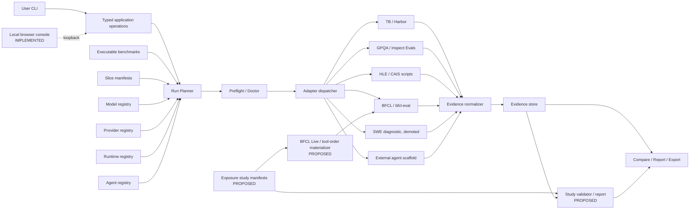

# Architecture & Decisions

> **Status:** ACCEPTED current system and implemented local operator console; PROPOSED benchmark-exposure extension (reconciled 2026-09-03). Source concept: [`docs/context/concept-zero.md`](context/concept-zero.md); implementation tracked in [`docs/roadmap.md`](roadmap.md).
> **Supersedes:** vNext v0.2 (ACCEPTED 2026-05-29, Core-first) — preserved as `legacy_static` context only.
> **Operator contract / product SoT:** root [`README.md`](../README.md), this file, and [`docs/api/internal-contracts.md`](api/internal-contracts.md). [`docs/context/concept-zero.md`](context/concept-zero.md) owns product intent and constraints. [`docs/context/concept-hld.md`](context/concept-hld.md) is a **historical design ledger**, not live CLI instructions.
> **Scope:** Defined canonical/fresh/derived benchmark populations → (runtime XOR agent)? → model via provider → native evidence, private proof, and bounded exposure studies.

## 0. Product Principles

1. **Simple spine.** Product path is `benchmark → (runtime|agent)? → model → evidence`. Runtime and agent are mutually exclusive axes; omit both for the executable model-only paths (GPQA/HLE/BFCL). A cataloged agent scaffold is not executable until separately admitted.
2. **Defined benchmarks only.** Live execution is limited to config-declared executable adapters.
3. **Official-first execution.** Prefer official distributions, runners, and scorers. BenchEval normalizes evidence; it does not reimplement benchmark semantics unless upstream has no usable feedback path (then label it as fallback).
4. **Config-first expansion.** New slices/runtimes/models/agents/providers on an existing adapter family are YAML/manifest work.
5. **Runtime-owned environments.** Benchmarks and selected runtimes own sandboxes/containers. BenchEval does not ship a separate Docker plane.
6. **Evidence over claims.** Reports preserve native artifacts and caveats; smoke ≠ full benchmark claim; green tests are not live proof.
7. **One truth, two entry points.** The CLI remains stable automation; the implemented local browser console calls the same typed application operations and never parses CLI stdout or owns scoring/storage semantics.
8. **Dependence, not accusation.** Exposure studies preserve canonical and candidate native scores and measure benchmark-specific dependence. They never certify a model clean, infer provider intent, or emit a universal decontaminated score.
9. **No hidden harness.** `network_policy` remains requested plan intent. Effective access is captured from the concrete official launch; BenchEval does not patch runtimes/scorers or maintain an egress allow-list.
10. **One variant before a framework.** BFCL Live is the first freshness contrast and one balanced BFCL tool-order permutation is the first paired representation study. A generic transform platform is forbidden until a second admitted family proves the abstraction.

### 0.1 Concept traceability

- `G-01` / `G-02` official execution and provenance drive AR-01–AR-06 and AR-16: adapters own preflight, official authority, exact-byte retention, and typed failure separation.
- `G-03` controlled comparison drives AR-07; only a shared eligible population with constant non-varied axes can produce a valid headline.
- `G-04` durable evidence and `C-06` permanent local retention drive AR-12 and AR-14: `private_proof_v1` is offline-verifiable and has no delete lifecycle.
- `G-05` SWE diagnostic-first and `N-06` no implicit promotion drive §18.1: a real diagnostic remains ineligible for `passed` until a later product decision.
- `G-06` benchmark-specific readiness drives AR-09 and the Tier-2 ledgers.
- `C-01` / `C-02` keep one Python CLI and the runtime-XOR-agent spine. `C-03` keeps credentials environment-only. `C-04` keeps substitute proof diagnostic. `C-05` defines the narrow human-intervention boundary.
- `N-01`–`N-05` exclude hard-dollar control, MOMO admission, dual-use execution, service/storage expansion, and smoke-derived superiority claims from v1.
- `G-07` / `G-08` add complete local-console coverage and CLI/UI parity. `C-07` keeps the console loopback-only; `C-08` keeps UI state and DTOs non-authoritative.
- `G-09` / `G-12` and `C-11` add exposure studies without changing native scores: source/candidate relation, fidelity, verifier, access, freshness, and interpretation remain separate evidence.
- `G-10` and `C-09` separate effective access from plan-time `network_policy`; model-only, official Inspect-restricted, and Harbor-uncontrolled paths must not collapse to one label.
- `G-11`, `C-10`, `C-12`, and `C-13` select BFCL Live then a diagnostic balanced tool-order study for the current frontier API pool, with official code/scorer bytes unchanged and no statistical claim from smoke.
- `N-07`–`N-10` exclude clean/cheating verdicts, generic transformation infrastructure, custom runtime/network controls, controlled training labs, and direct contamination estimates from unpaired populations.

## 1. Product Shape (v1)

BenchEval is a thin evaluation control plane:

> Given a **defined** benchmark (or slice), an optional runtime XOR agent, a provider-bound model, what happened, how expensive was it, and what evidence supports the result?

```text
benchmark/slice  →  (runtime | agent)?  →  model via provider  →  EvidenceRecord + artifacts
```

**Tier-0 executable software (gate count = 4):** `terminal-bench`, `gpqa-diamond`, `hle`, `bfcl-v4`. Catalog lists `swe-bench-verified` as non-executable: the official generation→evaluation diagnostic is implemented and remains ineligible for `passed` or auto-promotion (`bfcl-v4` was admitted 2026-08-24 on the diagnostic-labeled dev-box lifecycle demonstration `run-20260824-040631-228703-4756f857` plus the registered `passed` run `run-20260824-045622-854659-a46ae44d`), plus `swe-bench-pro`, `cybergym`, and `exploitgym` as `adapter_pending`.

**Live-proof status:** `bfcl-v4`, `hle`, `gpqa-diamond`, and `terminal-bench` hold registered Tier-1 evidence. Terminal-Bench is one native `fix-git` attempt per admitted runtime (`claude-code` `run-20260825-173913-754489-4f43e296`, `codex-cli` `run-20260825-171829-685914-aa08dd1d`), both `model_wrong_solution` with official `reward == 0.0`, plus a valid shared-axis runtime compare (`comparison_valid`, `contaminated_or_legacy`). No benchmark is called Tier-2 until its benchmark-specific checklist is complete. `swe-bench-verified` remains non-executable: official generation and evaluation are one evidence-bound diagnostic lifecycle and never auto-promote the row.

**Admitted execution profiles:** runtimes `claude-code`, `codex-cli`; providers `bytellm`, `ollama-cloud`. `momo` remains a discoverable **scaffold only**: planning or direct execution with it must fail before output reservation or provider/agent launch until a later admission decision.

**Implemented operator surface:** `bencheval ui` starts one loopback-only Python process and opens an optional browser console. It covers catalog, Run Builder, doctor/preflight, one active run session, validated run/evidence history, report/compare/export, private proofs, and readiness. It does not expose a public HTTP API, remote bind, credential editor, database, durable queue, or UI-only product behavior.

**Proposed exposure surface:** canonical, BFCL Live, and derived BFCL runs remain ordinary evidence-producing executions. Two non-executable diagnostic benchmark identities and a small study manifest declare the expected relation/population; a read-only `study report` operation validates retained evidence before showing native score contrasts. Effective access evidence is additive per attempt. The first release adds no multi-run scheduler, automatic model panel, reference correction, general transform registry, or new scoring authority.

## 2. Identity axes

```text
benchmark_id / slice_id  = what is being evaluated
model_id / provider_id   = model + how it is reached
runtime_id XOR agent_id  = optional scaffold (never both; both null = model-only)
adapter_id = BenchEval adapter selected by config
harness_kind = derived run-plan/evidence metadata declared by the adapter, not benchmark YAML
```

CLI: `bencheval run <bench>/<slice> --model <id> [--runtime|--agent] [--provider bytellm]`. `--dry-run` = phase 1 only; `-y` skips the continue prompt.

## 3. System Diagram

Full layered set: **[`docs/diagrams/`](diagrams/README.md)** — start at [system overview](diagrams/system-overview.md).


```mermaid
flowchart LR
    U[User CLI] --> APP[Typed application operations]
    UI[Local browser console<br/>IMPLEMENTED] -. loopback .-> APP
    APP --> BP[Run Planner]
    BR[Executable benchmarks] --> BP
    SM[Slice manifests] --> BP
    MR[Model registry] --> BP
    PR[Provider registry] --> BP
    RR[Runtime registry] --> BP
    AG[Agent registry] --> BP

    BP --> PF[Preflight / Doctor]
    PF --> AD[Adapter dispatcher]

    AD --> A1[TB / Harbor]
    AD --> A2[GPQA / Inspect Evals]
    AD --> A3[HLE / CAIS scripts]
    AD --> A4[BFCL / bfcl-eval]
    AD --> A5[SWE diagnostic, demoted]
    AD --> A6[External agent scaffold]

    A1 --> EN[Evidence normalizer]
    A2 --> EN
    A3 --> EN
    A4 --> EN
    A5 --> EN
    A6 --> EN
    EN --> ES[Evidence store]
    ES --> CP[Compare / Report / Export]
    STM[Exposure study manifests<br/>PROPOSED] --> XS[Study validator / report<br/>PROPOSED]
    ES --> XS
    BFM[BFCL Live / tool-order materializer<br/>PROPOSED] --> A4
    STM --> BFM
    XS --> CP
```

## 4. Stack Selection

| Component | Choice | Rationale |
|-----------|--------|-----------|
| Language | **Python 3.12** | Already set; matches Inspect ecosystem. |
| Package manager | **`uv`** | Already set (`pyproject.toml`). |
| Build backend | **hatchling** | Already set. |
| Config format | **YAML** | Human-diffable, lintable, versioned. `config/*.yaml`. |
| Validation | **Pydantic v2** | Already in deps. Used for `BenchmarkContract`, `SliceManifest`, `RuntimeProfile`, `ModelProfile`, extended `EvidenceRecord`. `frozen=True, extra="forbid"` per repo convention. |
| CLI | **argparse** (`bencheval` entrypoint) | Already set; extend `cli.py`, don't replace. |
| Local browser UI | **NiceGUI 3.x** (`ui` optional extra, IMPLEMENTED) | Python/backend-first, single local process, browser display and real-browser test support. Loopback only; CLI remains stable automation. |
| Evidence store | **JSONL** (primary) + **Parquet/DuckDB** (analytics) | JSONL now; DuckDB/Parquet via existing `analytics` extra (`duckdb`, `pyarrow`) and `export.py`. **No database** — this is a CLI tool. |
| Exposure study definition | **Typed YAML + retained JSON manifests** (PROPOSED) | Reuses current config/Pydantic patterns. YAML declares the study; canonical JSON bytes and SHA-256 bind the exact run population/transform. No registry service or DSL. |
| Exposure analysis | **Existing Python/statistics spine** (PROPOSED) | Raw counts, native rates, directional flips, and bounded confidence output can extend `stats.py`; no SciPy or new analytics dependency is earned before the statistics spike. |
| Harness adapters | **External binaries, not vendored** | Harbor = external CLI (`uv tool install harbor`) and may use Docker internally; Inspect = optional `eval` extra; native/external-command = subprocess. Core library stays dependency-light (no `eval` requirement for core). |
| Orchestration (heavy) | **Inspect AI** (optional `eval` extra) + **Harbor** (external) | Provider abstraction + sandbox; never reimplement benchmark semantics. |
| Sandbox ownership | **Runtime-owned** | BenchEval does not ship a Docker plane. Official benchmark runtimes own containers/images when they require them. |
| Terminal/verifier-heavy | **Harbor or external command profiles** | Optional E2 paths; not mandatory for all tasks. |
| Testing | **pytest** | Already set. |
| Lint | **ruff** (E/F/I/W, line 100) | Already set. Type-check via ruff; no pyright in repo. |
| Secret store | **`.env` only** | `config/models.yaml` must stay non-secret (AGENTS.md rule). |

## 5. Component Responsibilities

| Component | Responsibility | Status | Module(s) |
|---|---|---|---|
| Benchmark Registry | Catalog runnable benchmarks, adapters, source, license, native harness, metrics, caveats. | **Implemented:** `benchmark_registry.py` + `config/benchmarks.yaml` (**8** product entries, **4** executable). | `benchmark_registry.py` |
| Slice Manifest Registry | Typed `smoke`/`lite`/`full`/`custom` instance lists with budget + labels. | Product slices keep instance ids inline; `manifest.py` remains for optional large/generated external lists. | `manifest.py` (+ `slice_manifest.py`) |
| Model Registry | Model identity, provider, pricing, context limits, version capture. | **Implemented:** `config/models.yaml` + `pricing/` + model registry/types. | `model_registry.py`, `models.py`, `pricing.py` |
| Runtime Registry | Admitted runtimes (`claude-code`, `codex-cli`) + capability metadata. | `runtime_registry.py` + `config/runtimes/*.yaml`. | `runtime_registry.py` |
| Agent Registry | Catalog agent scaffolds and their admission state; only `admitted` profiles may enter a plan. MOMO is currently `scaffold`. | `agent_registry.py` + `config/agents/*.yaml`. | `agent_registry.py` |
| Provider Registry | Admitted providers (`bytellm`, `ollama-cloud`). | `provider_registry.py` + `config/providers/*.yaml`. | `provider_registry.py` |
| Run Planner | Build `RunPlan` from benchmark + slice + model + (runtime\|agent) + provider. | `benchmark_plan.py` (phase 1 of `run`). | `benchmark_plan.py` |
| Preflight / Doctor | Runtime/provider env checks before live runs (never prints secrets). | `doctor.py`. | `doctor.py` |
| Materialization Manager | Cleanup policy + adapter-owned ephemeral dirs. | `lifecycle.py` (`CleanupPolicy`); adapters own workspace layout. | `lifecycle.py` |
| Adapter Dispatcher | Route plan → adapter (runtime XOR agent XOR model-only). | `control_plane_executor.py`. | `control_plane_executor.py` |
| Adapters | Harbor TB, GPQA, HLE, BFCL; the SWE diagnostic module remains non-executable; SWE-Pro / ExploitGym / CyberGym are pending. | Tier-0 executable set in YAML. | `terminal_bench_harbor.py`, `gpqa_adapter.py`, `hle_adapter.py`, `bfcl_native_adapter.py`; the SWE diagnostic module and pending adapter modules |
| Evidence Normalizer | Convert native output → `EvidenceRecord`. | `evidence.py`. | `evidence.py` |
| Evidence Store | Evidence JSONL + optional Parquet/DuckDB export. | `evidence.py`, `export.py`. | as listed |
| Compare/Report/Export | Markdown/JSON reports + cross-run comparisons + run bundles. | `report.py`, `evidence_compare.py`, `export.py`, `run_bundle.py`. | as listed |
| Effective Access Evidence | Validate and project the concrete official launch's control source, egress, repository history, and optional retrieval audit; never infer them from `network_policy`. | **PROPOSED exposure phase X1.** | `access_evidence.py`, additive `domain.py` / `evidence.py` fields, adapter capture sites |
| Exposure Study Registry | Load closed study YAML, bind canonical/candidate identities and population rules, and reject unsupported relation/analysis combinations. | **PROPOSED exposure phase X1.** | `exposure_study.py`, `config/studies/*.yaml` |
| BFCL Study Materializer | Verify BFCL Live bytes and create a run-scoped, code-identical package-data overlay for one balanced tool-order transform; it never scores or mutates the installed package. | **PROPOSED exposure phases X0–X3.** | `bfcl_study.py`, existing `bfcl_native_adapter.py` lifecycle |
| Exposure Report | Read-only validation and rendering of unpaired freshness contrasts or paired representation studies; preserve native metrics and explicit non-claims. | **PROPOSED exposure phases X2–X4.** | `exposure_report.py`, `stats.py`, application/UI projections |
| Operator Console | Feature-complete local UI over typed application operations and canonical stores. | **IMPLEMENTED:** all operator pages/actions; browser/scale/accessibility hardening continues. | `application/` and `ui/` packages in §20 |

## 6. Execution Profiles

Live product paths use upstream-owned harnesses: Harbor/Docker for Terminal-Bench, Inspect Evals for GPQA, the CAIS scripts for HLE, and `bfcl-eval` for BFCL. Historical E0–E4 labels below are planning vocabulary only — Inspect and `bfcl-eval` are benchmark harnesses, not admitted product runtimes.

| Profile | Name | Used for | Notes |
|---------|------|----------|-------|
| E0 | Model-only / API | Official model-only benchmark harness | GPQA / HLE / BFCL |
| E1 | Runtime sandbox | Coding / repo tests under admitted runtime | Runtime-owned |
| E2 | Terminal / harness sandbox | Terminal, multi-step verifier-heavy | Harbor for TB; harness-owned |
| E3 | Calibration external | Public micro-slices | Adapter-backed; never Core-weighted |
| E4 | Stretch sandbox | Expensive official-harness runs | Explicit review; research unless admitted |

Dry-run planning reports `requires_harbor` / `requires_sandbox` when needed. Those flags are operator preflight signals, not a BenchEval-owned Docker plane. `recommended_profile` is catalog planning vocabulary: E3 does not itself imply a sandbox, while E4 does. New evidence normalizes the concrete launch to E0 (model-only), E1 (non-Harbor sandbox), or E2 (Harbor); E3/E4 remain valid when reading historical evidence.

`RunPlan.network_policy` remains a requested runtime/benchmark condition and a runtime-config hash input. It is not evidence that model-visible egress was blocked or allowed. Exposure-capable attempts separately capture the effective official access-control source, egress result, and repository-history state. Historical rows keep these fields absent; absence means unknown/legacy, never unrestricted or safe by inference.

## 7. Data Contracts

### 7.1 Benchmark Contract (`config/benchmarks.yaml`)

Existing product YAML registry is the authoritative catalog (**8** entries; **4** Tier-0 executable). Schema: `BenchmarkCatalog`/`BenchmarkEntry` in `benchmark_registry.py` (Pydantic, `frozen=True, extra="forbid"`). Fields: id, name, aliases, category, tier (`calibration`/`stretch`/`reference_only`), adapter_status (`cataloged`/`adapter_pending`/`manifest_available`/`unverified`), recommended_backend, recommended_profile, task_count, public_indexed, contamination_risk, single_mode_required, source_url, notes, `default_slice`, `adapter_id`, and `executable`. Ops manuals: `docs/ops/benchmarks/`. `harness_kind` is deliberately **not** configurable in benchmark YAML: the adapter implementation declares the official runner kind used for planning and evidence metadata. New harness families need a Python adapter + executor wiring + official score ingestion; config-only expansion applies when reusing an existing adapter family.

### 7.2 Slice Manifest (new typed layer)

```yaml
schema_version: "0.1"
slice:
  id: "swe-bench-verified-smoke-10"
  benchmark_id: "swe-bench-verified"
  purpose: "adapter_smoke"           # adapter_smoke | rough_regression | benchmark_native_claim | runtime_comparison | model_comparison
  selection_policy: "fixed_instance_ids"
  instances:
    - django__django-11099
    - sympy__sympy-18087
  valid_for: ["adapter_smoke", "rough_regression"]
  invalid_for: ["model_comparison"]
budget:
  max_instances: 10
  max_wall_clock_sec_per_instance: 900
  max_total_cost_usd: 50
labels:
  contamination_warning: true
  public_benchmark: true
```

Product slice YAML keeps small fixed instance lists inline. Large generated manifests can still use `instances_source`, but no product benchmark depends on a separate `*-smoke.txt` file.

### 7.3 Runtime Profile (`config/runtimes/<id>.yaml`)

Per HLD §6.2. Pydantic `RuntimeProfile`: id, kind, display_name, lifecycle, supported_platforms, supported_harnesses, model_binding, launch (command_template, working_dir_policy, env vars, timeout), capabilities, safety (network_default, workspace_boundary, forbidden_features), versioning (version_command, config_hash_inputs). **Admitted profiles now:** `claude-code`, `codex-cli`. Agent profiles live under `config/agents/` and carry a closed `scaffold | draft | admitted` state; MOMO is `scaffold` and non-executable. Providers live under `config/providers/` (`bytellm`, `ollama-cloud`).

### 7.4 EvidenceRecord v0.3 — additive extension (no breaking change)

`EvidenceRecord` is a **public export** (AGENTS.md fact). v0.3 **extends, does not restructure**, the v0.2 flat schema. New optional fields (default to keep v0.2 rows valid):

```python
class EvidenceRecord(BaseModel):
    # --- v0.2 (unchanged, frozen contract) ---
    run_id, task_id, model_id, execution_profile, backend
    primary_pass, partial_score, cost_usd, latency_sec
    failure_labels, artifact_paths, verifier_log_path, adapter_metadata, created_at
    # --- v0.3 additive (optional, default empty/None) ---
    benchmark_id: str | None = None
    benchmark_version: str | None = None
    slice_id: str | None = None
    adapter_id: str | None = None
    harness_kind: str | None = None
    harness_version: str | None = None
    runtime_id: str | None = None
    runtime_version: str | None = None
    runtime_kind: str | None = None
    runtime_config_hash: str | None = None
    agent_id: str | None = None
    provider_id: str | None = None
    provider_config_hash: str | None = None
    judge_model_id: str | None = None
    instance_id: str | None = None
    steps: int | None = None
    token_usage: dict[str, int] | None = None
    native_score: dict[str, JsonValue] | None = None
    normalized_score: float | None = None
    contamination_label: str | None = None
    reward_hack_risk_label: str | None = None
    verifier_integrity_label: str | None = None
    cleanup_result: str | None = None
    interpretation_label: str | None = None   # adapter_smoke | rough_regression | ...
    failure_class: str | None = None
    attempt_validity: str | None = None       # valid | invalid
    invalid_reason: str | None = None
    counts_toward_pass_at_k: bool | None = None
    physical_launch_id: str | None = None
    logical_attempt_number: int | None = None
    runtime_output_cap: int | None = None
```

Nested `run`/`model`/`runtime`/`attempt`/`artifacts`/`integrity` blocks from HLD §9.3 are **not** adopted as the on-disk shape (would break v0.2 readers); they remain a *report projection* only.

### 7.5 Exposure evidence and study manifests (PROPOSED)

The existing flat `EvidenceRecord` remains additive. Exposure phase E1 adds
optional closed values; v0.2/v0.3 rows with all four absent continue to parse:

```python
access_control_source: "not_applicable" | "official_default" | "official_profile" | "none" | "unknown" | None
egress_control: "not_applicable" | "blocked" | "restricted" | "uncontrolled" | "unknown" | None
repository_history: "not_applicable" | "future_history_removed" | "full_history_present" | "unknown" | None
retrieval_audit: "not_run" | "no_retrieval_observed" | "retrieval_observed" | None
```

These fields describe the concrete attempt, not the benchmark in general. An
adapter may stamp a non-unknown state only from the official launch contract or
a retained effective configuration. It may never translate `network_policy`
directly. Model-only calls stamp all three access-control fields
`not_applicable`; the provider route remains ordinary provenance. Pinned Inspect
SWE may stamp official blocked egress only when the generated/effective sandbox
configuration is retained. Harbor stamps `none` plus `uncontrolled` until its
official runner can prove otherwise. `retrieval_audit` is independent and never
changes `primary_pass`, `attempt_validity`, or native score.

`config/studies/*.yaml` introduces one small closed `ExposureStudyManifest`:

- stable study id and schema version;
- `freshness_contrast` or `representation_pair` kind;
- canonical and candidate benchmark/slice ids;
- relation class (`fresh_parallel` for BFCL Live,
  `representation_equivalent` for tool order);
- comparison mode (`stratified_unpaired` or `paired_by_source_instance`);
- required constant axes and eligible-population rules;
- declared strata or source-instance mapping requirements;
- permitted interpretation and explicit forbidden claims; and
- expected variant/materialization contract when applicable.

The YAML is configuration, not evidence. At execution/report time it is
canonicalized and hashed; the exact bytes plus resolved identities are retained
in proof. The generated BFCL `variant-manifest.json` additionally records source
identity/digest, transform id/version, deterministic balance algorithm, source
instance id, canonical tool-name order, derived order, derived data digest, and
unchanged producer/scorer digest. It contains no model output or score.

BFCL Live uses a separate `bfcl-v4-live` catalog identity built from the ten
pinned Live files. `bfcl-v4-tool-order-v1` uses a new derived-data identity that
binds the canonical BFCL identity, transform version, study-manifest digest, and
derived-file digest. Both rows stay `executable: false` and run only through the
existing diagnostic gate until a future admission decision; neither can inherit
the registered `bfcl-v4` Tier-1 status.

## 8. Adapter Rule

Adapters **prefer native harnesses**. Product v1 allowed shapes:

1. **Native wrapper** — call the official runner/scorer, parse its result files, and preserve raw artifacts (GPQA/HLE/BFCL today; future adapters must meet the same bar).
2. **Harbor wrapper** — Harbor-native terminal tasks (Terminal-Bench 2.1).
3. **External agent wrapper** — retained scaffold mechanics via `external_agent_adapter.py`; no agent profile is admitted in v1.
4. **Diagnostic derived-data wrapper** — stage declared source-bound data for an unchanged official runner/scorer under a distinct benchmark identity. The first and only selected case is BFCL tool-declaration order; it cannot register as the canonical benchmark.

Deferred / not product: Inspect-as-runtime wrappers. Compatibility shims must be explicitly labeled `adapter_smoke`.

**Forbidden:** copying public benchmark instances into custom Core tasks and treating them as BenchEval-native; mutating an installed benchmark distribution in place; patching an official runner/scorer while retaining its identity; or using a general transform/plugin engine before a second family earns it.

### 8.1 Official lifecycle contract

Every adapter family has an explicit, code-owned lifecycle. Configuration selects a declared adapter; it never supplies executable code or scoring semantics.

```text
resolve typed slice and immutable identities
  → preflight and fail-before-charge checks
  → resolve and retain the effective official access configuration
  → reserve run/evidence/artifact ownership
  → invoke the pinned official generator or harness
  → invoke the pinned official evaluator/judge when generation alone is not authoritative
  → bind the exact official result to the requested instance(s)
  → normalize native metrics and provenance into EvidenceRecord
  → verify retained artifact identity, clean transient state, register only qualified evidence
```

The console preflight route follows the derived official harness: generic Inspect for GPQA, Harbor plus Docker for Terminal-Bench, pinned package data for BFCL, the official checkout/dependencies/gated-token boundary for HLE, and Inspect-generation plus Docker and the pinned evaluator group for the SWE diagnostic. Charged confirmation fingerprints bind both the canonical plan and the normalized evidence/artifact output selections; launch rechecks those bytes and rejects any symlink component before the executor is called.

Exit status, stdout, model self-report, and adapter-invented verdict files never become scoring authority when the upstream benchmark defines an official report. Multi-phase adapters share one cumulative run envelope. A demoted adapter may run only as explicitly labeled diagnostic evidence; diagnostic evidence cannot register `passed`.

For a derived BFCL run, the adapter additionally verifies an exclusive run-owned
package overlay before launch and after scoring. All official Python/config/scorer
bytes must match the pinned distribution; only the files named by the derived
identity may differ. The installed distribution is read-only input and is never
restored after mutation because it is never mutated.

Current official authority boundaries:

| Benchmark | Generation / execution | Sole scoring authority |
|---|---|---|
| Terminal-Bench | Harbor dataset `terminal-bench/terminal-bench-2-1` | Harbor trial `verifier_result.rewards["reward"]` |
| GPQA Diamond | Inspect Evals `inspect_evals/gpqa_diamond` | successful Inspect eval log accuracy |
| HLE | official CAIS prediction then judge scripts | exact run-owned judged artifact |
| BFCL v4 | `bfcl generate` then `bfcl evaluate` | official `BFCL_v4_<category>_score.json` JSONL |
| SWE-bench Verified (demoted) | locked Inspect Evals + Inspect SWE generation, then official SWE-bench evaluator | executed instance: official `report.json` boolean `resolved`; official `empty_patch_ids` is a valid unevaluated model failure. Local `verifier.json`/`result.json` has no authority |

The authority boundary extends through retention (AR-16), not only parsing. GPQA copies the exact scored Inspect-log bytes into the owned direct-child `gpqa-official-log.json` while the scored descriptor is held, stamps `score_artifact_sha256`, and points `verifier_log_path` at that copy. A later pathname or hardlink swap of the original Inspect log must not change what private proof contains.

### 8.2 Expansion rule

The selected architecture is **explicit adapters over a shared control-plane spine**. Two alternatives were rejected:

- a generic benchmark plugin/lifecycle DSL, because the pending harnesses differ at their scoring, identity, sandbox, and cleanup trust boundaries;
- a BenchEval-owned orchestration service, database, or Docker plane, because the current operator-owned harness environments and JSONL evidence path meet the product need with fewer stateful components.

Adding a new family therefore means one narrow adapter, one executor dispatch, one official-artifact parser, typed identity/slice config, and the verification gates in §13. Shared helpers are extracted only after at least two admitted adapters demonstrate the same trust-boundary behavior.

## 9. Budget Classes

| Class | Max cost (run total) | Max wall time (per instance) | Notes |
|-------|---------:|--------------:|-------|
| B0 | $0.05 | 60s | E0 structured/tool tasks |
| B1 | $0.25 | 180s | Simple coding |
| B2 | $2.00 | 300s | Agentic / defensive Core upper bound |
| B3 | explicit | explicit | Stretch only |

Class values are classification ceilings, and the slice's own envelope is always the effective cap (bands mirror the class defaults, so a slice never classifies into a class whose ceiling it exceeds; B3's zero defaults declare no standard envelope). Per-instance wall-clock and run-total wall-clock are **separate `RunPlan` fields**: `max_wall_clock_sec_per_instance` bounds each attempt and `max_wall_clock_sec` bounds the whole run (`per-instance × instances`); adapters must never derive one from the other. Serialized schema-"0.3" plans written before the per-instance field existed derive it from the run total on load (the pre-field contract allowed one attempt to consume the whole envelope). The aggregate model-only harnesses (GPQA, HLE) execute every sample in one subprocess chain and are therefore bounded by the **run-total** envelope; per-instance wall is not enforceable inside an aggregate process and evidence records this as `per_instance_wall_enforcement=unavailable_aggregate_harness`. Observed steps are recorded retrospectively in evidence only — no max-step envelope is claimed or enforced.

**Budget truth (v1 decision):** BenchEval promises enforceable wall-clock envelopes and cost estimates; it does **not** promise provider-enforced hard-dollar termination. Provider-reported billing may be retained when available, but is informational and does not become a required stop controller. `max_cost_usd` is therefore a planning envelope, and `cost_usd=0.0` means *unmeasured*, not zero spend, whenever no measured value is returned. Reports and readiness claims must preserve that distinction. Exceeding an enforced wall envelope → failure label `budget_exceeded` (distinct from `wrong_solution`). A future provider termination controller is out of scope unless a new product decision reopens it.

## 10. Failure Taxonomy (must be distinguishable)

`harness_failure` · `runtime_launch_failure` · `runtime_auth_failure` · `runtime_permission_block` · `runtime_output_unparseable` · `runtime_context_overflow` · `runtime_tool_failure` · `runtime_config_drift` · `runtime_budget_exceeded` · `runtime_output_cap_reached` · `runtime_no_progress_stall` · `runtime_wall_clock_timeout` · `materialization_failure` · `model_wrong_solution` · `model_output_invalid` · `adapter_error` · `budget_exceeded` · `wrong_solution` · `operator_interrupted` · `interrupted_by_harness` · `config_failed` · `remote_infra_failure` · `evidence_corrupt` · `duplicate_launch`. (Canonical source: `FailureLabel` in `domain.py`.)

Preflight/infrastructure failures **abort without evidence**. Post-preflight adapter failures write `EvidenceRecord` with `primary_pass=false` and the relevant failure label. Verifier remains scoring authority when a candidate artifact exists.

External runtime launch and tool failures are separate: `runtime_launch_failure` means BenchEval could not start or materialize the runtime process; `runtime_tool_failure` means the runtime/tool process launched and returned an unsuccessful status. Output caps are recorded as `runtime_output_cap_reached`; when both output and total token counts are present, the output count is authoritative, otherwise total count is the fallback.

## 11. Scoring & Reporting

- **Preserve native metrics.** Keep the official metrics emitted by each admitted harness (for example Terminal-Bench verifier results, Inspect GPQA accuracy, and HLE judged answers). BenchEval adds an operational layer: cost, latency, token usage, runtime/harness/adapter/model/provider versions and hashes, judge identity, failure class, cleanup status, artifact paths, and caveats.
- **No universal weighted score by default.** Side-by-side only. A user-defined weighted portfolio may exist later as a labeled local-decision policy object, never as a benchmark-native score.
- **Interpretation labels** on every report: `adapter_smoke` · `rough_regression` · `benchmark_native_claim` · `runtime_comparison` · `model_comparison` · `contaminated_or_legacy` · `defensive_security_only`.
- **Exposure reports are read-only derived views.** They never replace the two native result sets. A freshness contrast reports per-stratum counts/rates/intervals and distribution caveats. A representation pair additionally reports canonical→candidate and candidate→canonical directional flips, paired score delta, and population validity. The statistics spike selects the exact interval/test before inferential language is enabled; smoke reports raw counts only.
- **No clean verdict or corrected score.** Reference-panel normalization, when later added, is secondary and explicitly relative. `retrieval_observed` is strong positive runtime-leakage evidence; `no_retrieval_observed` is not absence proof. No report attributes intent, cheating, or training contamination from a performance gap alone.

## 12. Security Boundary

- **Allowed normal lanes:** local toy patching, authorization repair, alert-triage data, regression tests, and local prompt-injection resistance without exfiltration or live-target access.
- **Catalog-only v1 boundary:** the official CyberGym and ExploitGym tasks require PoC/exploit behavior against benchmark-owned vulnerable targets. The product decision for v1 is to keep both catalog-only and non-executable; no official PoC/exploit lifecycle is planned for this release. Any post-v1 reconsideration requires a new explicit product decision, a separately labelled sandboxed lane, authoritative success semantics, and operator-host authorization and isolation prerequisites. Relabelling the official PoC lifecycle as merely “defensive” is not sufficient.
- **Forbidden:** exploit generation against live or third-party targets, real-target attack chains, credential theft, persistence, and mixing any dual-use Stretch result into Core/public weighted totals.
- **Exposure-study boundary:** public benchmark data and transcripts remain untrusted input. A run-owned variant overlay must use the same anchored/no-follow ownership rules as scored artifacts, may contain only declared public source/derived data plus byte-identical pinned BFCL code, and must never alter the active environment. Retrieval-audit artifacts may contain private prompts or local paths and therefore belong only in private proof unless explicitly sanitized.
- **Network boundary:** BenchEval records official effective access; it does not claim to secure arbitrary container egress, intercept provider traffic, or maintain a custom destination allow-list. An uncontrolled or unknown state is an honest evidence value, not a launch bypass or a reason to silently change the runtime.

## 13. Verification Gates

### 13.1 Adapter Admission

A benchmark adapter cannot claim Tier-1 live proof or Tier-2 readiness unless: native harness invocation ≥1 instance; version capture (benchmark/harness/adapter/runtime/model/provider and any judge); evidence completeness (raw result, stdout/stderr, verifier logs, artifacts, run config); failure separation; cleanup replay without deleting evidence; ≥1 typed slice with instance ids; dry-run accuracy; caveat labels attached. Tier-0 `executable: true` remains a software capability claim only.

BFCL Live and tool-order study rows are deliberately demoted diagnostic identities. A successful study does not inherit canonical BFCL admission and cannot set `executable: true` without a separate product/admission review. The report capability may be complete while both candidate benchmark rows remain non-executable by default.

### 13.2 Runtime Admission

A runtime cannot be marked production-ready unless: noninteractive launch; version capture; workspace isolation; config isolation (no global mutation unless allowed); effective network/history state is known or honestly recorded as uncontrolled/unknown; any stronger retrieval-control claim is actually enforceable; artifact extraction; budget enforcement; failure mapping to standard classes.

### 13.3 Report Validity

A report cannot claim model/runtime superiority unless: benchmark id identical; slice id identical; adapter version identical; harness version identical or explicitly waived; runtime-config difference = intended variable; model-config difference = intended variable; failed/invalid attempts reported not dropped; caveat labels shown.

An exposure report has a separate gate: the study manifest digest is retained; canonical/candidate roles and relation are declared; all required model/provider/runtime/harness/access axes are equal or explicitly varied; the eligible population matches the declared paired or stratified mode; verifier integrity passes before interpretation; native scores remain visible; and the report emits only the claim vocabulary allowed by the manifest. An invalid study exits nonzero and has no headline gap.

### 13.4 Stable requirements

| ID | Requirement |
|---|---|
| AR-01 | An official upstream artifact is the only pass authority when the benchmark defines one. |
| AR-02 | Benchmark, dataset, harness, adapter, model/provider, runtime/agent, slice, and judge identities are captured or the attempt is ineligible. |
| AR-03 | Multi-phase benchmark lifecycles are explicit, ordered, cumulatively bounded, and fail closed between phases. |
| AR-04 | Identity, dependency, model-support, and environment checks that can fail deterministically run before a charged launch. |
| AR-05 | Run/evidence/artifact paths are exclusively owned and post-launch writes and scored reads remain bound to pinned filesystem identities. |
| AR-06 | Native metrics and official raw artifacts are preserved; normalization never replaces them. |
| AR-07 | Comparison eligibility requires the shared-instance intersection and constant non-varied provenance axes. |
| AR-08 | Enforced budgets, estimates, and unavailable metering are distinct evidence states. |
| AR-09 | Tier-0 software, Tier-1 live evidence, and Tier-2 checklist completion are separate claims with benchmark-specific status. |
| AR-10 | Heavy harnesses, containers, corpora, and credentials remain operator-owned; BenchEval owns preflight, dispatch, evidence, and cleanup. |
| AR-11 | Dual-use benchmark execution is impossible until the product boundary and operator-host policy explicitly admit it. |
| AR-12 | Registered evidence has a portable, integrity-bound export path; machine-local registry paths are never presented as durable publication. |
| AR-13 | An agent profile marked `scaffold` remains discoverable but cannot produce a plan, reserve outputs, launch a provider, or enter evidence. |
| AR-14 | Finalized private proofs are retained in the local proof store permanently; v1 exposes no delete, prune, replacement, retention-expiry, or garbage-collection operation. |
| AR-15 | Raw live-run events remain authoritative; readers validate the complete history before deriving a non-destructive current-state projection. |
| AR-16 | Bytes used for an official verdict remain identical to the bytes later retained in private proof, or the evidence is ineligible. |
| AR-17 | CLI and console call the same typed application operations; page code and CLI-output parsing never own product semantics. |
| AR-18 | The console is loopback-only with exact local Host/Origin and per-process capability protection before any mutation; changing the bind address is forbidden. |
| AR-19 | UI/session/browser state is disposable and non-authoritative; canonical YAML, JSONL, artifacts, reports, and proof store remain the only durable state. |
| AR-20 | At most one mutating RunSession is active; browser refresh/close never cancels, retries, resumes, or duplicates a launch automatically. |
| AR-21 | Browser DTOs are closed, bounded, and secret-free; action availability is revalidated by domain operations rather than trusted from UI state. |
| AR-22 | Complete console journeys meet applicable WCAG 2.2 AA behavior with keyboard, visible focus, labels/errors, announcements, reduced motion, and non-color status. |
| AR-23 | Every current CLI product operation has an explicit console surface or is named as deliberately unsupported; UI release cannot silently omit proof/export/qualification truth. |
| AR-24 | `network_policy` remains requested plan intent; effective model-visible egress/history state is separate additive evidence and is never inferred from that request. |
| AR-25 | A non-unknown effective access value requires the retained official launch/profile configuration or a benchmark-specific proof; unsupported control is recorded as `uncontrolled` or `unknown`, not safe. |
| AR-26 | Relation class is stable task metadata; behavioral fidelity, freshness, verifier integrity, access, and retrieval audit remain independent measured axes. |
| AR-27 | Canonical, Live, and derived populations have distinct content-bound identities. Derived input never mutates the installed benchmark package or inherits canonical admission. |
| AR-28 | Official benchmark code/scorer bytes remain pinned and unchanged for a derived study; only declared run-owned data files may differ, and pre/post-run verification is mandatory. |
| AR-29 | Exposure reports preserve both native result sets, validate exact paired/stratified populations, and emit no clean/cheating verdict, direct contamination estimate, or universal adjusted score. |
| AR-30 | Smoke exposure studies prove plumbing only. Inferential output requires a declared effective population and a preselected uncertainty/test method appropriate to paired or unpaired data. |
| AR-31 | The first freshness study is BFCL non-live versus Live; the first paired variant is one deterministic balanced BFCL tool-order permutation. No generic transform framework exists before a second proven family. |
| AR-32 | Private proof retains the exact study manifest, effective-access evidence, source/derived data and variant manifest needed to reproduce interpretation; public exports redact private transcript/audit material. |

### 13.5 Quality scenarios

| ID | Scenario and required response |
|---|---|
| QS-01 | A local result file claims success while the official report is missing: record an invalid/unparseable failure; never pass. |
| QS-02 | A dataset, harness, or output path changes after preflight: fail as provenance drift or evidence corruption before accepting its bytes. |
| QS-03 | A multi-phase harness times out in phase two: terminate within the remaining cumulative wall envelope and retain phase-one evidence. |
| QS-04 | Provider spend is unavailable: record unmeasured cost and do not claim a dollar cap was enforced. |
| QS-05 | Two runtime files contain asymmetric eligible instance sets: invalidate the comparison rather than silently changing the sample. |
| QS-06 | A diagnostic run succeeds: retain labeled evidence but reject `evidence register --status passed`. |
| QS-07 | A private bundle moves to another host: included artifacts resolve within the bundle and its digest/index verifies without source-host paths. |
| QS-08 | A pending adapter's output directory is swapped after launch: no write or scored read escapes; the attempt fails `evidence_corrupt`. |
| QS-09 | An operator requests a dual-use benchmark before policy admission: planning remains non-executable and no harness launches. |
| QS-10 | A fresh supported install follows the documented dependency path: every advertised executable adapter reaches preflight without an undeclared package. |
| QS-11 | A private proof is copied after the source checkout disappears: offline verification resolves every reference beneath the proof root and matches the expected inventory digest. |
| QS-12 | An already-written live registry contains an illegal transition or identity drift: reading or projecting it fails instead of presenting a false current state. |
| QS-13 | MOMO is selected by CLI or a crafted direct plan: the request fails before any output path, subprocess, or provider call is created. |
| QS-14 | A legacy comparison contains a passing infrastructure-failure row or asymmetric eligibility: the row remains visible, is excluded from headline rates, and an invalid comparison exits nonzero. |
| QS-15 | A crafted browser event invokes an action shown disabled for a catalog-only benchmark, scaffold agent, invalid comparison, illegal transition, or proof deletion: the application/domain operation rejects it before side effects. |
| QS-16 | A browser refreshes or a second tab opens during a run: both observe one RunSession/run ID and no second provider/harness launch occurs. |
| QS-17 | The console restarts after a completed/failed run: validated history/evidence/proofs reconstruct the same durable view, while any lost in-memory session is explicitly non-resumable. |
| QS-18 | A keyboard-only operator plans a dry run, resolves an error, inspects evidence, and exports a proof: focus and status remain perceivable and no pointer-only action exists. |
| QS-19 | Local history/evidence grows to the measured U3 scale: cursor paging and preview caps bound memory/DOM/file reads without adding a database before evidence requires one. |
| QS-20 | A plan requests `benchmark_required` while official Inspect disables sandbox internet: retain both values and report blocked effective egress without rewriting the plan. |
| QS-21 | Harbor launches a public historical task without enforceable egress isolation: retain the official result, record uncontrolled access, and suppress any retrieval-hardened interpretation. |
| QS-22 | A retrieval auditor finds a known answer/patch: preserve native scoring, retain the positive audit and its provenance, and prevent a stronger exposure/novelty headline. |
| QS-23 | Pinned BFCL Live wheel data differs from upstream or lacks one of ten files: fail before provider charge and emit no Live identity. |
| QS-24 | A tool-order materializer encounters a source/package symlink, hardlink, concurrent mutation, or code/scorer mismatch: leave the installed package and outside paths untouched and fail the diagnostic as integrity/config drift. |
| QS-25 | Canonical and variant evidence have asymmetric instances or drift in model/provider/runtime/harness/access settings: invalidate the paired study rather than compare different populations. |
| QS-26 | A successful five-case exposure smoke is reported: show raw counts and `plumbing_only`; do not emit confidence, significance, contamination, or superiority language. |
| QS-27 | A valid full paired study is copied without its originating checkout: private proof verification recovers study/variant manifests and exact source/derived bytes before the report is trusted. |

## 14. VETOs (unchanged where still relevant)

- Mixing Calibration/Stretch tasks into weighted public-benchmark totals without caveats.
- BenchEval-authored or ad hoc LLM-as-judge for authoritative `primary_pass`. An upstream benchmark's official judge (HLE) is allowed only when its exact model identity and native judged artifact are bound into evidence.
- Undeclared or inferred agent-visible network/history access. Internet may be part of an official task, but the effective regime must be retained and cannot be called restricted without proof.
- Statistical significance claims from smoke/lite slices alone.
- Breaking the v0.2 `EvidenceRecord` flat contract (additive only).
- Reintroducing fake runtimes (e.g. `native-api`) for model-only paths — use null `runtime_id` / `agent_id`.
- Vendoring Harbor as a Python dependency (external CLI only).
- Calling a gap a clean/contaminated verdict, cheating finding, novel-problem proof, or decontaminated score without the independent evidence that exact claim requires.
- Mutating an installed benchmark package, patching an official runtime/scorer, or hiding a custom harness behind an official benchmark identity.
- Building a generic transform DSL, automatic multi-seed scheduler, or reference-panel correction before the BFCL studies prove value and a second transform family exists.

## 15. Risk Assessment

| Risk | Severity | Mitigation |
|---|---|---|
| Runtime/model conflation | High | Four-axis identity §2; CLI enforces `--runtime` distinct from `--backend`. |
| EvidenceRecord break | High | Additive-only v0.3; v0.2 rows stay valid. |
| Harbor unavailable / Docker absent | High | Doctor gates; local injected-runner tests remain diagnostic only; Terminal-Bench live acceptance stays blocked until the operator host passes preflight. |
| Public benchmark exposure | High | Preserve canonical score, capture verifier/access/freshness evidence, compare only declared populations, and report dependence rather than a clean verdict. |
| Reward-hackable verifiers | High | Preserve native result + label verifier-integrity risk; no promotion on one score. |
| Requested-versus-effective access drift | High | Keep `network_policy` as intent and capture official effective egress/history separately; unknown/uncontrolled never upgrades a claim. |
| Transform-induced difficulty | High | Separate relation proof from behavioral fidelity; use balanced permutations and directional flips; smoke is plumbing only. |
| Derived package mutation/cross-run contamination | High | Run-owned package-data overlay, anchored writes, byte-identical code/scorer verification, no installed-package mutation, distinct identity. |
| Provider nondeterminism mistaken for variant effect | Medium | Hold model/provider/runtime/settings constant, retain repeated canonical variance when needed, and invalidate asymmetric/drifting studies. |
| Exposure-study cost without information | Medium | Frontier-headroom spike, one balanced variant before seeds, explicit budget, and no framework until the result changes a decision. |
| Cost overrun | High | Enforced wall limits, default smoke slices, dry-run cost estimates, and explicit `unmeasured` evidence. v1 deliberately makes no provider-enforced hard-dollar termination claim. |
| Cyber scope creep | High | CyberGym/ExploitGym remain catalog-only and non-executable for v1; never target live systems or mix their results into Core. |
| CLI runtimes mutate global config | Medium | Ephemeral home/workspace; config hash capture. |
| Native harness drift | High | Pin benchmark repo version, image digest, harness version, adapter version. |
| Adapter maintenance burden | Medium | Native wrappers only; no task reimplementation. |
| Machine-local proof loss | High | Export/import implemented `private_proof_v1`; transfer or refresh operator-host Tier-1 proofs before Tier-2 and never treat a host path alone as durable evidence. |
| Scored-versus-retained byte drift | High | Copy exact scored bytes under an owned path before descriptor release, stamp the digest, and verify proof contains those bytes. GPQA exact-byte retention is implemented; remaining Tier-2 items are ledger-specific. |

## 16. Tech Debt (acknowledged)

- Plain-text manifests remain supported only for optional large/generated lists; product slices store small fixed ids inline.
- No DB: JSONL is the store of record; DuckDB/Parquet is a derived analytics export, not transactional.
- No pyright in repo; type discipline via ruff + Pydantic runtime validation.
- Historical sections under `docs/context/` deliberately preserve pre-prune design decisions and are labeled non-operational; the live product contract is README + this architecture + `docs/api/internal-contracts.md` + `docs/diagrams/`.
- Historical evidence lacks effective-access fields; null remains unknown/legacy and will not be reconstructed from current configs.
- The first exposure release supports only BFCL Live and one BFCL tool-order transform. This duplication is intentional until a second family demonstrates a safe reusable abstraction.
- Retrieval audit is deferred until real transcripts and a versioned evaluation protocol exist; its absence does not block native scores or the first BFCL model-only studies.

## 17. Module map and source-tree ownership (current)

Every production module under `src/bencheval/` has one architectural home below. This is an ownership map, not a promise that pending adapters are executable.

| Component | Production modules | Responsibility |
|---|---|---|
| Public core and types | `__init__.py`, `domain.py`, `contracts.py`, `exceptions.py`, `ids.py` | Public exports, frozen DTOs, errors, and identifiers. |
| Config location/cache | `paths.py`, `config_cache.py` | Checkout, packaged config, `BENCHEVAL_HOME`, validation, cached reads. |
| Catalogs, slices, models, budgets | `benchmark_registry.py`, `slice_manifest.py`, `manifest.py`, `model_registry.py`, `runtime_registry.py`, `agent_registry.py`, `provider_registry.py`, `models.py`, `pricing.py`, `budget_defaults.py` | Typed configuration and identity lookup; no secrets. |
| Planning and preflight | `benchmark_plan.py`, `doctor.py`, `preflight_report.py`, `redaction.py` | Phase-one plan, dependency/env checks, shareable preflight, secret/path redaction. |
| Execution, isolation, lifecycle | `control_plane_executor.py`, `lifecycle.py`, `run_isolation.py`, `path_safety.py`, `backends.py` | Dispatch, budgets/deadlines, path ownership, cleanup, backend vocabulary. |
| Executable adapters and integrations | `terminal_bench_harbor.py`, `harbor_claude_code_npm.py`, `harbor_codex_npm.py`, `anthropic_role_shim.py`, `gpqa_adapter.py`, `hle_adapter.py`, `bfcl_native_adapter.py` | Admitted official harnesses and runtime install/shim boundaries. |
| Agent scaffold mechanics | `external_agent_adapter.py`, `momo_agent_adapter.py` | Non-authoritative external-agent integration retained for future admission work; no v1 agent is executable. |
| Demoted or pending adapters | `swebench_adapter.py`, `swebench_pro_harbor.py`, `cybergym_adapter.py`, `exploitgym_adapter.py` | Research/diagnostic code only; no catalog-executable claim. |
| Evidence, identity, admission | `evidence.py`, `identity_strings.py`, `live_proof.py`, `provenance_gates.py`, `adapter_admission.py`, `live_run_manifest.py` | JSONL record, captured identities, qualification, Tier-0 assessment, append-only run registry. |
| Comparison and statistics | `evidence_compare.py`, `model_compare.py`, `runtime_compare.py`, `stats.py` | Shared-instance validity, deltas, confidence intervals, comparison CLIs. |
| Reports and exports | `report.py`, `export.py`, `run_bundle.py`, `proof_bundle.py` | Markdown/JSON reporting, Parquet/DuckDB analytics, publication bundles, and immutable `private_proof_v1`. |
| CLI | `cli.py` | `list`, `catalog`, `run`, `doctor`, report/compare/export, evidence registration. |

The implemented console does not belong in `cli.py`. Its source tree is defined in §20 and handler-independent orchestration lives in `application/`; existing domain, adapter, evidence, and proof modules remain the owners of invariants and side effects.

Exposure phases add only the following production/config files; all other
changes extend the current owners above:

```text
src/bencheval/
  access_evidence.py   - Typed constructors/validation for effective official access evidence; must not enforce network or infer from RunPlan.network_policy.
  exposure_study.py    - Closed study-manifest loader, canonical digest, relation/population validation; must not launch adapters or calculate scores.
  bfcl_study.py        - BFCL Live verification and run-owned tool-order overlay materialization; must not score, mutate site-packages, or generalize into plugins.
  exposure_report.py   - Read-only freshness/paired analysis and JSON/Markdown rendering; must preserve native scores and fail closed on population/axis drift.
config/studies/
  bfcl-v4-live-vs-non-live.yaml - Stratified unpaired freshness contract and forbidden contamination claims.
  bfcl-v4-tool-order-v1.yaml    - Paired representation-equivalent contract and balanced-transform requirement.
config/slices/
  bfcl-v4-live-*.yaml            - Diagnostic Live populations created only after the E0 wheel/CLI spike.
  bfcl-v4-tool-order-*.yaml      - Diagnostic paired populations mapping exactly to canonical source ids.
tests/specs/
  test_effective_access_contracts.py - Requested policy versus retained effective-state RED contracts.
  test_exposure_study_contracts.py   - Manifest, population, identity, forbidden-claim, and legacy compatibility RED contracts.
  test_bfcl_study_contracts.py       - Exact Live pins and hostile run-owned overlay/materializer RED contracts.
tests/regressions/
  test_exposure_report_integrity.py  - Asymmetric population, drift, smoke overclaim, and proof-retention regressions.
```

`domain.py` owns the four closed access enums; `evidence.py` owns their additive
record fields; `benchmark_registry.py` owns the derived BFCL identity type;
`identity_strings.py` owns its stable label; `bfcl_native_adapter.py` remains the
only official BFCL generate/evaluate/scoring boundary; `control_plane_executor.py`
dispatches diagnostic catalog rows; `proof_bundle.py` retains evidence-referenced
study files beneath `artifacts/study/` using the existing `artifact` role (no
proof-schema expansion); `cli.py` exposes read-only study validate/report commands; and
`application/{dto,operations}.py` plus `ui/pages.py` may project reports only in
the final UI-integration phase. None of those files may absorb transform logic.

## 18. Remaining adapter architecture

The following are researched designs, not executable claims:

### 18.1 SWE-bench Verified diagnostic lifecycle

The retained adapter already contains injected-runner generation→official-evaluator sequencing. Local `verifier.json`/`result.json` have no authority. Official per-instance `report.json[instance_id]["resolved"]` is the pass/fail oracle when the instance was executed; official schema-v2 `empty_patch_ids` membership without that report is a valid submitted model failure. Diagnostic dispatch and schema-v2 coherence are wired. CLI `--diagnostic` injects the real process runner after run-owned parquet materialization and execution-time image-digest binding; `process_runner is None` still fail-closes. The charged diagnostic `run-20260826-095222-202465-019ab2b0` proved generation→official eval; official schema-v2 classified the instance as `error_ids` (patch apply failed), so the row is invalid-for-verdict evidence and not a promotion trigger. Three routes were compared:

| Route | Fit | Decision |
|---|---|---|
| Locked Inspect Evals + Inspect SWE runtime generation, then official SWE-bench evaluator | Reuses the installed task and exact admitted Codex/Claude binary pins, exports standard predictions, and still leaves the official evaluator as sole score authority. Inspect proxies the model route, so the result is diagnostic rather than standalone-CLI parity. | **Selected for the first diagnostic implementation.** |
| mini-SWE-agent batch generation + official SWE-bench evaluator | Upstream-simple exact-ID batch generation, but mini-SWE is a distinct agent/scaffold. Using it while claiming a selected BenchEval Codex/Claude runtime would make the runtime axis misleading. | Defer to a separately named future agent profile, if admitted. |
| Harbor SWE-bench Verified | Reuses Harbor, but Harbor documents an adapted dataset and measured parity drift rather than byte-for-byte official lifecycle parity. | Do not select as the first official diagnostic. |

The selected lifecycle is:

```text
locked Inspect Evals task + Inspect SWE solver for the selected pinned runtime binary
  → export exactly one standard prediction JSONL row
  → pinned official SWE-bench evaluator over a run-owned pinned dataset row
  → official schema-v2 aggregate plus, when executed, requested-instance
    `report.json[instance_id]["resolved"]` (empty-patch classification is a
    valid model failure and is not executed)
  → evidence with prediction bytes, schema-v2 aggregate, and per-instance
    report.json when the instance was executed
```

The official evaluation guide defines the prediction fields as `instance_id`, `model_name_or_path`, and `model_patch`; the evaluator emits the requested instance's `report.json`: [SWE-bench evaluation guide](https://github.com/SWE-bench/SWE-bench/blob/v5.0.1/docs/guides/evaluation.md), [official evaluator](https://github.com/SWE-bench/SWE-bench/blob/v5.0.1/swebench/harness/run_evaluation.py), and [CLI evaluator](https://github.com/SWE-bench/SWE-bench/blob/v5.0.1/swebench/cli/evaluate.py). Inspect Evals documents its task/export boundary in its [SWE-bench task README](https://github.com/UKGovernmentBEIS/inspect_evals/blob/main/src/inspect_evals/swe_bench/README.md), while Inspect SWE documents the [Codex solver](https://meridianlabs-ai.github.io/inspect_swe/codex_cli.html).

Inspect generation and official evaluation use separate isolated `uv` envs: inspect-evals `0.8.0` still imports `MAP_REPO_VERSION_TO_SPECS` to write `model_patch`, so generation gets `swebench==4.1.0`; the official CLI stays exact `swebench==5.0.1`. Those pins do not share a venv.

The selected versions are the already locked Inspect Evals `0.8.0` task version 3 and Inspect SWE `0.2.47`, the exact runtime binary pins already stored in runtime profiles, exact `swebench==5.0.1` (tag commit `87ab1f6ced28f75ba73ca899dc759b019310944a`), and the official Verified dataset revision `78f471bf655a3137b2e8a75af1501690ec009ec3`. The source parquet is `data/test-00000-of-00001.parquet`, 6,304,616 bytes, SHA-256 `030cfd7f2a704c4c0226e7f104c725a3b41230b1d3517f9c915ad7ea5be3fa25`. `swebench` belongs in an exact-pinned `swe` dependency group so its evaluator, Docker, dataset, and CLI graph does not enter core or the generic Inspect extra.

Uncharged 2026-08-26 compatibility research closed the earlier dataset ambiguity. A run-owned Hugging Face-style directory containing the selected official row loads successfully in Inspect Evals `0.8.0` when only `PASS_TO_PASS` and `FAIL_TO_PASS` are deterministically encoded as canonical JSON strings; the task decodes them to lists, selects exactly `django__django-11099`, reports task version 3, and accepts an immutable digest-form image template. This is an adapter-owned compatibility representation, not a second source snapshot. The official evaluator receives a separate run-owned row derived from the same verified source bytes. Retain the source row, both deterministic representations, a transformation manifest, and all digests.

The official CLI shape is `swebench eval <run-owned eval-input> -p <preds> -i <id> -j 1 --run-id <unique> --report-dir <dir>` (the default runner prefixes `uv run --isolated --locked --project <BenchEval root> --only-group swe --`). The source file that owns the running adapter must belong to that project, the `swe` group must contain only the exact evaluator pin, and `uv.lock` must be current. The explicit project selects only the locked evaluator group without changing the evaluator cwd: official `logs/run_evaluation` output therefore remains under the run-owned instance directory. `eval-input` is a post-generation owned copy of the bound official row; Inspect never receives that path. Hub aliases such as `verified` are rejected on this diagnostic route. The v1 diagnostic is Codex-only. The schema-v2 aggregate is a required coherence oracle: an executed per-instance `report.json` without that summary, or with `error` / `infra_failure` / `ambiguous_failure` membership, or resolved/unresolved/empty-patch disagreement, is invalid evidence. Empty patches are valid submitted model failures and are not executed. Inspect generation binds an execution-time platform image digest. Both phases share one monotonic cumulative deadline and one run-owned artifact root.

Historical Hub-alias diagnostic `sha256:fcc766f5932607c5250571cdfdf6603e62a8bb19a995a05f81edc561939235b5` used `swebench eval verified` and stamped `provisional:swe-bench-verified/public`. Retention-bound diagnostic `run-20260826-141431-679309-31a57785` / `sha256:5f7f79ce44eb8c00d7ee826914e8d4591206de2d3b876a2524ccad508e373e52` scored the run-owned `official-dataset` directory, stamped `swe-bench-verified@78f471bf655a3137+data-030cfd7f2a704c4c` plus `swebench==5.0.1`, and retains the official row, Inspect row, transformation manifest, bound Inspect `.eval`, predictions, and schema-v2 summary. `runtime_version` is `0.148.0` from the sandbox Codex binary. Official schema-v2 classified the instance as `error_ids` (patch apply failed), so there is no executed per-instance `report.json` and the row is invalid-for-verdict, not a promotion trigger. `cleanup_result=skipped`.

Keep the benchmark non-executable and force `diagnostic` interpretation until a real smoke proves both phases. That proof triggers a separate human review; it never auto-promotes the catalog row. The contamination/quality caveat still prevents a frontier-quality claim.

### 18.2 CyberGym and ExploitGym

CyberGym's official lifecycle is data materialization, a local/private execution server, task generation, agent PoC submission, and `verify_agent_result.py`; its public data footprint is roughly 240 GB before full server data. [Official CyberGym repository](https://github.com/sunblaze-ucb/cybergym). ExploitGym's official runner accepts positional task IDs or `--tasks-file`, writes task-scoped `result.json`, and optionally adds a causal target-vulnerability scorer; the product must choose whether flag acquisition alone or flag-plus-causal-score is authoritative. [Official ExploitGym evaluation guide](https://github.com/sunblaze-ucb/exploitgym/blob/main/docs/eval.md).

Neither current adapter implements that lifecycle. The v1 product decision is to keep both benchmarks catalog-only and non-executable, so no official lifecycle or scoring-authority implementation is planned in the v1 roadmap. The retained Python modules remain non-authoritative research scaffolding; the pre-admission anchored-I/O contract is implemented so dormant code cannot preserve known unsafe pathname writes. Any post-v1 admission proposal must reopen the product decision and define a pinned upstream release/task manifest, official result authority, host-capacity runbook, operator authorization, isolation, and real one-instance proof before catalog promotion.

### 18.3 Portable live evidence

`results/manifests/runs.jsonl` is an append-only machine-local event index. `append_live_run` already enforces the append-time event contract: `model_id` is immutable; optional benchmark/slice/runtime axes may be filled once and are immutable thereafter; event timestamps do not move backward; same-status correction rows are allowed; `registered` may advance to any lifecycle state, `running` to completed/passed/failed/archived, `completed` to passed/failed/archived, and passed/failed only to themselves or archived.

The reader preserves raw append order and exposes a validated derived projection. `private_proof_v1` is the implemented portable/offline-verifiable format below. Legacy `run_bundle_v1` remains a local convenience export rather than durable proof; private legacy export must fail closed when an evidence-referenced path cannot be copied exactly, including a path beneath a skipped symlink ancestor.

#### Selected private-proof format

BenchEval implements a **`private_proof_v1` directory**, borrowing the completeness/path rules of [BagIt RFC 8493](https://www.rfc-editor.org/rfc/rfc8493.html) without claiming BagIt conformance. Full BagIt adds payload/tag conventions that do not remove the need for BenchEval run semantics. [OCI image layout](https://github.com/opencontainers/image-spec/blob/main/image-layout.md) and the [OCI distribution specification](https://github.com/opencontainers/distribution-spec/blob/main/spec.md) add registry complexity for an object-storage problem explicitly deferred from v1. Neither dependency is earned now.

```text
results/proofs/
  proofs.jsonl
  sha256/<inventory-digest>/
    inventory.json
    proof.json
    history.jsonl
    projection.json
    evidence.jsonl
    run-plan.json
    report.md
    artifacts/{raw,capture}/...
```

The canonical proof is the finalized directory; a `.tar.gz` is only a transport derivative. `proof_id` is `sha256:` plus the SHA-256 of the exact canonical `inventory.json` bytes. Each other regular file appears exactly once in the inventory with a small closed role, byte size, and SHA-256. Inventory paths are normalized relative paths beneath the proof root. Absolute paths, empty/`.`/`..` components, backslashes, NUL, symlinks, hardlinks, devices, FIFOs, nested proofs, duplicate normalized names, case-fold collisions, Unicode-normalization collisions, missing files, and extra files are rejected.

Private export is fail-closed:

- copy the exact evidence, official results, verifier logs, stdout/stderr, workspace diffs, run configuration, run history, projection, report, and every evidence-referenced raw/capture artifact;
- resolve repository-relative and absolute source references only against explicitly declared raw/capture roots, rewrite them beneath `artifacts/`, and reject anything outside those roots;
- persist the frozen `RunPlan` with an anchored exclusive write after output ownership is claimed and before the first launch; never reconstruct a historical plan from current config;
- require exactly one `run_id` across proof metadata, history, projection, and evidence (`RunPlan` has no `run_id`); a complete proof also binds shared frozen identity axes — benchmark, slice, model, runtime/agent, adapter, and planned instances — across plan, evidence, history, and projection, and rejects absent required axes or any non-null disagreement; and
- keep public/redacted bundles as publication derivatives that private-proof verify/import rejects.

`runs.jsonl` remains the raw machine-local lifecycle event log. Whole-history reader validation and the derived **last-valid-event operational-view** are implemented: immutable run/model identities, first-non-null fill-once axes, last valid status/host/notes/time, latest non-null artifact locators, event count, and first/last timestamps. Projection never compacts or overwrites raw rows. An adjacent mode-0600 `fcntl.flock` file makes read→validate→append→flush/fsync one exclusive critical section; public reads take a shared lock. This deliberately targets the supported macOS/Linux operator hosts without adding a locking dependency.

Offline verification must prove exact file-set equality, sizes, hashes, inventory digest, run-ID coherence, valid replayed history, stored-versus-derived projection equality, and containment/inventory of every retained reference. An expected proof digest or an existing local index anchors self-consistency; the digest detects corruption but does not authenticate the creator. Import verifies first, atomically installs under `sha256/<digest>`, and appends one idempotent `proof_index_v1` row to `proofs.jsonl`. Imported source lifecycle events are **not** replayed into local `runs.jsonl` because retaining a proof is not the same event as running it.

The local proof store is the v1 long-term store. Finalized proofs are retained permanently and BenchEval exposes no delete, prune, replacement, expiry, or garbage-collection operation. Filesystem backup remains operator-owned. Bucket/object-store transports, deduplication, signatures, OCI/ORAS, discovery services, and remote retention are future options, not present blockers. Historical BFCL/HLE evidence without a pre-launch `run-plan.json` is retained as `legacy_unverifiable` / `run_plan_missing_legacy`; BenchEval must not invent a historical plan from current configuration.

## 19. Product decisions

The following decisions are closed for v1:

1. **Cost:** no provider-enforced hard-dollar termination promise. BenchEval is wall-bounded and cost-estimated; measured provider billing is optional evidence, not a required controller.
2. **Agent:** MOMO is cataloged scaffold mechanics, not an admitted execution profile. It must fail before charge until a future admission decision.
3. **Private proof retention:** local store, permanent by default, and no BenchEval cleanup operation. Object/bucket storage is deferred.
4. **SWE-bench Verified:** implement and retain a real diagnostic generation→official-evaluation proof, then make a separate promotion decision. No automatic admission.
5. **Dual-use benchmarks:** CyberGym and ExploitGym remain catalog-only and non-executable. Their official PoC/exploit lifecycles and ExploitGym metric selection are outside v1.
6. **HITL:** probe and automate ordinary host, dependency, credential-presence, and service prerequisites. Pause only when a runtime literally requires device/subscription login, CAPTCHA, hardware touch, unavailable administrator action, or a new product decision.
7. **Operator console:** add an optional loopback-only NiceGUI surface with full current-feature coverage. CLI and UI share typed application operations; no public API, remote bind, database, durable queue, or UI-owned truth is introduced.
8. **Exposure objective:** measure benchmark-specific dependence/exposure sensitivity; do not classify a model or provider as clean, contaminated, or cheating and do not publish a decontaminated score.
9. **Access evidence:** preserve `network_policy` as requested plan intent. Add effective official access/history evidence and optional one-way retrieval audit; do not build a BenchEval egress allow-list or modify runtimes.
10. **First studies:** run BFCL non-live versus Live as a stratified freshness/generalization contrast, then one balanced tool-declaration order pair if the Live and overlay spikes pass. Both candidate identities remain diagnostic and distinct from admitted `bfcl-v4`.
11. **Abstraction limit:** no generic transform DSL/plugin/scheduler, reference-panel correction, or controlled training laboratory in the first release. Reopen only after the first study is informative and a second transform family exists.

The local operator console is now implemented. The next product implementation candidate is the exposure-study program in §22. It does not select a new admitted benchmark family: BFCL Live and tool-order remain diagnostic, SWE promotion stays separate, and every catalog/admission change remains evidence-gated.

## 20. Local operator console (IMPLEMENTED)

### 20.0 Evidence and source reconciliation

- `VERIFIED_EXISTING`: the core remains a dependency-light Python CLI with 8 catalog rows, 4 executable benchmarks, 2 admitted runtimes, 2 admitted providers, no admitted agent, canonical YAML/JSONL/files, and report/compare/export/proof operations; the optional `ui` extra adds the local console without entering core imports.
- `USER_DECISION`: the 2026-09-01 request adds a feature-complete front-end prototype and design. It supersedes only the old dashboard exclusion; hosted, multi-user, database, remote proof, deletion, dual-use execution, and hard-dollar-control exclusions remain.
- `DEPRECATED`: the Dashboard/Post-MVP statement in historical `docs/context/concept-hld.md` is retained as history, not current intent. The live sources are concept-zero, this architecture, roadmap, and contracts.
- `ADOPTED`: NiceGUI 3.x based on its official Python/backend-first browser model, local/native modes, async-task guidance, tables/downloads, real browser testing, MIT license, and active release/repository state verified on 2026-09-01.
- `REJECTED`: Reflex self-hosting adds separate frontend/backend/API URL; split React/FastAPI adds Node and a public-like API; Textual does not satisfy the requested browser-grade prototype. Revisit only if the local/single-process architecture changes.
- `IMPLEMENTED`: the command, typed operation/DTO layer, capability middleware, single run session, complete page surface, and optional package dependency. Generated images remain design evidence only. Cross-browser, accessibility, scale, and charged-UI-run evidence remain quality gates.

### 20.1 Executive decision

Adopt a **single-process, loopback-only NiceGUI console** as an optional extra. The console is a presentation and interaction adapter over shared typed application operations. The CLI remains the stable automation interface; the browser transport is private implementation detail. No page calls adapters, parses CLI output, reads storage files directly, derives scoring/readiness, or persists authoritative state.

This is the smallest architecture that covers every existing operator feature without introducing a hosted service, database, durable queue, public API, or Node-owned product contract. The design references are [`docs/prototypes/frontend-v1.md`](prototypes/frontend-v1.md) and its two PNG boards.

### 20.2 Runtime view

```text
operator browser
  ⇅ NiceGUI private event transport on 127.0.0.1
one `bencheval ui` Python process
  ├─ page/component state (ephemeral, non-authoritative)
  ├─ one active RunSession (ephemeral process/task owner)
  └─ typed application operations
       ├─ current registries/planner/doctor/executor
       ├─ evidence/history/report/compare/export
       └─ private proof export/verify/import
            ⇅
       canonical YAML + JSONL + artifacts + proof store
            ⇅
       operator-owned harness/provider/runtime processes
```

- Startup command: `bencheval ui [--port <loopback-port>] [--no-open]`.
- Bind address is fixed to `127.0.0.1`; there is no `--host` or remote mode.
- The process may serve multiple tabs for the same local operator, but owns at most one active mutating run session. Read-only queries may overlap.
- Closing or refreshing a page does not cancel or retry a run. Explicit Cancel is the only UI cancellation action.
- A console restart reconstructs completed/failed/current registry state from canonical files. It does not claim to resume an orphaned in-memory process; reconciliation exposes the durable state and an actionable warning.
- Long-running work uses NiceGUI background tasks around the existing synchronous application operation. No durable scheduler, worker service, or queue exists.

### 20.3 Component view

- **Application operations:** transport-neutral functions that compose existing registries, planner, doctor, executor, readers, qualification, report, comparison, export, and proof modules. They own no benchmark semantics.
- **View DTOs:** frozen, closed Pydantic projections with deliberate redaction, pagination, action availability, and status vocabulary. Storage entities are never serialized as a shortcut.
- **UI shell:** navigation, global search, environment/readiness summary, theme, keyboard shortcuts, status announcements, and the sole active-run strip.
- **Run session controller:** owns the one background task/process reference, cancellation signal, bounded live event/log buffer, and tab reattachment. It never replaces manifest/evidence state.
- **Pages:** Overview, Catalog, Run Builder, Runs & Evidence, Compare, Reports & Exports, Proofs, Readiness, and Environment. The complete feature mapping is canonical in `docs/prototypes/frontend-v1.md`.
- **Existing domain modules:** remain sole owners of plan validity, official authority, qualification, comparison eligibility, filesystem ownership, redaction, proof integrity, and lifecycle transitions.

### 20.4 Source tree and file responsibilities

The responsibility map below is authoritative. The first implementation combines related operation functions in `application/operations.py` and page functions in `ui/pages.py`; split them only when measured change pressure earns the additional modules.

```text
src/bencheval/
  application/
    __init__.py         - In-process operation exports; no UI/framework imports.
    dto.py              - Frozen request/view DTOs; no storage or UI imports.
    operations.py       - Catalog, run, evidence, analysis, proof, and readiness composition.
  ui/
    __init__.py         - Optional-extra boundary; core import must not import NiceGUI.
    app.py              - `bencheval ui` composition, loopback bind, launch capability, routing.
    security.py         - Host/client/origin/capability-cookie and response-header enforcement.
    session.py          - One active child process, cancellation, and reconnect projection.
    pages.py            - Shell plus all nine feature pages; delegates every operation.
    assets/
      console.css       - Project tokens and focus/reduced-motion rules; no semantic business logic.
tests/
  test_operator_console.py - DTO/operation, security, optional-import, and CLI contracts.
docs/prototypes/        - Design boards and feature-coverage specification; never runtime authority.
```

Dependency direction is `ui → application → existing domain modules`. Existing domain modules must not import `application` or `ui`; application modules must not import NiceGUI. `cli.py` is migrated to application operations incrementally so no large rewrite is required before the first read-only console slice.

### 20.5 Security, privacy, and local abuse cases

The console can launch charged subprocesses and reveal private local evidence, so “localhost” alone is not a complete boundary.

- Bind IPv4 loopback only. Reject proxy headers, non-loopback Host, unexpected Origin, CORS, iframe embedding, and remote/static exposure.
- A random per-process capability nonce is exchanged by the initially opened local URL for a `HttpOnly`, `SameSite=Strict` session cookie and removed from visible history. Middleware also rejects non-loopback clients, Host, and Origin; applies a strict same-site HttpOnly cookie and no-store responses; and rejects framing. The exchange has deterministic hostile-request coverage and a real Chromium proof.
- Credentials remain environment-owned. DTOs expose name/presence/doctor result, never values. Default log/artifact previews apply existing redaction; explicit raw-private reveal is local, transient, labelled, and never browser-persisted.
- Every path input is normalized and revalidated by the existing operation. Browser-provided paths, filenames, MIME types, and rendered Markdown/HTML are untrusted. Active content is never rendered from artifacts.
- Diagnostic, catalog-only, scaffold, invalid comparison, illegal transition, and proof-delete restrictions are enforced by application/domain operations, not disabled buttons alone.

### 20.6 Operations and accessibility

- Package as a bounded `ui` optional extra after dependency/license/lock review; core `uv sync` and `import bencheval` remain NiceGUI-free.
- Startup prints the loopback URL, config/results/proof roots, and whether the browser was opened. It never prints the capability nonce or secrets after exchange.
- Logs are local structured application logs with secret redaction. No telemetry or external analytics is added.
- Browser targets are current Chromium, Firefox, and WebKit on the supported macOS/Linux operator hosts. Desktop is the run-launch target; tablet is read/inspect capable; mobile launch is deferred.
- Applicable WCAG 2.2 AA behavior is required: keyboard access, no trap, visible and unobscured focus, labels/errors, minimum contrast, non-color status, status-message announcements, reduced motion, and tabular equivalents for charts.

### 20.7 Architecture decisions

- **ADR-UI-01 — ACCEPTED:** NiceGUI rather than Reflex, split React/FastAPI, or Textual. Consequence: one Python deployment and private transport, at the cost of framework coupling contained under `ui/`.
- **ADR-UI-02 — ACCEPTED:** CLI and UI share application operations. Shelling out is forbidden except where the existing domain operation itself invokes an official external harness.
- **ADR-UI-03 — ACCEPTED:** canonical stores stay YAML/JSONL/files; UI state is disposable. No DB, queue, cache, or browser-owned lifecycle state.
- **ADR-UI-04 — ACCEPTED:** loopback/single-user only. Remote or multi-user mode requires a new auth/authorization/deployment architecture decision.
- **ADR-UI-05 — ACCEPTED:** one active mutating run. Revisit only when operators demonstrate a need for concurrent scheduling and the executor has safe cancellation/recovery contracts.

## Data and State

Applicability: **REQUIRED**. BenchEval already owns configuration, plans, evidence, history, reports/exports, artifacts, and proof-index state. The console adds no authoritative store.

- **Canonical configuration:** packaged or checkout YAML under `config/`, read through existing registries and Pydantic models. UI never writes config.
- **Run plan:** frozen `RunPlan` and anchored `run-plan.json`, created before launch. A PlanPreviewDTO is derived, not persisted separately.
- **Run lifecycle:** append-only `runs.jsonl`; full-history validation precedes the derived current view. UI sorting/filtering never rewrites history.
- **Evidence:** `EvidenceRecord` JSONL plus owned artifacts; official authority, validity, failure, cost basis, and interpretation remain domain fields.
- **Reports/analytics/public bundles:** derived files at exclusive operator- selected destinations; never systems of record.
- **Private proofs:** immutable `private_proof_v1` directories and append-only proof index; permanent local retention and no delete lifecycle.
- **RunSession:** process-memory state only — session ID/run ID, phase, task or process handle, cancellation signal, bounded events/log tail, attached tab count. It must be reconstructible as “no resumable session” after restart.
- **UI preferences:** theme/density/reduced-motion may use browser storage but are non-sensitive and non-authoritative. No path, credential, run, evidence, proof, registration, or readiness state is stored there.

Existing exclusive-write, append-lock, content-digest, path-containment, and corruption rules remain the transaction model. The console cannot repair or skip corrupted shared canonical state. A corrupt proof object is isolated as an unverified inventory row so healthy siblings and readiness remain visible; a corrupt proof index or run history still presents a page-level typed integrity error and the operator-owned recovery path. Backup remains filesystem/operator-owned.

## Interfaces and Contracts

Applicability: **REQUIRED**. Canonical implemented contract: [`docs/api/operator-console-contract.md`](api/operator-console-contract.md).

The public compatibility boundary remains the CLI and exported Pydantic/domain types. The browser transport generated by NiceGUI is private and unversioned; there is no supported HTTP/REST/GraphQL/WebSocket API. The UI calls typed in-process operations returning frozen view DTOs.

Contract rules:

- Request DTOs validate syntax and UI-safe limits; existing domain operations validate benchmark semantics, identities, paths, transitions, eligibility, and integrity.
- Operations return frozen view DTOs and raise `BenchEvalError` in-process. UI handlers map failures to concise redacted messages; tracebacks and secret values stay out of the browser. There is no serialized transport error schema.
- Read operations are safe to repeat. Dry-run is pure. Start/cancel/register and exclusive exports are never automatically retried. Proof import is idempotent only for the same verified digest, matching the current domain contract.
- Lists use opaque source-bound cursors and bounded limits; a source fingerprint mismatch returns a refresh-required result instead of silently skipping rows.
- Action availability is a domain projection (`allowed`, `disabled_reason`), not authorization by UI state. Crafted event payloads are revalidated.
- Compatibility changes to CLI, persisted schemas, proof format, or exported domain DTOs follow their existing policies. UI DTOs may evolve before first release; after release they use additive fields within a declared UI contract version. Private transport details remain unsupported.

## 21. Console risks, debt, and revisit triggers

- **Framework/package weight:** NiceGUI may enlarge the optional dependency and wheel/runtime surface. Phase U0 measures lock footprint, startup, build, and clean-install behavior; reject it if core import or one-process packaging cannot remain clean.
- **Background cancellation:** existing adapters are synchronous and differ in subprocess ownership. Live mutation waits until a real cancellation/timeout/ browser-reconnect spike proves no duplicate or orphaned launch.
- **Local web attack surface:** state-changing controls remain disabled until loopback Host/Origin/capability behavior passes a hostile browser test.
- **Large JSONL/artifacts:** views use bounded readers, cursors, lazy artifact metadata, and capped text previews. Revisit indexing only when measured local data exceeds response/startup targets; do not preemptively add a database.
- **Framework escape hatch:** application operations and DTOs remain NiceGUI- free. If NiceGUI becomes unmaintained, inaccessible, or prevents packaging, replace only `ui/`, not domain/application contracts.
- **Remote/multi-user request:** triggers a new concept and auth/data/deployment design; never expose this console by changing its bind address alone.

## 22. Benchmark exposure studies (PROPOSED)

### 22.0 Evidence and source reconciliation

- `VERIFIED_EXISTING`: BenchEval already preserves official native results,
  immutable benchmark/harness/runtime/provider identities, eligible shared
  populations, append-only evidence, and portable private proof. Those are the
  substrate for a study; no second execution store is needed.
- `VERIFIED_EXISTING`: `RunPlan.network_policy` is planner/runtime intent. Pinned
  Inspect SWE defaults to a network-disabled task sandbox, Harbor explicitly
  cannot enforce `deny`, and model-only harnesses use host provider egress without
  exposing arbitrary tools to the model. Effective access therefore cannot be
  reconstructed from the plan field.
- `VERIFIED_EXISTING`: BFCL upstream commit `6ea57973…` contains the six Live
  question files and four Live ground-truth files. The admitted catalog identity
  covers only the nine non-live files used by `smoke-5`.
- `VERIFIED_EXISTING`: the pinned BFCL CLI loads category data from its package
  `data/` directory and has no arbitrary question-file option. Result/score paths
  are configurable; source question data is not.
- `ADOPTED`: official BFCL generate/evaluate and AST score artifacts remain the
  only scorer path. Official access-control options may be selected and retained.
- `REJECTED`: a BenchEval network proxy/allow-list, runtime or scorer patch,
  installed-package mutation, generic transformation DSL, automatic multi-seed
  scheduler, default reference-model correction, or in-project model training.
- `SPIKE_REQUIRED`: exact PyPI wheel Live bytes/CLI behavior, run-owned BFCL
  overlay import behavior, useful frontier population size, and the inferential
  method beyond raw paired counts.

Primary external evidence is the concept ledger E-12–E-22. Cursor's result
establishes runtime retrieval as a material confound, not a universal requirement
to remove network. The ICML mitigation study and option-position work establish
that scorer equivalence does not remove behavioral-fidelity calibration. BFCL
Live supplies the lowest-cost official freshness route, while its documented
difficulty/composition shift forbids a direct contamination estimate.

### 22.1 Architecture-significant requirements

- `G-09` Goal: compare canonical evidence with a source-bound fresh or
  representation-equivalent population while preserving both native result sets.
  Architecture impact: a study manifest and read-only report layer; no replacement
  score. Verification: BFCL Live contrast and a paired tool-order report.
- `G-10` Goal: capture effective model-visible access separately from requested
  policy. Architecture impact: additive attempt fields plus adapter-specific
  capture. Verification: model-only, Inspect, and Harbor real-path probes.
- `G-11` Goal: begin with BFCL Live, then one BFCL tool-order study only if the
  spikes pass. Architecture impact: two diagnostic identities and a BFCL-specific
  materializer, not a generic plugin system. Verification: exact wheel pins,
  official scores, and source/derived manifest replay.
- `G-12` Goal: constrain interpretation. Architecture impact: closed report
  validity/non-claim rules and nonzero failure. Verification: golden reports plus
  hostile population/access/verifier cases.
- `C-09` Constraint: `network_policy` semantics are backward compatible.
  Architecture impact: no rename, migration, or inference from historical plans.
- `C-10` Constraint: official code/scorer bytes do not change. Architecture
  impact: overlay verification surrounds every derived run. Verification:
  pre/post-run producer/scorer hashes and installed-tree immutability.
- `C-11` Constraint: relation, fidelity, freshness, verifier, access, and retrieval
  are orthogonal. Architecture impact: separate fields and validation stages.
- `C-12` / `C-13` Constraint: current frontier API models are primary and smoke
  is plumbing only. Architecture impact: headroom/cost spike before population
  selection; report has a raw-only smoke mode.
- `Q-12`–`Q-18` Quality scenarios: plan/effective access disagreement, uncontrolled
  Harbor, positive retrieval audit, BFCL pin failure, overlay integrity, asymmetric
  paired evidence, and smoke overclaim all fail or downgrade exactly as specified
  in the concept.

### 22.2 Candidate architectures and selection

**Metadata-only caveats** add no execution units or code, but cannot bind or
replay populations and cannot distinguish a valid paired study from two arbitrary
runs. Rejected as insufficient.

**Selected: narrow study layer over existing runs.** Four small Python modules,
typed YAML, two demoted BFCL catalog identities after spikes, and existing
JSONL/proof storage cover the need. Operators run canonical and candidate lanes
through the ordinary control plane; a separate read-only report validates them.
This adds zero deploy units, zero services, zero stateful stores, zero queues,
zero caches, and no required third-party dependency. It deliberately duplicates
the first BFCL-specific transform rather than speculating about reuse.

**Generic morphism/orchestration platform** would add plugins, inverse-output
mappings, seed scheduling, benchmark-specific scripting, and new state. It is
rejected until two independent admitted transform families demonstrate common
invariants and the first study changes a product decision.

**Custom strict harness or controlled-training lab** could support different
research questions but would modify the measured runtime or create a new model-
training operation. It is outside the selected user/product boundary.

### 22.3 System context and runtime boundaries

```text
operator
  ├─ existing `bencheval run ... [--diagnostic]`
  └─ proposed `bencheval study validate|report ...`
          │
          ▼
one BenchEval process
  ├─ current planner / doctor / executor
  ├─ effective-access capture (evidence only; no network enforcement)
  ├─ study manifest validator
  ├─ BFCL study materializer (Live pins or run-owned data overlay)
  └─ read-only exposure report
          │
          ├─ official pinned BFCL code + scorer
          ├─ admitted provider + frontier model
          └─ current evidence / raw artifacts / private proof
```

No process stays resident after a CLI run. The optional console remains the same
single NiceGUI process and consumes only application DTO projections. Official
BFCL and provider subprocesses retain current lifecycle, credential, deadline,
and failure ownership. The variant overlay is created inside the claimed run
root before launch and is treated as untrusted/ephemeral input plus retained
evidence; it is not installed globally.

The access boundary is observational:

- **model-only:** arbitrary agent egress and repository history are
  `not_applicable`; provider API connectivity remains ordinary launch provenance;
- **Inspect SWE:** a blocked/restricted value is allowed only when the exact
  generated/effective official sandbox configuration is retained;
- **Harbor/TB:** until an official enforceable control exists, source=`none` and
  egress=`uncontrolled` (or `unknown` if the launch cannot establish it);
- **historical evidence:** absent fields remain unknown/legacy;
- **retrieval audit:** optional post-run analysis; it never supplies access proof
  or scorer authority.

### 22.4 Component and flow view

**Effective access capture.** `access_evidence.py` exposes closed constructors for
model-only, retained official profile, and known-uncontrolled paths. Adapters pass
the concrete retained launch facts; the helper rejects attempts to stamp blocked
or restricted access from `RunPlan.network_policy` alone. It owns no process or
firewall behavior.

**Study registry.** `exposure_study.py` loads repository-owned manifests, validates
the two supported kinds/modes, canonicalizes them, and calculates the study
digest. It knows benchmark/slice ids and comparison invariants but not adapter
launch or scoring semantics.

**BFCL Live path.** `bfcl_study.py` verifies the exact ten Live files against the
new catalog identity, then delegates generation/evaluation to
`bfcl_native_adapter.py`. There is no materialized variant or output mapping. The
new `bfcl-v4-live` row stays diagnostic; its official native scores are real, but
the study report treats them as an unpaired distribution.

**BFCL tool-order path.** The materializer reads the pinned canonical JSONL,
rejects unsafe/noncanonical source files, and emits a run-owned replacement with
only `function` list order changed for declared `multiple` and
`parallel_multiple` rows. The algorithm uses source identity, transform version,
and instance id to produce a balanced deterministic target position; it records
the before/after tool-name order for every row. It copies the pinned BFCL package
into an exclusive overlay, verifies all official code/config/scorer files are
byte-identical, replaces only the declared data file, and launches the same
official CLI from that overlay. It never rewrites output because function names
and ground truth are unchanged.

**Exposure report.** `exposure_report.py` parses evidence through the existing
model, applies normal attempt eligibility, verifies manifest and immutable axes,
then selects exactly one mode:

- `stratified_unpaired`: BFCL non-live versus Live; report native category counts,
  rates/intervals, raw delta, and distribution/freshness caveats;
- `paired_by_source_instance`: canonical versus tool order; require one eligible
  row per source id on both sides, then report both native rates, paired delta,
  canonical-only passes, candidate-only passes, concordant outcomes, and the
  preselected uncertainty result.

No result is silently dropped. Invalid/infra rows remain in exclusions and may
invalidate the study if the declared population is no longer comparable. The
report owns interpretation, not native scoring or registration.

### 22.5 Data, identity, and retention

- **Study YAML:** version-controlled intent under `config/studies/`; closed schema,
  safe ids, no executable code, no secrets. Canonical digest is retained with
  each report/proof.
- **Catalog identities:** `bfcl-v4-live` binds the ten exact upstream/wheel files.
  `bfcl-v4-tool-order-v1` binds the source BFCL identity, transform version,
  study digest, and derived-file digest. Neither is `executable: true`.
- **Variant manifest:** immutable JSON under the run's `artifacts/study/`; includes
  source/derived row mapping, order mapping, digests, and producer/scorer hashes.
- **Effective access artifact:** retained official task/compose/config digest or
  explicit known-uncontrolled declaration. Secret-bearing proxy/env bytes are
  never copied; only non-secret effective identity is stored.
- **Evidence:** additive access fields; canonical and candidate rows retain their
  own benchmark versions/native scores. The study does not create synthetic
  attempt rows.
- **Report:** deterministic JSON is the machine-readable authority; Markdown/UI
  are projections. Exclusive output and no-partial-file rules match current
  compare/report operations.
- **Private proof:** study, variant, source/derived, and safe access artifacts are
  evidence-referenced beneath `artifacts/study/`, so the existing generic
  `artifact` role retains them without changing `private_proof_v1`. Permanent
  local retention and no-delete policy remain unchanged.

Study/config evolution is additive while schema `0.1` is current. Changing
transform logic, balancing, source identity, or population creates a new study or
transform version; it never rewrites a finalized manifest or proof. Corrupt or
missing study artifacts invalidate only the exposure interpretation, while the
underlying native evidence remains readable under its existing rules.

### 22.6 Interfaces and compatibility

Proposed public CLI additions:

```text
bencheval study validate <study-yaml>
bencheval study report <study-yaml> \
  --canonical-evidence <jsonl> \
  --candidate-evidence <jsonl> \
  --format json|markdown \
  [--output <exclusive-path>]
```

Actual execution deliberately reuses the existing entry point:

```text
bencheval run bfcl-v4-live/<slice> --model <id> --provider <id> --diagnostic
bencheval run bfcl-v4-tool-order-v1/<slice> --model <id> --provider <id> --diagnostic
```

There is no `study run`, automatic paired launcher, background scheduler, or
reference-model panel in the first release. Operators choose and confirm each
charged run normally. The report command is read-only unless writing an exclusive
output file; all validation errors are `BenchEvalError`, produce no partial
output, and return nonzero through the CLI.

The existing `run`, `compare`, `report`, proof, and evidence schemas remain
compatible. `EvidenceRecord` additions are optional. Existing compare continues
to require identical benchmark/slice identities and is not reused for cross-
population exposure semantics. The console later adds an Exposure section to the
existing Compare page through `application.operations`; it does not parse CLI
output or gain page-local rules.

### 22.7 Operations and fitness gates

The exposure extension uses the existing `bfcl` dependency group, provider
credentials, run roots, wall/cost budgets, private proofs, and dev-box runbook.
No new daemon, port, external store, dependency group, or secret is introduced.
The first operations sequence is:

1. exact wheel/upstream data and CLI compatibility probe without provider charge;
2. exact run-owned overlay/import and installed-tree immutability probe without a
   model call;
3. tiny Live and tool-order runs marked `plumbing_only`;
4. reviewed population/precision/cost decision;
5. charged research populations and private proofs;
6. deterministic report verification on a copied proof/root;
7. only then decide whether the capability is useful enough for broader UI or a
   second transform family.

Fitness gates are AR-24–AR-32 and QS-20–QS-27. In addition:

- `make check-production-v1` must stay green for software changes;
- exact upstream/wheel/overlay hashes and official CLI results are real acceptance
  evidence; injected runners or synthetic benchmark rows are diagnostic only;
- the Live report cannot claim pairing or contamination;
- the tool-order report cannot claim contamination, novelty, or statistical
  significance until its declared population/analysis gate passes;
- a copied private proof must reproduce report validation without the source
  checkout or mutable installed overlay;
- a retrieval audit is not a release dependency for model-only BFCL studies.

### 22.8 Architecture decisions

- **ADR-EX-01 — ACCEPTED:** measure benchmark-specific dependence/exposure
  sensitivity, not model cleanliness, provider intent, or a decontaminated score.
- **ADR-EX-02 — ACCEPTED:** do not patch/fork official runtime, harness, or scorer
  and do not build a BenchEval egress allow-list. Official knobs may be selected
  and evidenced.
- **ADR-EX-03 — PROPOSED:** retain `network_policy` as intent and add orthogonal
  effective-access/retrieval fields to evidence. Consequence: historical rows are
  unknown rather than reconstructed.
- **ADR-EX-04 — PROPOSED:** use a manifest-driven read-only study layer over
  ordinary runs instead of orchestration or a replacement score.
- **ADR-EX-05 — SPIKE_REQUIRED:** add `bfcl-v4-live` only after exact wheel/CLI
  verification; add tool order only after the run-owned overlay proves official
  code/scorer identity and installed-tree immutability.
- **ADR-EX-06 — ACCEPTED:** relation class and behavioral fidelity are separate;
  choice/tool order is representation-equivalent even when model behavior changes.
- **ADR-EX-07 — ACCEPTED:** BFCL Live precedes a balanced tool-order pair;
  MATH()/DyVal and controlled training remain deferred for the frontier-first
  product.
- **ADR-EX-08 — ACCEPTED:** no generic transform abstraction before a second
  family and an informative first study create demonstrated reuse pressure.

### 22.9 Risks, intentional debt, and revisit triggers

- **Live distribution confounding:** a large BFCL Live gap may reflect freshness,
  difficulty, language, or category mix. Mitigation: stratify and retain native
  population facts; never estimate contamination from the raw gap. Revisit if a
  matched Live/non-live subset becomes officially available.
- **Order transform confounding:** a gap may be general position bias rather than
  item memorization. Mitigation: balanced positions, paired flips, and explicit
  dependence wording. Revisit with a second representation transform only after
  the first result is informative.
- **Provider variance:** one canonical and one variant pass can differ randomly.
  Mitigation: run-variance/precision spike before inferential claims; do not begin
  with several arbitrary seeds.
- **Overlay complexity:** copying a heavy package may cost disk/time or interact
  with imports. Mitigation: E0 measures it; reject the transform rather than patch
  upstream if a byte-identical isolated overlay is not reliable.
- **Access evidence overclaim:** official configuration may not prove every
  network path. Mitigation: closed proof requirements and conservative unknown/
  uncontrolled values. Revisit when an official runner exposes stronger
  introspection.
- **Retrieval audit unreliability:** LLM judges can miss or hallucinate evidence.
  It remains deferred/diagnostic. Revisit only with real transcripts and a
  reviewed protocol.
- **Intentional BFCL specificity:** two small modules/manifests may duplicate
  future work. This is cheaper than premature plugins; refactor only when a
  second family passes equivalent identity/fidelity/official-scorer gates.

### 22.10 Implementation guardrails

- Never change a runtime, official BFCL Python/config/scorer byte, provider
  prompt/tool behavior, or installed package in place for an exposure study.
- Never derive effective access from `network_policy`, `requires_sandbox`, a
  benchmark name, or lack of observed retrieval.
- Keep transform materialization in `bfcl_study.py`; keep native scoring in
  `bfcl_native_adapter.py`; keep analysis in `exposure_report.py`.
- Keep study YAML declarative and closed. No Python entry points, templates that
  execute code, generic transform names, or arbitrary file paths from config.
- A new transform algorithm, source population, or balancing rule gets a new
  immutable identity/version; finalized proof bytes are never rewritten.
- Tests must discriminate missing/asymmetric populations, axis/access drift,
  package mutation, symlink/hardlink/path swaps, scorer-byte drift, smoke
  overclaim, and positive retrieval-audit interpretation.
- Test substitutes may verify deterministic local failure handling only and carry
  the repository-required justification; they cannot prove BFCL, access controls,
  provider behavior, exposure results, or readiness.
- Do not expose the new report in the UI until CLI/domain contracts and copied-
  proof verification pass. UI remains a projection and cannot loosen claims.
- Do not add a third-party statistics, transformation, sandbox, or training
  dependency without a new architecture review and evidence that the standard
  library/current stack is insufficient.
