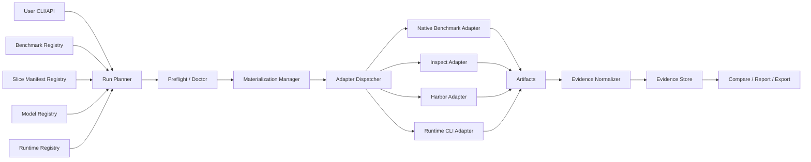

# BenchEval Concept-Zero v0.3

**Document type:** Concept-Zero / product and architecture HLD
**Project:** BenchEval vNext
**Status:** Replacement proposal after codebase observation and external benchmark research
**Date:** 2026-06-17 (revised 2026-06-17 — benchmark research + factual corrections, see §16 Changelog)
**Primary decision:** Reframe BenchEval from a private Core benchmark project into a public benchmark × model × runtime evaluation control plane.

---

## 0. Executive Summary

BenchEval should not be a benchmark-authoring project. The product requirement is not “create Core-8/Core-16 tasks.” The product requirement is to answer:

> Given a benchmark or benchmark slice, a model, and a runtime/scaffold, what happened when we ran it, how expensive was it, and what evidence supports the result?

The correct product shape is:

```text
benchmark/slice × model × runtime/scaffold × harness adapter → normalized evidence panel
```

The current Core-first direction is misaligned. A small private Core suite can be useful as an internal harness self-test or regression probe, but it should not be the main product surface. BenchEval’s main value should be adapter orchestration, runtime normalization, cost-controlled slicing, artifact preservation, and comparable reporting across existing benchmark ecosystems.

This document supersedes the previous private-first concept. Public benchmarks are no longer a side appendix called “Calibration Pack.” They are the product substrate. Core-8/Core-16 are demoted to optional internal self-tests.

The MVP should deliver:

1. A benchmark registry with runnable adapters, not just metadata.
2. A slice/manifest system for smoke, lite, and full runs.
3. A runtime registry for Claude Code, Codex CLI, native API/Inspect, Harbor agents, and future runtimes.
4. A model registry that separates model identity from runtime identity.
5. A run planner that materializes tasks, invokes native harnesses, applies budgets, and cleans workspaces.
6. An evidence normalizer that preserves native scores while adding consistent cost, latency, runtime, artifact, and failure metadata.
7. A report/compare/export layer that can answer “Claude Code + model A vs Codex CLI + model B on Terminal-Bench smoke” without pretending all benchmarks share one universal score.

The first engineering target is not Core-16. It is one end-to-end public adapter path with runtime dimension captured correctly.

---

## 1. Product Definition

BenchEval is an evaluation control plane for running existing benchmarks against selected models and selected runtimes/scaffolds under a reproducible, cost-bounded, evidence-preserving workflow.

BenchEval is not a new public leaderboard, not a universal benchmark, and not a custom harness rewrite. Its job is to bridge and normalize existing benchmark ecosystems.

### 1.1 User Questions

BenchEval must answer these questions directly:

| Question | Required capability |
|---|---|
| How good is model X on benchmark Y? | Benchmark adapter + model profile + native score capture. |
| How good is model X when driven through runtime R? | Runtime registry + runtime-specific launch adapter. |
| Is Claude Code better than Codex CLI for this benchmark slice? | Same benchmark, same slice, different runtime, normalized evidence. |
| Can I run only a cheap smoke subset? | Slice manifests: smoke, lite, full, custom. |
| Can I avoid rebuilding benchmark environments manually? | Materialization manager, cache, pinned harness versions, cleanup lifecycle. |
| Can I compare historical runs? | Evidence store, versioned run metadata, report/compare/export. |
| Can I trust the result? | Native artifacts, verifier logs, harness version, contamination/risk labels, failure taxonomy. |

### 1.2 Product Principle

Do not invent tasks when an existing benchmark and harness already exist. Build adapters, not benchmark clones.

The only acceptable custom “task” layer in MVP is an internal self-test pack proving that BenchEval’s adapter, evidence, and reporting paths work. It must not be marketed or treated as the main evaluation signal.

---

## 2. Facts, Assumptions, Inferences, Recommendations

### 2.1 Facts from External Research

Inspect AI is a frontier-evaluation framework developed by the UK AI Security Institute and Meridian Labs. It supports coding, agentic, reasoning, behavioral, and multimodal evaluations, with tools, scorers, logging, and sandbox integrations. It is suitable as a lightweight orchestration layer for model/API-driven evaluations and custom wrappers. [R1]

Harbor is a framework from the creators of Terminal-Bench for evaluating and optimizing agents and language models in containerized environments. Its README states it supports arbitrary agents including Claude Code, OpenHands, and Codex CLI, and can scale horizontally through sandbox/cloud providers such as Daytona, Modal, E2B, Runloop, Tensorlake, LangSmith, Blaxel, and Novita Sandbox. Harbor is also the official harness for Terminal-Bench 2.0 (`harbor run --dataset terminal-bench@2.0 --agent claude-code`). Repository: `github.com/harbor-framework/harbor` (Apache-2.0). [R2]

Terminal-Bench 2.0 is a hard terminal-agent benchmark with 89 curated tasks in real terminal environments (v1.0 had 80 tasks; v2.0 has 89). It is "harbor-native": tasks are expressed in the Harbor task format and run with the Harbor harness, which pre-integrates Claude Code, OpenHands, Codex CLI, and other CLI agents. Repository: `github.com/laude-institute/terminal-bench-2`; leaderboard: `tbench.ai`. [R3]

SWE-bench Verified is a human-filtered 500-instance subset of SWE-bench, but OpenAI’s 2026 analysis says it is increasingly contaminated and no longer suitable for measuring frontier autonomous software-engineering progress. OpenAI found flawed tests in 59.4% of the audited subset and evidence that frontier models had seen at least some problems or solutions during training. [R4] [R5]

SWE-rebench introduces an automated pipeline for collecting interactive software-engineering tasks and reports more than 21,000 Python-based tasks; SWE-rebench V2 reports 32,000+ tasks across 20 languages and 3,600+ repositories. These projects are relevant because they directly address scale and contamination issues in static SWE evaluation. [R6] [R7]

BFCL V4 evaluates function/tool calling and is periodically updated. It is useful as a model/tool-calling benchmark, but it is less suitable for evaluating full coding runtimes such as Claude Code or Codex CLI unless wrapped as a runtime-specific tool-call scenario. [R8]

τ-bench evaluates tool-agent-user interaction using simulated users, domain APIs, policy guidelines, final database-state comparison, and pass^k reliability measurement. It is relevant for multi-turn tool workflows and policy adherence. [R9]

LiveCodeBench continuously collects coding problems over time and covers capabilities beyond pure code generation, including self-repair, code execution, and test-output prediction. BigCodeBench evaluates practical programming with diverse function calls and complex instructions, with 1,140 fine-grained tasks in the full set. [R10] [R11]

CyberSecEval 4 introduces AutoPatchBench for automatic native-code security patching and CyberSOC-style defense evaluation. These are relevant only under a defensive, sandboxed, non-operational security boundary. [R12]

OSWorld provides a real computer environment for multimodal agents and includes 369 desktop/web tasks across operating systems and applications. It is useful post-MVP, but it is expensive and introduces GUI/VM flakiness that should not block the first BenchEval adapter path. [R13]

Claude Code and Codex CLI are not just model endpoints. They are runtimes/scaffolds with file access, command execution, permissions, settings, skills/subagents/hooks/MCP-like extensibility, or sandbox policies. Therefore, BenchEval must model “runtime” separately from “model.” [R14] [R15]

Recent benchmark-integrity research shows that agent benchmarks can be reward-hacked: Terminal Wrench reports 331 reward-hackable terminal-agent environments and 3,632 exploit trajectories, while Berkeley RDI reports benchmark-scoring vulnerabilities across multiple prominent agent benchmarks. BenchEval must preserve native results but attach verifier-integrity and reward-hacking risk metadata rather than blindly treating public scores as capability truth. [R16] [R17]

Several cybersecurity agent benchmarks are directly relevant to BenchEval's defensive-only Core boundary and to the Stretch/Calibration lanes that may include offensive-restricted evaluation under explicit safety review:

- **CyberGym** (arXiv 2506.02548, UC Berkeley, v3 2026-03) is a large-scale benchmark of 1,507 real-world vulnerabilities across 188 open-source projects (OpenSSL, FFmpeg, OpenCV, …). The task is **vulnerability reproduction**: given a vulnerability description and the pre-patch codebase, an agent must generate a proof-of-concept (PoC) that triggers the bug. It is execution-based and objectively verified with sanitizers; it is ~7.5× larger than prior cyber agent benchmarks. Top agents reach ~20–30% single-trial success. It was used in Anthropic's Claude-Sonnet-4.5 system card. During evaluation agents autonomously found 34 zero-day vulnerabilities and 18 incomplete patches (responsibly disclosed). [R18]
- **ExploitGym** (Berkeley RDI, `cybergym.io`) is a companion benchmark of 869 instances across three domains — userspace, browser, and the Linux kernel — where the task is **full exploit generation**: given a vulnerability and a proof-of-vulnerability input, an agent must craft an exploit achieving unauthorized code execution. This is explicitly **offensive-restricted**: it belongs only in the Stretch lane behind an explicit safety review and must never be Core-weighted. [R19]
- **CyberGym-E2E** (Berkeley RDI, paper 2026, full release pending) extends toward end-to-end evaluation of the full vulnerability lifecycle (find → reproduce → exploit → patch). It is a roadmap item, not yet a runnable public task set. [R20]
- **BountyBench** (arXiv 2505.15216, Stanford CRFM) is a framework with 25 real-world systems and 40 bug bounties (awards $10–$30,485) covering 9 of the OWASP Top 10. It defines three task types — Detect (find a new vulnerability), Exploit (exploit a given vulnerability), Patch (patch a given vulnerability) — and evaluates agent attackers and defenders in a Kali Linux container. It directly exercises the runtime dimension (Claude Code, Codex CLI, custom agents). [R21]

**Naming note: DeepSWE.** "DeepSWE" (e.g. `DeepSWE-32B`) is an **RL-trained agent/model** built by All Hands on top of SWE-bench-style tasks, not a standalone runnable public benchmark with a canonical task set. BenchEval must not treat `deepswe` as an executable adapter target; it should resolve only to a `reference_only`/`unverified` registry entry, and any promotion requires a verified canonical task source, manifest policy, and adapter plan. A distinct public benchmark dataset named "DeepSWE" was not verified as of 2026-06-17. [R22]

### 2.2 Assumptions

BenchEval users care about model selection and runtime/scaffold selection, not just abstract model capability.

Benchmark environments are expensive, fragile, and heterogeneous. The product must reduce repeated manual setup and full-suite execution cost.

Most public benchmarks already include task definitions, harnesses, or reference runners. Reusing those native harnesses is lower-risk than reimplementing tasks inside BenchEval.

The current codebase already has useful pieces: benchmark catalog metadata, manifests, run/report/export/evidence pieces, provider smoke checks, and cleanup lifecycle primitives. The missing product layer is runnable adapter + runtime dimension.

### 2.3 Inferences

A Core-first design creates the wrong incentive. It spends engineering time authoring and maintaining artificial microtasks while the user need is public benchmark routing and runtime comparison.

A benchmark catalog without runnable adapters is only a phone book. It helps discovery but does not answer performance questions.

A CLI backend flag such as `local|inspect|harbor` is not the same as runtime identity. `harbor` is a harness/execution backend; `claude-code` and `codex-cli` are runtimes/scaffolds. These dimensions must not be collapsed.

Public benchmarks are still useful even when contaminated or imperfect, but they must be labeled correctly: compatibility smoke, rough external signal, or current/fresh capability probe depending on benchmark age and construction.

### 2.4 Recommendations

Reframe BenchEval as a public benchmark execution and evidence normalization control plane.

Demote Core-8/Core-16 to `internal-selftest` or `private-regression`, outside the main benchmark list and outside the main product narrative.

Implement runtime identity as a first-class field in CLI, registry, evidence records, reports, and comparisons.

Implement native benchmark adapters incrementally. Do not port benchmark internals unless the native harness is unusable.

Make slice manifests the default execution mode. Full-suite runs should require explicit opt-in.

Preserve native benchmark metrics. Normalize only cross-cutting operational metadata: cost, latency, runtime version, model version, token usage, artifacts, failure class, harness version, and cleanup result.

---

## 3. Goals and Non-Goals

### 3.1 Goals

| Goal | Requirement |
|---|---|
| Public benchmark execution | Users can select a benchmark and slice, then run it without manual environment construction. |
| Runtime comparison | Users can compare `claude-code`, `codex-cli`, `inspect-api`, `harbor-agent`, and future runtimes on the same slice. |
| Model comparison | Users can compare model IDs under the same runtime and benchmark slice. |
| Cost control | Smoke/lite/full/custom manifests are first-class. Full runs are not the default. |
| Adapter reuse | Use native harnesses where possible: Harbor for terminal tasks, benchmark-specific runners for SWE/code/tool benchmarks, Inspect wrappers where useful. |
| Evidence preservation | Store native artifacts, logs, stdout/stderr, diffs, verifier outputs, run config, versions, costs, and failure labels. |
| Controlled interpretation | Reports distinguish benchmark score, runtime behavior, model behavior, harness failure, and environment failure. |
| Minimal custom infra | Build registry, adapter dispatch, evidence normalization, and reporting glue. Do not rebuild benchmark suites. |

### 3.2 Non-Goals

| Non-goal | Reason |
|---|---|
| Inventing Core-8/Core-16 as the main benchmark | Misaligned with the product need and duplicates public benchmark effort. |
| Creating a universal weighted score across all benchmarks | Cross-benchmark aggregation is usually misleading. |
| Reimplementing SWE-bench, Terminal-Bench, BFCL, τ-bench, or OSWorld | Higher maintenance cost and likely worse correctness than native harnesses. |
| Public leaderboard | Not needed for internal model/runtime selection and increases gaming pressure. |
| Full-suite default execution | Too expensive and slow; smoke/lite slices are required. |
| Offensive cyber capability evaluation as a core product | Safety, legal, and operational boundaries are too risky. Use defensive/sandboxed subsets only. |
| Live internet tasks in MVP | Nondeterminism, provider drift, and reproducibility problems. |
| GUI/desktop agents in MVP | VM, rendering, accessibility, and timing flakiness should be post-MVP. |

---

## 4. Current Codebase Alignment Assessment

Based on the repository observation supplied in the current review, the codebase is partially aligned at the infrastructure level but misaligned at the product level.

### 4.1 What Is Useful

| Existing area | Product value |
|---|---|
| `config/benchmarks.yaml` | Seed for benchmark registry. |
| Benchmark list/show CLI | Discovery surface. |
| Manifest support | Basis for smoke/lite/full slices and sequential large-suite runs. |
| `--manifest --mode single --cleanup` lifecycle | Useful for expensive benchmark slices. |
| Evidence/report/compare/export path | Foundation for normalized result panels. |
| Provider smoke/doctor scripts | Useful preflight gates before spending runtime budget. |
| Inspect/Harbor backend concepts | Useful harness targets, but not runtime identities. |

### 4.2 What Is Misaligned

| Current direction | Problem |
|---|---|
| Core-8/Core-16 as main suite | Answers an internal regression question, not the user’s benchmark/runtime question. |
| Public benchmark catalog as metadata only | Discovery without execution is not enough. |
| `backend=local|inspect\|harbor` as primary execution dimension \| Collapses harness/backend with runtime/scaffold. |
| No first-class `runtime=claude-code|codex-cli\|...` \| Cannot answer model + runtime performance questions. |
| Native task IDs only for custom Core tasks | Public benchmark instance IDs cannot be materialized and executed. |
| Roadmap places adapters late | The adapter layer is the product, not a late calibration feature. |

### 4.3 Required Reframe

Old frame:

```text
Private Core suite first
Public benchmarks later as calibration
Runtime mostly implicit in backend/provider
```

New frame:

```text
Public benchmark adapters first
Runtime registry first-class
Core suite only as internal self-test/private regression
```

---

## 5. Benchmark Strategy

BenchEval should classify benchmarks by execution role, not by marketing importance. The machine-readable catalog of recognized public benchmarks lives in `config/benchmarks.yaml` and is exposed via `bencheval benchmark list|show`; it currently holds 64 entries and is the validation target for adapter planning. This document lists representative examples; the YAML registry is authoritative for count, aliases, safety lane, and adapter status.

### 5.1 Benchmark Classes

| Class | Purpose | Representative examples | MVP handling |
|---|---|---|---|
| Model-only / API eval | Test model output, tool-call schema, function calling, reasoning. | BFCL, LiveCodeBench generation modes, BigCodeBench complete/instruct, HumanEval/MBPP (+ variants), APPS, CodeContests, MultiPL-E, ClassEval, SciCode, EvalPerf, CRUXEval, GSM8K, MATH, AIME, MMLU-Pro, GPQA, SimpleQA, LiveBench, TruthfulQA, ChartQA, DocVQA, MMMU. | Useful for cheap smoke and API model comparison. |
| Agentic coding eval | Test repository issue-to-patch workflows. | SWE-bench family (Verified/Lite/Full/Pro/Multilingual/Multimodal/Verified-Mini), Multi-SWE-bench, SWE-Lancer, SWE-Gym, SWE-smith, SWE-rebench, Commit0, R2E (Repo-to-Environment), Aider Polyglot, DevEval, RepoBench, DS-1000, CodeClash. | High-priority; requires materialization and verifier artifact capture. |
| Terminal/runtime eval | Test shell/file/process workflows under an agent runtime. | Terminal-Bench 2.0 (89 tasks, Harbor-native), ML-Bench, MLE-Bench, MLAgentBench, PaperBench. | High-priority for Claude Code vs Codex CLI comparison. |
| Tool-agent-user eval | Test policy, tools, simulated user, final state. | τ-bench, τ²-bench, API-Bank, ToolBench, ACEBench, AgentDojo. | P2/P3 after runtime registry works. |
| Web & general agents | Test browser/multimodal/multi-domain agents. | WebArena, VisualWebArena, WebVoyager, Mind2Web, WebShop, GAIA, AgentBench, AgentBoard, BrowseComp. | P2/P3; GUI/browser flakiness requires isolation. |
| OS/computer-use eval | Test desktop/mobile/multimodal agents. | OSWorld, Windows Agent Arena, OSUniverse, AndroidWorld, VisualAgentBench (VAB). | Post-MVP due VM/GUI complexity. |
| Long-context eval | Test retrieval over very long contexts. | LongBench, InfiniteBench, LooGLE, Needle-in-a-Haystack. | Cheap model-only smoke; useful for context-window comparison. |
| Defensive security eval | Test patching, triage, secure-code repair, SOC workflows, vulnerability reproduction. | CyberSecEval 4 AutoPatchBench/CyberSOC, SECURE, SecBench, Cybench (CTF), CyberGym (vulnerability reproduction, 1,507 instances), BountyBench (Detect/Patch tasks), CyberGym-E2E (pending). | Defensive/sandboxed subsets only, post initial adapter. |
| Offensive-restricted security eval | Full exploit generation against real targets. | ExploitGym (869 instances, userspace/browser/kernel), BountyBench Exploit tasks, CyberGym PoC generation against unpatched code. | **Stretch only**, explicit safety review, never Core-weighted, no live targets. |
| General LLM eval harness | Test broad NLP/knowledge/reasoning datasets. | lm-evaluation-harness, HELM. | Optional adapter after product core; not the main runtime-comparison use case. |

### 5.2 Recommended Initial Adapter Set

The first adapters should maximize signal per engineering hour. Adapter status is tracked in `config/benchmarks.yaml` (`cataloged`, `adapter_pending`, `manifest_available`, `unverified`); the table below reflects verified facts as of 2026-06-17.

| Priority | Adapter | Verified scale | Why | Slice |
|---:|---|---|---|---|
| P0 | Terminal-Bench 2.0 via Harbor | 89 tasks; Harbor-native; supports Claude Code, OpenHands, Codex CLI | Directly exercises CLI runtimes; Harbor already models agent execution; official harness relationship. | `smoke-5`, then `lite-20`, then official full. |
| P0 | SWE-bench-family smoke adapter | Verified 500 / Lite 300 / Full 2,294 / Pro 1,865 / Multilingual 300 / Multimodal 517; repo already has SWE-style manifests | Validates issue-to-patch materialization. | `smoke-10`; label Verified as contaminated/legacy if used. |
| P0 | SWE-rebench | >21,000 Python tasks (NeurIPS 2025); V2 reports 32,000+ across 20 languages | Decontaminated, continuously refreshed; directly addresses SWE-bench saturation. | latest window / hard subset. |
| P1 | BFCL V4 adapter | Multi-suite (Gorilla; AST + executable) | Cheap model/tool-calling signal; validates model-only path. | official small subset or category slice. |
| P1 | LiveCodeBench or BigCodeBench adapter | LiveCodeBench rolling; BigCodeBench 1,140 tasks | Cheap coding model signal; useful for API model comparison. | latest window / hard subset / instruct subset. |
| P1 | SWE-Gym / Commit0 / R2E | SWE-Gym 2,438 Python tasks; Commit0 57 libraries; R2E framework | RL-training and repo-to-execution envs; useful for agent training and self-improvement eval. | small fixed subset. |
| P2 | τ-bench adapter | retail + airline domains (Sierra) | Tests multi-turn tool/policy reliability. | domain smoke. |
| P2 | CyberSecEval defensive adapter | CyberSecEval 4 AutoPatchBench/CyberSOC | Defensive-only, sandboxed; relevant to security use cases. | AutoPatchBench smoke or CyberSOC smoke only. |
| P2 | CyberGym (defensive slice) | 1,507 real-world vulns / 188 projects; vulnerability reproduction | Large-scale, execution-verified; used in Claude-Sonnet-4.5 system card. Defensive framing only (patch verification, not exploit deployment). | `smoke-10` reproduction subset; never live-target exploit. |
| P3 | BountyBench (Detect + Patch only) | 25 systems / 40 bounties / 9-of-10 OWASP Top 10; Stanford CRFM | Captures dollar-impact offense/defense; restrict to Detect + Patch tasks, exclude Exploit tasks from non-Stretch lanes. | small Kali-container slice. |
| P3 | OSWorld adapter | 369 desktop/web tasks | GUI/runtime dimension, high operational complexity. | small verified slice. |
| Stretch | ExploitGym | 869 instances / 3 domains | **Offensive-restricted.** Full exploit generation; requires explicit safety review and approval gate; never Core-weighted, never live targets. | smoke only under safety review. |
| Stretch | CyberGym-E2E | pending release (paper 2026) | End-to-end vulnerability lifecycle; wait for public task set before adapter work. | n/a until release. |

SWE-bench Verified should not be used as a frontier promotion benchmark. It can still be used as an adapter smoke test because its ecosystem is widely supported and its task IDs are familiar, but reports must label it as contaminated/legacy for frontier capability inference.

---

## 6. Runtime Model

BenchEval must separate four concepts:

```text
model_id       = the model or provider endpoint used for generation
runtime_kind   = the agent scaffold/host driving the task
harness_kind   = the benchmark execution harness or environment manager
adapter_kind   = the BenchEval glue mapping run spec ↔ native harness ↔ evidence
```

### 6.1 Examples

| Scenario | model_id | runtime_kind | harness_kind | adapter_kind |
|---|---|---|---|---|
| API model on BFCL | `openai/gpt-*` | `inspect-api` or `native-api` | `bfcl-native` | `bfcl` |
| Claude Code on Terminal-Bench | configured Claude model | `claude-code` | `harbor` | `terminal-bench-harbor` |
| Codex CLI on Terminal-Bench | configured Codex model | `codex-cli` | `harbor` | `terminal-bench-harbor` |
| mini-SWE-agent on SWE-bench | model configured inside agent | `mini-swe-agent` | `swebench-native` | `swebench` |
| API model on LiveCodeBench | model endpoint | `native-api` | `livecodebench-native` | `livecodebench` |

### 6.2 Runtime Registry Contract

A runtime profile must declare:

```yaml
schema_version: "0.1"

runtime:
  id: "claude-code"
  kind: "cli_agent"
  display_name: "Claude Code"
  lifecycle: "external_process"
  supported_platforms: ["macos", "linux"]
  supported_harnesses: ["harbor", "native_repo", "custom_wrapper"]
  model_binding: "runtime_configured"   # runtime_configured | bencheval_injected | not_applicable

launch:
  command_template: ["claude", "--permission-mode", "...", "..."]
  working_dir_policy: "ephemeral_workspace"
  env_vars_required: []
  env_vars_optional: []
  timeout_sec_default: 300

capabilities:
  reads_files: true
  edits_files: true
  runs_shell: true
  supports_mcp: true
  supports_subagents: true
  supports_hooks: true
  supports_noninteractive: true
  supports_json_output: "partial"

safety:
  network_default: "deny"
  workspace_boundary: "ephemeral_only"
  requires_user_approval: false
  forbidden_features_for_eval:
    - "external_network_unless_benchmark_requires"
    - "persistent_global_config_mutation"

versioning:
  version_command: ["claude", "--version"]
  config_hash_inputs:
    - ".claude"
    - "CLAUDE.md"
```

Equivalent profiles are required for `codex-cli`, `inspect-api`, `harbor-agent`, `mini-swe-agent`, and future runtimes.

### 6.3 Runtime Failure Classes

| Failure class | Meaning |
|---|---|
| `runtime_launch_failure` | CLI or runtime process failed before task start. |
| `runtime_auth_failure` | Required login/token/subscription unavailable. |
| `runtime_permission_block` | Runtime refused an action because of policy/sandbox settings. |
| `runtime_output_unparseable` | Runtime produced no extractable final artifact. |
| `runtime_context_overflow` | Runtime exceeded context or compaction failed. |
| `runtime_tool_failure` | Runtime tool layer failed independent of model reasoning. |
| `runtime_config_drift` | Runtime settings changed relative to pinned profile. |
| `runtime_budget_exceeded` | Runtime exceeded wall time, steps, token, or cost envelope. |

These must be distinct from `model_wrong_solution` and `harness_failure`.

---

## 7. Architecture

### 7.1 System Diagram



### 7.2 Component Responsibilities

| Component | Responsibility | MVP decision |
|---|---|---|
| Benchmark Registry | Catalog runnable benchmarks, adapters, source, license, native harness, metrics. | Required. Existing metadata becomes executable contract. |
| Slice Manifest Registry | Defines `smoke`, `lite`, `full`, and custom instance lists. | Required. Default to smoke. |
| Model Registry | Stores model identity, provider, pricing, context limits, API route, version capture. | Required. |
| Runtime Registry | Stores CLI/API/scaffold runtime profiles and capability metadata. | Required. New. |
| Run Planner | Builds a concrete execution plan from benchmark + slice + model + runtime. | Required. |
| Preflight / Doctor | Checks harness install, runtime auth, disk, Docker/Harbor, env vars, budget. | Required. |
| Materialization Manager | Creates ephemeral workspaces, fetches images/repos/datasets, applies cleanup. | Required. |
| Adapter Dispatcher | Routes to native/Inspect/Harbor/runtime adapters. | Required. |
| Evidence Normalizer | Converts native output into `EvidenceRecord` while preserving native artifacts. | Required. |
| Evidence Store | Stores run configs, attempts, scores, costs, logs, diffs, artifacts, verifier output. | Required. JSONL initially, Parquet/DuckDB by P2/P3. |
| Compare/Report/Export | Produces markdown/JSON/HTML reports and cross-run comparisons. | Required. |
| Dashboard | UI over stored evidence. | Post-MVP. |

### 7.3 Adapter Rule

Adapters must prefer native harnesses.

Allowed adapter patterns:

1. **Native wrapper:** call official benchmark runner, parse native result files, preserve raw artifacts.
2. **Harbor wrapper:** use Harbor for benchmarks already expressed as Harbor tasks or terminal-agent tasks.
3. **Inspect wrapper:** use Inspect where it adds model/provider/tool orchestration without reimplementing benchmark semantics.
4. **Compatibility shim:** only when the benchmark lacks a usable runner; must be explicitly labeled.

Forbidden MVP pattern:

```text
Copy public benchmark instances into custom Core tasks and treat them as BenchEval-native tasks.
```

That creates maintenance debt and obscures native benchmark semantics.

---

## 8. CLI Surface

### 8.1 Discovery

```text
bencheval benchmark list
bencheval benchmark show <benchmark_id>
bencheval benchmark slices <benchmark_id>
bencheval runtime list
bencheval runtime show <runtime_id>
bencheval model list
bencheval model show <model_id>
bencheval adapter list
```

### 8.2 Preflight

```text
bencheval doctor
bencheval doctor --benchmark terminal-bench --runtime claude-code
bencheval run --dry-run \
  --benchmark terminal-bench \
  --slice smoke-5 \
  --runtime codex-cli \
  --model runtime-default
```

Dry-run output must include:

- Benchmark and slice.
- Instance count.
- Harness and adapter.
- Runtime and model-binding mode.
- Estimated cost envelope.
- Expected disk/cache requirements.
- Network policy.
- Cleanup policy.
- Known benchmark caveats.
- Whether the run is valid for model comparison, runtime comparison, or adapter smoke only.

### 8.3 Execution

```text
bencheval run \
  --benchmark terminal-bench \
  --slice smoke-5 \
  --runtime claude-code \
  --model runtime-default \
  --cleanup always

bencheval run \
  --benchmark swe-bench-verified \
  --slice smoke-10 \
  --runtime mini-swe-agent \
  --model openai/gpt-5.3-codex \
  --label adapter-smoke

bencheval run \
  --benchmark bfcl-v4 \
  --slice tool-smoke \
  --runtime native-api \
  --model openai/gpt-5.3
```

### 8.4 Comparison

```text
bencheval compare <run_a> <run_b>
bencheval compare --benchmark terminal-bench --slice smoke-5 --latest 10
bencheval report <run_id> --format markdown|json|html
bencheval export <run_id> --format jsonl|parquet
```

Comparison rules:

- Same benchmark + same slice + same harness version: allowed.
- Same benchmark + different slice: diagnostic only.
- Different benchmark: no single merged score; report side-by-side only.
- Different runtime under same benchmark/slice: valid runtime comparison if model binding is clear.
- Different model under same runtime/benchmark/slice: valid model comparison if runtime config is unchanged.

---

## 9. Data Contracts

### 9.1 Benchmark Contract

```yaml
schema_version: "0.1"

benchmark:
  id: "terminal-bench"
  display_name: "Terminal-Bench"
  domain: "terminal_agent"
  source_type: "public"
  primary_use: "runtime_comparison"
  native_harness: "harbor"
  default_adapter: "terminal-bench-harbor"
  license: "benchmark-specific"
  homepage: "https://www.tbench.ai/"
  repository: "https://github.com/laude-institute/terminal-bench-2"

metrics:
  native_primary: "resolved"
  native_secondary:
    - "pass_rate"
    - "wall_time"
    - "steps"
  normalize_as:
    - "primary_pass"
    - "latency_sec"
    - "runtime_failure_class"

caveats:
  contamination_risk: "medium"
  reward_hack_risk: "medium"
  requires_sandbox: true
  live_network_required: false

slices:
  - id: "smoke-5"
    manifest: "config/manifests/terminal-bench-smoke-5.txt"
  - id: "lite-20"
    manifest: "config/manifests/terminal-bench-lite-20.txt"
  - id: "full"
    native_selector: "all"
```

### 9.2 Slice Manifest Contract

```yaml
schema_version: "0.1"

slice:
  id: "swe-bench-verified-smoke-10"
  benchmark_id: "swe-bench-verified"
  purpose: "adapter_smoke"
  selection_policy: "fixed_instance_ids"
  valid_for:
    - "adapter_validation"
    - "rough_regression"
  invalid_for:
    - "frontier_model_promotion"

instances:
  - "django__django-11099"
  - "..."

budget:
  max_instances: 10
  max_wall_clock_sec_per_instance: 900
  max_total_cost_usd: 50

labels:
  contamination_warning: true
  public_benchmark: true
  full_suite_required_for_public_claim: true
```

### 9.3 EvidenceRecord v0.3

```yaml
schema_version: "0.3"

run:
  run_id: "20260617T120000Z-terminal-bench-smoke5-claude-code"
  benchmark_id: "terminal-bench"
  benchmark_version: "2.0"
  slice_id: "smoke-5"
  adapter_id: "terminal-bench-harbor"
  harness_kind: "harbor"
  harness_version: "<captured>"

model:
  model_id: "runtime-default"
  provider: "runtime-configured"
  resolved_model_id: "<captured-if-available>"
  temperature: 0
  model_config_hash: "sha256:..."

runtime:
  runtime_id: "claude-code"
  runtime_version: "<captured>"
  runtime_kind: "cli_agent"
  runtime_config_hash: "sha256:..."
  permission_mode: "<captured>"
  network_policy: "deny"
  workspace_policy: "ephemeral"

attempt:
  instance_id: "<native-instance-id>"
  status: "completed"
  native_score: {...}
  primary_pass: true
  normalized_score: 1.0
  failure_class: null
  cost_usd: 1.23
  latency_sec: 240
  token_usage: {...}
  steps: 17

artifacts:
  raw_result_path: "runs/<run_id>/native/result.json"
  stdout_path: "runs/<run_id>/stdout.log"
  stderr_path: "runs/<run_id>/stderr.log"
  workspace_diff_path: "runs/<run_id>/diff.patch"
  verifier_log_path: "runs/<run_id>/verifier.log"
  trace_path: "runs/<run_id>/trace.jsonl"

integrity:
  cleanup_result: "success"
  replayable: true
  verifier_integrity_label: "native"
  reward_hack_risk_label: "known_public_risk"
  contamination_label: "public_possible"
```

---

## 10. Scoring and Reporting Policy

### 10.1 Preserve Native Metrics

BenchEval must not overwrite benchmark-native semantics. If Terminal-Bench reports pass rate and confidence interval, preserve that. If SWE-bench reports resolved instances, preserve that. If BFCL reports AST/state/function-call categories, preserve those.

BenchEval adds an operational evidence layer:

- Cost.
- Latency.
- Token usage.
- Runtime version.
- Model version.
- Harness version.
- Adapter version.
- Failure class.
- Cleanup status.
- Artifact paths.
- Benchmark caveats.

### 10.2 No Universal Weighted Score

BenchEval must not compute a single “model score” across unrelated benchmarks by default.

Allowed:

```text
Terminal-Bench smoke-5: Claude Code vs Codex CLI
SWE-bench smoke-10: model A vs model B under mini-SWE-agent
BFCL V4 tool-smoke: model A vs model B under native API
```

Forbidden as default:

```text
0.3 * Terminal-Bench + 0.3 * SWE-bench + 0.2 * BFCL + 0.2 * τ-bench = universal model score
```

A custom weighted portfolio may be supported later as a user-defined policy object, but it must be labeled as a local decision policy, not a benchmark-native score.

### 10.3 Interpretation Labels

Every report must label the run:

| Label | Meaning |
|---|---|
| `adapter_smoke` | Validates BenchEval adapter path, not model capability. |
| `rough_regression` | Useful for internal trend checks. |
| `benchmark_native_claim` | Full benchmark run under official settings. |
| `runtime_comparison` | Same benchmark/slice, model binding clear, runtime differs. |
| `model_comparison` | Same benchmark/slice/runtime, model differs. |
| `contaminated_or_legacy` | Public benchmark likely affected by contamination or saturation. |
| `defensive_security_only` | Security benchmark was transformed or selected for defensive evaluation only. |

---

## 11. Migration Plan from Current Codebase

### 11.1 Rename and Reposition

| Current artifact | New treatment |
|---|---|
| `config/selftest/core-8/` | Canonical selftest lane (P9.2); registry falls back to legacy `config/tasks/` if present. |
| `config/selftest/core-16/` | Expansion suite; freeze growth until public adapters are live-truthful. |
| `Calibration Pack` | Rename to `Public Benchmark Adapters`; make it product-main. |
| `benchmark_registry.py` | Promote from catalog metadata to runnable registry contract. |
| `manifest.py` | Promote to slice manifest manager. |
| `backend` field | Rename/split into `harness_kind` and `executor_backend`; do not use as runtime identity. |
| Legacy `cursor_cli`/experimental fields | Migrate into runtime registry or delete if stale. |
| `EvidenceRecord` | Add `runtime`, `harness`, `adapter`, `benchmark`, `slice`, and caveat fields. |

### 11.2 Engineering Sequence

1. Freeze Core work except minimal self-test maintenance.
2. Add runtime registry schema and runtime discovery CLI.
3. Add `runtime_id`, `harness_kind`, `adapter_id`, and `slice_id` to `EvidenceRecord`.
4. Convert `config/benchmarks.yaml` into executable benchmark contracts.
5. Convert current manifests into typed slice manifests.
6. Implement dry-run planner.
7. Implement one real adapter end-to-end.
8. Add Terminal-Bench/Harbor runtime comparison path.
9. Add SWE-bench-family adapter path with contamination warning labels.
10. Add BFCL/LiveCodeBench/BigCodeBench model-only adapters.
11. Add Parquet/DuckDB analytics after JSONL artifacts stabilize.

### 11.3 First Vertical Slice

Recommended first vertical slice:

```text
Terminal-Bench smoke-5
× runtime: claude-code, codex-cli
× model: runtime-default
× harness: harbor
× output: EvidenceRecord v0.3 + markdown report + compare view
```

Why this first:

- It directly validates runtime dimension.
- Harbor already targets containerized terminal-agent evaluation.
- Terminal-Bench is agent/runtime-native rather than pure API model-only.
- It will immediately expose auth, launch, cleanup, artifact, and runtime-version problems.

Second vertical slice:

```text
SWE-bench-family smoke-10
× runtime: mini-swe-agent or native harness first
× optional runtime: claude-code/codex-cli after materialization works
× output: adapter smoke report with contamination/legacy caveat
```

Third vertical slice:

```text
BFCL V4 or LiveCodeBench smoke
× runtime: native-api / inspect-api
× model: explicit provider model
× output: cheap model-only comparison report
```

---

## 12. Risk Register

| Risk | Severity | Mitigation |
|---|---:|---|
| Core work consumes product time | High | Freeze Core as self-test; public adapters are P0. |
| Runtime/model conflation | High | Separate `model_id`, `runtime_id`, `harness_kind`, `adapter_id`. |
| Public benchmark contamination | High | Add caveat labels; prefer fresh/current benchmarks for promotion; use contaminated benchmarks only for adapter smoke or rough trend. |
| Reward-hackable public verifiers | High | Preserve native result but label verifier-integrity risk; add artifact integrity checks; do not make promotion decisions on one public score. |
| Native harness drift | High | Pin benchmark repo version, Docker image digest, harness version, and adapter version. |
| Environment setup failures misread as model failures | High | Separate `harness_failure`, `runtime_launch_failure`, `materialization_failure`, and `model_wrong_solution`. |
| Runtime auth/subscription failure | Medium | Doctor checks before run; mark invalid, not model failure. |
| Cost overrun | High | Default smoke slices, dry-run budgets, per-run and per-instance hard caps. |
| CLI runtimes mutate global config | Medium | Ephemeral home/workspace, config hash capture, sandboxed runtime profile. |
| Cleanup destroys evidence | Medium | Cleanup only task workspace; evidence artifacts persisted before cleanup. |
| Cross-benchmark false equivalence | High | No universal weighted score by default; side-by-side only. |
| Cyber benchmark scope creep | High | Defensive-only subsets, sandbox-only, no live targets, explicit safety review. |
| GUI benchmark flakiness | Medium | Post-MVP only; require VM snapshot/replay gates. |
| Adapter maintenance burden | Medium | Native wrappers only; no task reimplementation unless necessary. |

---

## 13. Verification Gates

### 13.1 Adapter Admission Gates

A benchmark adapter cannot be marked runnable unless it passes:

| Gate | Requirement |
|---|---|
| Native harness invocation | Adapter can run at least one official/native instance. |
| Version capture | Benchmark, harness, adapter, runtime, and model versions captured. |
| Evidence completeness | Raw native result, stdout/stderr, verifier logs, artifacts, and run config stored. |
| Failure separation | Harness, runtime, materialization, budget, and model failures are distinguishable. |
| Cleanup replay | Workspace cleanup succeeds without deleting evidence. |
| Slice support | At least one smoke manifest works. |
| Dry-run accuracy | Dry-run predicts instance count, harness, runtime, and budget envelope. |
| Caveat labels | Contamination/reward-hack/safety caveats attached where applicable. |

### 13.2 Runtime Admission Gates

A runtime cannot be marked production-ready unless it passes:

| Gate | Requirement |
|---|---|
| Launch check | Runtime can start noninteractively or under a controlled wrapper. |
| Version check | Runtime version can be captured. |
| Workspace isolation | Runtime operates in ephemeral workspace. |
| Config isolation | Runtime does not mutate user/global config unless explicitly allowed. |
| Network policy | Network behavior is known and controllable. |
| Artifact extraction | Final answer, diff, logs, and verifier output can be extracted. |
| Budget enforcement | Wall-clock and process termination work. |
| Failure mapping | Runtime errors map to standard failure classes. |

### 13.3 Report Validity Gates

A report cannot claim model or runtime superiority unless:

- Benchmark ID is identical.
- Slice ID is identical.
- Adapter version is identical.
- Harness version is identical or difference is explicitly waived.
- Runtime config difference is the intended experimental variable.
- Model config difference is the intended experimental variable.
- Failed/invalid attempts are reported, not silently dropped.
- Caveat labels are shown in the summary.

---

## 14. Roadmap

| Phase | Scope | Exit criteria |
|---|---|---|
| P0 | Reframe and schema freeze | This concept accepted; Core demoted; `runtime_id/harness_kind/adapter_id/slice_id` schema accepted. |
| P1 | Runtime registry + dry-run planner | `benchmark list`, `runtime list`, `run --dry-run` produce correct execution plans. |
| P2 | First runtime benchmark adapter | Terminal-Bench smoke runs through Harbor on at least one CLI runtime and one baseline runtime. |
| P3 | Runtime comparison report | Claude Code vs Codex CLI or equivalent runtime comparison produces normalized evidence and caveat labels. |
| P4 | SWE-family adapter | SWE-bench/SWE-rebench-style smoke materializes instances and stores verifier artifacts. |
| P5 | Model-only adapter | BFCL/LiveCodeBench/BigCodeBench smoke runs through native/API or Inspect path. |
| P6 | Analytics store | DuckDB/Parquet views for cost, latency, pass/fail, runtime failure, and historical regression. |
| P7 | Defensive security adapter | CyberSecEval defensive smoke only, with explicit safety boundary. |
| P8 | GUI/computer-use adapter | OSWorld or related GUI suite after VM/replay stability. |

---

## 15. Final Decision

BenchEval should pivot.

The old direction:

```text
Private Core regression harness + public benchmark catalog + late adapters
```

The required direction:

```text
Public benchmark adapter control plane + runtime registry + evidence normalization + optional internal self-tests
```

The engineering order should change immediately:

1. Stop expanding Core-16 as a product milestone.
2. Keep Core-8 only as a self-test proving local harness/evidence plumbing.
3. Implement runtime registry and EvidenceRecord runtime fields.
4. Make benchmark manifests executable through native adapters.
5. Deliver a real Terminal-Bench/Harbor runtime-comparison vertical slice.
6. Add SWE-family and model-only adapters after the runtime path works.

This puts BenchEval on the same page as the stated requirement: choose benchmark, choose model, choose runtime, run a bounded slice, and produce evidence.

---

## References

[R1] Inspect AI documentation: <https://inspect.aisi.org.uk/>
[R2] Harbor GitHub repository: <https://github.com/harbor-framework/harbor> and Harbor docs: <https://www.harborframework.com/docs>
[R3] Terminal-Bench 2.0 paper: <https://arxiv.org/abs/2601.11868> and Terminal-Bench site: <https://www.tbench.ai/>
[R4] SWE-bench Verified: <https://www.swebench.com/verified.html>
[R5] OpenAI, “Why SWE-bench Verified no longer measures frontier coding capabilities”: <https://openai.com/index/why-we-no-longer-evaluate-swe-bench-verified/>
[R6] SWE-rebench: <https://arxiv.org/abs/2505.20411>
[R7] SWE-rebench V2: <https://arxiv.org/abs/2602.23866>
[R8] Berkeley Function Calling Leaderboard V4: <https://gorilla.cs.berkeley.edu/leaderboard.html>
[R9] τ-bench: <https://arxiv.org/abs/2406.12045>
[R10] LiveCodeBench: <https://livecodebench.github.io/>
[R11] BigCodeBench: <https://bigcode-bench.github.io/> and <https://arxiv.org/abs/2406.15877>
[R12] CyberSecEval 4: <https://meta-llama.github.io/PurpleLlama/CyberSecEval/>
[R13] OSWorld: <https://os-world.github.io/> and <https://arxiv.org/abs/2404.07972>
[R14] Claude Code documentation: <https://docs.anthropic.com/en/docs/claude-code/overview>
[R15] Codex CLI documentation: <https://developers.openai.com/codex/cli> and sandboxing: <https://developers.openai.com/codex/concepts/sandboxing>
[R16] Terminal Wrench: <https://arxiv.org/abs/2604.17596>
[R17] Berkeley RDI benchmark-integrity report: <https://rdi.berkeley.edu/blog/trustworthy-benchmarks-cont/>
[R18] CyberGym (Wang et al., arXiv 2506.02548, v3 2026-03): <https://arxiv.org/abs/2506.02548> and Berkeley RDI blog: <https://rdi.berkeley.edu/blog/cybergym/>
[R19] ExploitGym (Berkeley RDI, Frontier AI Cybersecurity Observatory): <https://www.cybergym.io/> → ExploitGym section
[R20] CyberGym-E2E (end-to-end vulnerability lifecycle, paper 2026, release pending): <https://www.cybergym.io/> → CyberGym-E2E section
[R21] BountyBench (Zhang et al., arXiv 2505.15216, Stanford CRFM): <https://arxiv.org/abs/2505.15216> and <https://bountybench.github.io/>
[R22] DeepSWE naming note: "DeepSWE-32B" is an RL-trained agent/model (All Hands) on SWE-bench-style tasks, not a verified standalone public benchmark task set; canonical task source not verified as of 2026-06-17.

---

## 16. Changelog

### 2026-06-17 — Benchmark research pass and factual corrections

Research-driven revision of this proposal after verifying named benchmarks against primary sources (arXiv abstracts, official sites, GitHub READMEs):

- **Harbor attribution (§2.1, [R2]):** Confirmed Harbor is "from the creators of Terminal-Bench" (same Stanford × Laude team); repo `github.com/harbor-framework/harbor`, Apache-2.0. Harbor pre-integrates Claude Code, OpenHands, Codex CLI and is the official harness for Terminal-Bench 2.0 (`harbor run --dataset terminal-bench@2.0`). Clarified repo vs. leaderboard URLs.
- **Terminal-Bench task count (§2.1, [R3]):** Confirmed 89 tasks for v2.0 (v1.0 had 80); the "80+" figure in older docs refers to v1.0.
- **CyberGym (§2.1, [R18]):** Promoted from an integrity footnote to a named first-class benchmark. Verified: 1,507 real-world vulnerabilities across 188 OSS projects; task is vulnerability **reproduction** (PoC generation against pre-patch code), execution-verified with sanitizers; ~7.5× larger than prior cyber agent benchmarks; used in the Claude-Sonnet-4.5 system card; agents discovered 34 zero-days and 18 incomplete patches during eval.
- **ExploitGym (§2.1, [R19], §5.2):** Added. 869 instances across userspace/browser/kernel for full exploit generation. Classified as **offensive-restricted Stretch only**, never Core-weighted, explicit safety review required.
- **CyberGym-E2E (§2.1, [R20], §5.2):** Added as a pending roadmap item (paper 2026, public release not yet available).
- **BountyBench (§2.1, [R21], §5.2):** Added. 25 real-world systems, 40 bug bounties ($10–$30,485), 9-of-10 OWASP Top 10, three task types (Detect/Exploit/Patch), Stanford CRFM. BenchEval uses Detect + Patch in normal lanes and keeps Exploit tasks behind the Stretch safety gate.
- **DeepSWE (§2.1, [R22]):** Clarified it is an RL-trained agent/model (`DeepSWE-32B`, All Hands), not a verified standalone public benchmark task set. Registry must keep `deepswe` as `reference_only`/`unverified` until a canonical task source is verified.
- **Benchmark catalog (§5):** Expanded §5.1 class taxonomy to ~10 classes and added a catalog-size note pointing to the existing 64-entry `config/benchmarks.yaml` registry (the authoritative machine-readable source). Expanded §5.2 initial-adapter table to 13 rows with verified scales and explicit safety-lane assignments.
- **Open issues for follow-up:** (a) verify `deepswe` against the correct arXiv ID / All Hands blog if it becomes reachable; (b) add CyberGym-E2E to `config/benchmarks.yaml` only after its public task release; (c) confirm exact ExploitGym source URL and license once the site stabilizes.
