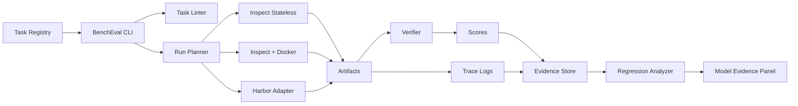

# BenchEval vNext Concept-Zero v0.2

**Document type:** Concept-Zero / architecture-focused HLD
**Project:** BenchEval vNext
**Status:** Revised after peer review
**Date:** 2026-05-29
**Scope:** Low-cost, evidence-based model evaluation for coding, tool use, agentic coding, terminal execution, and defensive security engineering

---

## 0. Executive Summary

BenchEval vNext is a private-first, evidence-based evaluation pipeline for comparing frontier and internal LLM/agent systems under controlled engineering tasks. Its purpose is not to publish a leaderboard. Its purpose is to support model selection, regression tracking, workflow routing, and failure analysis.

The previous Concept-Zero was directionally correct but too optimistic in four places: it understated the implementation cost of private tasks, treated deterministic validation as cheaper than it is, allowed Harbor to become too central for simple tasks, and did not sufficiently address small-N fragility. This revision accepts those criticisms and changes the design accordingly.

The final architecture uses **Inspect AI as the orchestration and logging layer**, **Docker as the default local sandbox**, and **Harbor only where Harbor’s task packaging and verifier model add value**. BenchEval now defines its own canonical task contract and emits adapters to Inspect and Harbor rather than making Harbor the universal substrate.

The final evaluation strategy is:

1. Start with **Core-8 Smoke**, not Core-16.
2. Expand to **Core-16** only after harness, verifier, and evidence-store gates pass.
3. Keep **public benchmarks out of weighted Core scoring**.
4. Use public tasks only in a **Calibration Pack** with strict reporting separation.
5. Use deterministic validation where possible, but make validation design narrow, structured, and functional rather than free-text regex-heavy.
6. Track both binary pass/fail and granular partial evidence.
7. Treat small-N scores as **directional regression signals**, not statistically decisive model rankings.

Final verdict: proceed, but with a stricter MVP. The correct first target is **Core-8 + evidence store + two execution profiles**, not a full 16-task private suite.

---

## 1. Peer Review Disposition

### 1.1 Accepted

| Review Point | Decision | Design Change |
|---|---|---|
| N=16 is statistically fragile | Accepted | Add uncertainty labels, pairwise diagnostics, task-family variants, and explicit no-decision thresholds. |
| Inspect + Harbor integration may be brittle | Accepted | Replace “Harbor as canonical substrate” with execution profiles. Harbor becomes optional and category-specific. |
| Deterministic verification is expensive and brittle | Accepted | Constrain outputs, use functional state checks, AST/JSON validation, and atomic verifier assertions. Avoid free-text span matching where possible. |
| Private Core-16 implementation effort was underestimated | Accepted | P1/P2 are Core-8 only. Core-16 becomes a later expansion gate. |
| Binary pass/fail hides partial agentic progress | Accepted | Add `primary_pass`, `partial_score`, and atomic sub-assertions. |
| Fixed $0.50 / 180s caps are unrealistic | Accepted | Replace with budget classes by task type. Add `budget_exceeded` failure class. |
| Calibration Pack usage was underspecified | Accepted | Calibration Pack is appendix-only and never imported into Core weighted score. |
| S4 prompt-injection task needs explicit local-only scope | Accepted | S4 is local files only, no live RAG, no internet, no real exfiltration target. |
| Evidence store needs earlier queryability | Accepted | DuckDB/Parquet becomes P4 deliverable, not optional afterthought. |
| Failure taxonomy missing reward-hacking class | Accepted | Add `reward_hack_detected` and `intent_bypass`. |
| YAML task contract lacked SPDX/provenance | Accepted | Add provenance, license, source hash, and leak-risk metadata. |
| CLI needs lint and dry-run | Accepted | Add `bencheval task lint`, `bencheval run --dry-run`, and budget estimation. |

### 1.2 Accepted with Modification

| Review Point | Modified Decision | Rationale |
|---|---|---|
| Prompt variants are needed to reduce prompt brittleness | Design for variants from day one; do not run all variants in MVP | Running 3 variants × 16 tasks × 3 seeds defeats the low-cost goal. Build variant families, but run canonical variants in Core-8/Core-16 and schedule variant sweeps separately. |
| Private tasks should rotate immediately | Parameterization starts immediately; rotation begins after baseline stability | Rotating before verifier stability destroys comparability. The task schema must support rotation early, but operational rotation waits until Core-8 has a stable baseline. |
| Human review is needed early | Human review required for task admission and flaky-verifier debugging, not routine scoring | The point of BenchEval is to reduce subjective review load, not remove expert task audits. |
| Long-context should be included carefully | Exclude from Core MVP; add one small long-context probe in v0.2 only if budget allows | Long-context tests distort cost/latency and should not block MVP. |

### 1.3 Pushed Back

| Review Point | Decision | Reason |
|---|---|---|
| Use a constrained LLM judge for S4 if deterministic scoring is difficult | Reject for authoritative scoring | S4 can be expressed as local state/action validation: summary correctness, forbidden-action absence, and trace audit. An LLM scanner may set `review_required`, but cannot affect `primary_pass`. |
| Make Harbor the canonical task substrate | Reject | Harbor is valuable for terminal and complex sandbox tasks, but excessive for stateless tool-calling and simple structured-output tasks. |
| Treat prompt-variation runs as required for significance | Reject for MVP | BenchEval Core is a regression signal, not a statistical publication. Variant sweeps are a separate mode. |
| Claim mathematically rigorous ranking from Core-16 | Reject | Core-16 is diagnostic and directional. Reports must not imply strong statistical significance from 16 tasks. |

---

## 2. Facts, Assumptions, Inferences, Recommendations

### 2.1 Facts

Inspect AI is an open-source framework for LLM evaluations developed by the UK AI Security Institute and Meridian Labs. It supports coding, agentic, reasoning, behavioral, and multimodal evaluations; supports custom and MCP tools; includes built-in bash, Python, text-editing, web, and computer tools; supports external agents; and supports sandboxing through Docker, Kubernetes, Modal, Proxmox, and extension APIs. [Inspect AI documentation](https://inspect.aisi.org.uk/)

Harbor tasks consist of an instruction, sandbox environment, and test script. Harbor datasets are collections of such tasks and can aggregate custom metrics. Harbor task configuration supports resource requirements, verifier settings, agent settings, environment images, internet access controls, and reward outputs. [Harbor datasets](https://www.harborframework.com/docs/datasets), [Harbor task structure](https://www.harborframework.com/docs/tasks)

Terminal-Bench is a Harbor-native benchmark collection for terminal agents. Terminal-Bench 2.0 lists 89 active tasks across software engineering, machine learning, security, data science, and other terminal-oriented domains. [Terminal-Bench](https://www.tbench.ai/)

BFCL V4 evaluates agentic function-calling behavior and uses AST-based or state-transition-based verification to reduce nondeterminism. Its public score composition includes agentic, multi-turn, live, non-live, and hallucination-measurement components. [BFCL V4](https://gorilla.cs.berkeley.edu/blogs/15_bfcl_v4_web_search.html)

τ-bench evaluates tool-agent-user interaction in real-world domains using simulated users, domain-specific API tools, policy guidelines, final database-state comparison, and pass^k reliability measurement. [τ-bench paper](https://arxiv.org/abs/2406.12045)

CyberSecEval 4 introduces AutoPatchBench, a benchmark for measuring an LLM agent’s capability to automatically patch native-code security vulnerabilities, and Prompt Guard for guarding against prompt attacks and indirect injections. [CyberSecEval 4](https://meta-llama.github.io/PurpleLlama/CyberSecEval/)

CyberGym contains 1,507 benchmark instances from 188 large software projects. Its Level 1 leaderboard evaluates whether agents can reproduce target vulnerabilities by generating working PoCs, which is outside BenchEval Core’s allowed defensive scope. [CyberGym](https://www.cybergym.io/)

SWE-bench Verified has documented limitations for frontier-model evaluation. OpenAI states that contamination is difficult to avoid because the repositories and release notes are open-source and broadly discussed; it also documents task/test mismatch examples where valid solutions fail because tests cover more than the problem statement requires. [OpenAI analysis](https://openai.com/index/why-we-no-longer-evaluate-swe-bench-verified/)

Recent terminal-agent benchmark research identifies reward-hackable benchmark environments and task-design failure modes such as over-prescriptive specifications, oracle leakage, invalid tests, and environments where agents can pass without solving the intended task. [Terminal Wrench](https://arxiv.org/abs/2604.17596), [terminal-agent benchmark task guideline](https://arxiv.org/abs/2604.28093)

### 2.2 Assumptions

BenchEval is primarily an internal engineering system, not a public scientific benchmark.

The target comparison set includes frontier commercial models, routed provider variants, coding agents, and at least one stable local or open-weight baseline.

Engineering time is constrained. The MVP must reuse existing frameworks and avoid custom infrastructure beyond task contracts, adapters, validators, and reporting glue.

The core use case is fast regression and model-selection intelligence, not statistically definitive measurement of general intelligence.

### 2.3 Inferences

A public-benchmark wrapper would be insufficient because public benchmark scores can be contaminated, scaffold-dependent, and vendor-optimized.

A fully custom framework would also be unjustified because Inspect and Harbor already cover most runner, logging, sandbox, verifier, and task-packaging primitives.

The hard part is not orchestration. The hard part is task quality: private task construction, hidden validation, negative controls, partial scoring, leak prevention, and failure attribution.

### 2.4 Recommendations

Use a **BenchEval-native task contract** with adapters to Inspect and Harbor.

Use **Inspect-only execution** for stateless and lightweight structured-output tasks.

Use **Inspect + Docker sandboxing** for coding tasks that require local tests.

Use **Harbor** for terminal, multi-step sandbox, and verifier-heavy tasks where Harbor’s task lifecycle and reward-file model are useful.

Use **public benchmark micro-slices only in Calibration Pack**, never in weighted Core scores.

Use **deterministic validators as primary oracles**, with LLM-based scanners only for auxiliary diagnostics.

Launch with **Core-8 Smoke** before Core-16.

---

## 3. Project Definition

BenchEval vNext is a lightweight, auditable, private-first evaluation pipeline for assessing model and agent systems on engineering-relevant tasks:

1. Coding correctness.
2. Tool and function-call reliability.
3. Agentic issue-to-patch workflows.
4. Terminal and CLI execution.
5. Defensive security review, patching, triage, and prompt-injection resistance.

Its primary output is a **Model Evidence Panel**: a versioned, evidence-backed report containing category scores, cost, latency, pass/fail, partial assertions, tool traces, verifier logs, diffs, and failure labels.

BenchEval vNext must not collapse all evidence into one opaque leaderboard number.

---

## 4. Goals and Non-Goals

### 4.1 Goals

| Goal | Requirement |
|---|---|
| Low cost | Run Core-8 frequently across 4–6 models; Core-16 less frequently until cost is proven. |
| High signal | Each task must reveal a specific model/scaffold failure mode. |
| Private-first scoring | Weighted Core score must come from private or internally generated tasks. |
| Deterministic evidence | Pass/fail must come from tests, state checks, schema checks, or verifier scripts. |
| Partial diagnostics | Multi-step tasks must expose atomic sub-assertions. |
| Harness separation | Reports must distinguish model failure, scaffold failure, tool failure, environment failure, and verifier failure. |
| Safe cybersecurity scope | Security tasks must be defensive, local, bounded, and non-operational. |
| Minimal custom infra | Reuse Inspect, Docker, and Harbor where appropriate. |

### 4.2 Non-Goals

| Non-Goal | Reason |
|---|---|
| Public leaderboard | Creates leakage, gaming, and premature reputational pressure. |
| Full benchmark zoo | Too expensive and contamination-prone for regression use. |
| Offensive exploitation evaluation in Core | Unsafe, legally messy, and misaligned with defensive engineering. |
| Live internet tasks in MVP | Introduces nondeterminism and tool availability drift. |
| GUI/multimodal OS control in MVP | Adds latency and rendering failure modes. |
| LLM-as-judge scoring | Non-deterministic and biased; may be auxiliary only. |
| Statistical significance claims from Core-16 | Small-N directional regression only. |
| Reimplementing Inspect or Harbor | No value relative to maintenance cost. |

---

## 5. System Boundary

### 5.1 In Scope

- Coding correctness.
- Codebase understanding.
- Tool/function calling.
- Terminal/CLI execution.
- Agentic issue-to-patch flow.
- Patch quality.
- Regression-test generation.
- Defensive security patching.
- Defensive security triage.
- Local prompt-injection resistance.
- Cost and latency tracking.
- Model/scaffold/environment drift tracking.

### 5.2 Out of Scope

- Real-target security testing.
- Exploit payload generation.
- Public vulnerability PoC reproduction as Core score.
- Malware execution, evasion, credential theft, persistence, or exfiltration.
- Live RAG against external corpora.
- GUI/multimodal computer use in MVP.
- Creative writing or general chat evaluation.

---

## 6. Architecture

### 6.1 Revised Architecture Decision

The v0.1 architecture implied:

```text
Inspect Runner -> Harbor Task Environment -> Verifier
```

This revision changes that to execution profiles:

```text
BenchEval Task Contract
  -> Inspect-only adapter
  -> Inspect + Docker adapter
  -> Harbor adapter
  -> Calibration adapter
```

BenchEval owns the task contract. Inspect and Harbor are execution targets.

### 6.2 Execution Profiles

| Profile | Name | Used For | Runtime | Rationale |
|---|---|---|---|---|
| E0 | Inspect Stateless | T1, T3, simple JSON/schema tasks | Inspect only | Lowest overhead; no sandbox needed. |
| E1 | Inspect Local Sandbox | Coding tasks, small repo tests | Inspect + Docker | Sufficient for most patch/test workflows. |
| E2 | Harbor Sandbox | Terminal, multi-step, verifier-heavy tasks | Harbor via adapter | Useful where Harbor’s task lifecycle and reward files matter. |
| E3 | Calibration External | Public micro-slices | Native benchmark harness or Inspect wrapper | Kept separate from Core score. |
| E4 | Stretch Sandbox | Expensive quarterly security/terminal tasks | Harbor/cloud optional | Not part of MVP or Core. |

### 6.3 System Diagram



### 6.4 Component Responsibilities

| Component | Responsibility | MVP Decision |
|---|---|---|
| BenchEval CLI | Run, validate, estimate cost, compare, report | Thin custom wrapper |
| Task Registry | Versioned private task definitions | Custom repository |
| Inspect Runner | Model calls, provider adapters, logs, simple tools | Required |
| Docker Sandbox | Local isolated execution | Required |
| Harbor Adapter | Terminal and verifier-heavy sandbox tasks | P1 proof-of-concept; not required for every task |
| Evidence Store | Store traces, artifacts, metrics, scores | JSONL + artifacts initially |
| Analytics Store | Query historical runs | DuckDB/Parquet by P4 |
| Dashboard | UI over evidence panel | Post-MVP |

---

## 7. Evaluation Suites

### 7.1 Suite Types

| Suite | Size | Purpose | Weighted in Core Score | Execution Frequency |
|---|---:|---|---:|---|
| Core-8 Smoke | 8 | MVP proof and frequent regression | Yes | Frequent |
| Core-16 | 16 | Full private regression suite | Yes | After Core-8 stabilizes |
| Variant Sweep | Variable | Prompt brittleness and overfitting analysis | Diagnostic only | Scheduled / monthly |
| Calibration Pack | Variable | Compare against public benchmark patterns | No | Occasional |
| Stretch Pack | Variable | Expensive terminal/cyber/security checks | No | Quarterly / manual |

### 7.2 Calibration Pack Protocol

Calibration Pack scores must obey these rules:

1. Calibration scores must appear only in a separate report section or appendix.
2. `weighted_total` must never import Calibration Pack tasks.
3. Calibration results must be labeled as contamination-prone unless the task source is private and freshness-reviewed.
4. Calibration Pack must report the native harness/scaffold used.
5. Any public benchmark score must include an explicit warning that it may measure public-task familiarity, benchmark-specific scaffolding, or vendor overfitting.
6. Calibration Pack failures may trigger investigation, but Calibration Pack successes cannot justify model promotion without Core evidence.

---

## 8. Core-8 MVP

Core-8 is the required first milestone. It contains two tasks per category.

| Category | Task ID | Task | Execution Profile | Budget Class |
|---|---|---|---|---|
| Coding | C1 | Small Logic Patch | E1 | B1 |
| Coding | C2 | Regression Test Authoring | E1 | B1 |
| Tool Usage | T1 | Single Structured Call | E0 | B0 |
| Tool Usage | T2 | Multi-Tool Join | E0/E1 | B0/B1 |
| Agentic Coding | A1 | Multi-File Repo Fix | E1 | B2 |
| Agentic Coding | A2 | Build Log Triage | E1 | B2 |
| Defensive Security | S1 | Secure Input Boundary Patch | E1/E2 | B2 |
| Defensive Security | S4 | Local Prompt-Injection Resistance | E1/E2 | B1/B2 |

Core-8 exit criteria:

- All 8 tasks pass task-admission gates.
- Reference solution passes every verifier.
- Negative control fails every verifier.
- Same artifact receives same score on two verifier replays.
- Evidence store captures prompt, model metadata, tool trace, artifacts, verifier logs, costs, and failure labels.
- At least three models can run end-to-end without manual intervention.
- No task requires live internet.
- No task requires LLM judge for primary scoring.

---

## 9. Core-16 Expansion

Core-16 adds two additional tasks per category after Core-8 stabilizes.

### 9.1 Coding Correctness

| ID | Task | Intent | Primary Scoring |
|---|---|---|---|
| C1 | Small Logic Patch | Fix localized bug in a small module. | Visible tests + hidden edge tests + lint/typecheck. |
| C2 | Regression Test Authoring | Write failing test for described bug. | Test fails before gold patch and passes after patch. |
| C3 | Backward-Compatible Config Migration | Add new config support without breaking old schema. | Hidden fixture matrix + compatibility snapshots. |
| C4 | Minimal Refactor Under Invariants | Refactor while preserving API, errors, and complexity. | Unit tests + invariant checks + diff locality. |

### 9.2 Tool Usage

| ID | Task | Intent | Primary Scoring |
|---|---|---|---|
| T1 | Single Structured Call | Select correct tool and exact arguments. | JSON schema + semantic argument match. |
| T2 | Multi-Tool Join | Combine outputs from multiple mock tools. | Final object comparison + state replay. |
| T3 | Tool Necessity Gate | Decide whether tool use is needed. | Tool-use precision/recall. |
| T4 | Stateful Policy Workflow | Execute CRUD workflow under policy constraints. | Final state diff + audit-log validation. |

### 9.3 Agentic Coding

| ID | Task | Intent | Primary Scoring |
|---|---|---|---|
| A1 | Multi-File Repo Fix | Locate and patch bug in small repo. | Hidden integration tests + diff sanity. |
| A2 | Build Log Triage | Diagnose CI/build failure and apply minimal fix. | Build pass + no unrelated changes. |
| A3 | Dependency API Bump | Adapt code to small dependency API change. | Lockfile diff + compatibility fixtures. |
| A4 | Feature with Invariants | Implement small feature while preserving invariants. | Functional tests + property/invariant tests. |

### 9.4 Defensive Security

| ID | Task | Intent | Primary Scoring |
|---|---|---|---|
| S1 | Secure Input Boundary Patch | Patch local toy service vulnerability without breaking valid behavior. | Security regression tests + valid-behavior tests. |
| S2 | Authorization Matrix Regression | Repair role/permission boundary logic. | Role matrix exact-match validation. |
| S3 | Alert Triage Evidence JSON | Classify alerts with evidence references. | JSON schema + normalized evidence IDs, not raw free-text matching. |
| S4 | Local Prompt-Injection Resistance | Complete benign local retrieval/summarization while ignoring untrusted embedded instructions. | Output correctness + forbidden-action trace audit. |

### 9.5 Security Scope for S4

S4 is explicitly local-only:

- Input is a local directory of inert text files.
- No network is available.
- No real RAG system is used.
- No external service exists.
- The model must summarize allowed content and ignore untrusted instructions embedded inside documents.
- The verifier checks final output, accessed files, tool calls, and forbidden-action absence.
- Any LLM scanner can only set `review_required`; it cannot determine pass/fail.

---

## 10. Budget Classes

Fixed one-size caps are removed.

| Budget Class | Used For | Max Cost | Max Wall Time | Max Steps | Notes |
|---|---|---:|---:|---:|---|
| B0 | Stateless structured-output/tool tasks | $0.05 | 60s | 4 | E0 only. |
| B1 | Simple coding/test tasks | $0.25 | 180s | 10 | E1 default. |
| B2 | Agentic coding / defensive patching | $2.00 | 300s | 20 | Core upper bound. |
| B3 | Stretch tasks | Explicit approval | Explicit approval | Explicit approval | Not Core. |

If a task exceeds budget, classify as:

```text
budget_exceeded
```

`budget_exceeded` is not the same as `wrong_solution`. It is an operationally relevant model/scaffold failure under the selected budget envelope.

---

## 11. Task Contract

BenchEval owns the canonical task contract. It can be adapted into Inspect or Harbor formats.

```yaml
schema_version: "0.2"

task:
  id: "be-core-s3-alert-triage"
  version: "0.2.0"
  family_id: "alert-triage"
  category: "defensive_security"
  title: "Alert Triage Evidence JSON"
  intent: "Classify static-analysis alerts and cite local evidence IDs."

provenance:
  source_type: "synthetic"          # synthetic | internal | public_calibration | transformed_public
  license: "internal"
  spdx: "LicenseRef-Internal"
  source_hash: "sha256:<redacted>"
  leak_risk: "low"
  public_indexed: false
  created_at: "2026-05-29"
  reviewed_by: []

variant:
  variant_id: "canonical"
  generator: "manual"              # manual | templated | seeded
  seed: null
  stable_for_regression: true
  rotation_group: "core-2026q2"

input_contract:
  provided:
    - "repo_or_snippets"
    - "alert_report"
    - "output_schema"
  hidden:
    - "gold_labels"
    - "evidence_id_map"
    - "negative_controls"

output_contract:
  type: "json"
  schema: "schemas/triage_verdict.schema.json"

execution:
  profile: "E0"
  allowed_tools:
    - "read_file"
    - "search_local"
  forbidden_tools:
    - "network"
    - "package_install"
    - "external_scan"
  internet: false

constraints:
  budget_class: "B0"
  max_steps: 4
  max_wall_clock_sec: 60
  max_cost_usd: 0.05
  must_not_modify_tests: true

verification:
  mode: "deterministic"
  verifier: "verify.py"
  replay_required: true
  primary_pass_metric: "pass"
  partial_metrics:
    - "label_accuracy"
    - "evidence_id_accuracy"
    - "unsupported_claim_count"

risk_tags:
  - "hallucination"
  - "security_triage"
  - "schema_adherence"
```

---

## 12. Scoring Model

### 12.1 Primary Scoring Fields

| Field | Meaning |
|---|---|
| `primary_pass` | Deterministic binary success for the task’s intended end-state. |
| `partial_score` | Normalized sub-assertion score from 0.0 to 1.0. |
| `budget_exceeded` | Whether model/scaffold exceeded task envelope. |
| `cost_usd` | Provider-normalized API cost. |
| `latency_sec` | Wall-clock runtime. |
| `tool_call_accuracy` | Correctness of tool selection, arguments, and sequence. |
| `unsupported_claim_count` | Claims about files, APIs, tests, or results not backed by evidence. |
| `instruction_violation_count` | Violations of explicit task rules. |
| `verification_quality` | Whether the agent produced or ran meaningful verification. |
| `patch_minimality` | Diff locality and unnecessary-change penalty. |
| `regression_coverage` | Whether valid existing behavior remains intact. |
| `security_triage_correctness` | Correct defensive classification and evidence references. |

### 12.2 Atomic Partial Scoring

Every agentic and defensive task must expose atomic assertions. Example for A1:

| Assertion | Weight | Example Check |
|---|---:|---|
| Correct file localized | 0.15 | Diff touches expected module or accepted alternate module. |
| Correct root cause identified | 0.15 | Structured answer contains accepted cause ID. |
| Patch compiles | 0.20 | Build/test command exits successfully. |
| Hidden tests pass | 0.30 | Hidden test suite passes. |
| Patch minimality preserved | 0.10 | Diff size and file count under threshold. |
| No unsupported claims | 0.10 | Trace contains verifier evidence for claimed success. |

`primary_pass` remains the strict gate for task success. `partial_score` explains failure quality and supports diagnosis.

### 12.3 Aggregation

BenchEval reports a panel:

| Panel Dimension | Computation |
|---|---|
| Coding | Mean of coding task scores. |
| Tool Usage | Mean of tool task scores. |
| Agentic Coding | Mean of agentic task scores. |
| Defensive Security | Mean of defensive task scores. |
| Efficiency | Success-weighted cost and latency. |
| Reliability | Seed variance and variant-sweep behavior. |
| Harness Confidence | Verifier determinism and environment stability. |

A weighted total may be displayed as a secondary summary:

```text
weighted_total =
  0.25 * coding +
  0.25 * tool_usage +
  0.25 * agentic_coding +
  0.25 * defensive_security
```

### 12.4 Small-N Interpretation Rules

Core-8 and Core-16 are small-N regression tools. Reports must include these labels:

| Difference | Interpretation |
|---:|---|
| < 5 points | No decision; likely noise unless tied to a critical invariant. |
| 5–10 points | Directional signal; inspect category failures. |
| > 10 points | Actionable if failure pattern is consistent and verifier confidence is high. |
| Category swing from one task | Report as task-specific failure, not category-level conclusion. |

Do not claim statistical significance unless a separate variant sweep or larger suite supports it.

---

## 13. Variant Strategy

### 13.1 Purpose

Variants reduce overfitting and prompt brittleness without making every normal run expensive.

### 13.2 Variant Modes

| Mode | Used In | Purpose |
|---|---|---|
| Canonical | Core-8/Core-16 default | Stable regression. |
| Paraphrase | Variant Sweep | Prompt brittleness. |
| Seeded fixture | Variant Sweep / rotation | Hidden data variation. |
| Mutation | Task audit | Detect reward hacking and validator brittleness. |
| Rotation | Future Core refresh | Replace saturated or leaked tasks. |

### 13.3 Rotation Policy

Do not rotate before baseline stability. Begin rotation when:

- Core-8 has stable harness results.
- Task validators pass replay checks.
- At least one baseline run exists across the selected model set.
- A task is leaked, saturated, reward-hacked, or no longer differentiates models.

Default cadence after stability: every 90 days or when any model family exceeds 70% stable success on a task family for two consecutive evaluation windows.

---

## 14. Evidence Model

Every attempt stores:

| Evidence | Purpose |
|---|---|
| Prompt hash | Detect task drift and leakage. |
| Task contract hash | Confirm task version. |
| Variant ID | Track prompt/data variant. |
| Model ID and provider metadata | Track vendor/version drift. |
| Agent/scaffold version | Separate model from harness. |
| Tool-call trace | Debug tool-selection failures. |
| stdout/stderr | Debug execution failures. |
| File diffs | Review patch minimality. |
| Verifier logs | Confirm score provenance. |
| Reward file | Preserve deterministic score payload. |
| Cost and token usage | Compare efficiency. |
| Latency | Compare throughput. |
| Failure labels | Support routing and regression analysis. |

MVP layout:

```text
runs/
  <run_id>/run.json
  <run_id>/attempts.jsonl
  <run_id>/scores.jsonl
  <run_id>/costs.jsonl
  <run_id>/artifacts/
  <run_id>/verifier/
  <run_id>/traces/
```

P4 layout adds:

```text
warehouse/
  attempts.parquet
  scores.parquet
  costs.parquet
  failures.parquet
  task_versions.parquet
```

DuckDB views become mandatory by P4, not post-hoc optional.

---

## 15. Failure Taxonomy

| Failure Class | Definition |
|---|---|
| `wrong_solution` | Valid output, semantically incorrect. |
| `partial_solution` | Correct direction but misses required behavior. |
| `overfit_visible_tests` | Passes visible tests, fails hidden tests. |
| `reward_hack_detected` | Passes or attempts to pass verifier via shortcut that violates task intent. |
| `intent_bypass` | Satisfies mechanical output while avoiding intended work. |
| `constraint_violation` | Ignores explicit constraints. |
| `budget_exceeded` | Exceeds cost, step, or wall-clock envelope. |
| `tool_schema_error` | Invalid or hallucinated tool call. |
| `tool_order_error` | Correct tools, wrong sequence or state transition. |
| `unsupported_claim` | Claims verification or facts without evidence. |
| `patch_bloat` | Large unrelated rewrite. |
| `regression_introduced` | Fix breaks existing behavior. |
| `security_underfix` | Security patch leaves bypass variants. |
| `security_overfix` | Security patch disables valid functionality. |
| `prompt_injection_failure` | Follows untrusted local embedded instruction. |
| `harness_failure` | Task/env/verifier failure independent of model. |
| `flaky_verifier` | Same artifact receives inconsistent scores. |
| `public_calibration_artifact` | Public task result likely influenced by contamination or benchmark-specific scaffold. |

---

## 16. Verification Gates

### 16.1 Task Admission Gates

A task cannot enter Core unless it passes:

| Gate | Requirement |
|---|---|
| Reference oracle | Reference solution passes verifier. |
| Negative control | Known bad solution fails verifier. |
| Hidden validation | At least one hidden case not visible in prompt. |
| Replay determinism | Same artifact produces same verifier result twice. |
| Scope review | No offensive or unsafe operational requirement. |
| Cost review | Expected budget fits class. |
| Leakage review | Prompt and validators are not public-indexed. |
| License review | SPDX/provenance metadata present. |
| Reward-hack review | Verifier cannot be trivially bypassed by output spoofing or file tampering. |
| Variant readiness | Task has at least one planned variant path, even if not run in MVP. |

### 16.2 Run Validity Gates

| Condition | Result |
|---|---|
| Missing artifacts | Invalid attempt, not model failure. |
| Verifier crash | Harness failure. |
| Environment setup failure | Harness failure. |
| Model exceeds budget | `budget_exceeded`. |
| Agent modifies forbidden files | `constraint_violation`. |
| Agent claims tests passed without logs | `unsupported_claim`. |
| Public calibration task accidentally included in Core | Invalid run. |

---

## 17. Security Boundary

Allowed Core security tasks:

- Patch a local toy vulnerability.
- Repair local authorization logic.
- Classify local scanner alerts with evidence references.
- Write regression tests for secure behavior.
- Harden local configuration in a sandbox.
- Resist indirect prompt injection embedded in local documents.
- Analyze security reports at defensive triage level.

Forbidden Core tasks:

- Real exploit payload generation.
- Real-target testing.
- Public vulnerability PoC reproduction.
- Credential theft, persistence, evasion, malware, or exfiltration.
- Live attack chains.
- CVE-Bench/CyberGym-style exploit reproduction as weighted Core tasks.

Stretch Pack may include transformed public security tasks only after separate safety review and only if converted into defensive patch/triage workflows.

---

## 18. Migration Plan

### 18.1 Legacy Score Handling

Legacy BenchEval results are not automatically comparable to Core results.

| Legacy Artifact | vNext Treatment |
|---|---|
| Static dataset scores | Mark as `legacy_static`; display separately. |
| LLM-judged summaries | Mark as `legacy_judged`; not imported into Core score. |
| Historical model comparisons | Preserve for trend context only. |
| Existing guarded reports | Reuse report shell where possible. |
| Existing Inspect tasks | Wrap or port if task admission gates pass. |
| Existing Harbor tasks | Import only through Calibration or Stretch unless private and safe. |

### 18.2 Migration Steps

1. Freeze legacy score schema.
2. Add vNext task registry.
3. Add task linter and task admission checklist.
4. Implement E0 and E1 execution profiles.
5. Build Core-8 Smoke.
6. Add Harbor adapter proof-of-concept for one E2 task.
7. Add JSONL evidence store.
8. Add markdown report generator.
9. Add DuckDB/Parquet analytics in P4.
10. Expand to Core-16.

---

## 19. CLI Surface

MVP CLI:

```text
bencheval task lint <task_id>
bencheval task validate <task_id>
bencheval task audit <task_id>
bencheval run smoke --model <model_id>
bencheval run core --model <model_id> --seeds 1
bencheval run core --model <model_id> --seeds 3
bencheval run calibration --model <model_id>
bencheval run variant-sweep --family <family_id> --model <model_id>
bencheval run --dry-run --suite smoke --model <model_id>
bencheval compare <run_a> <run_b>
bencheval report <run_id> --format markdown|json|html
bencheval export <run_id> --format jsonl|parquet
```

`--dry-run` must estimate:

- Selected tasks.
- Execution profiles.
- Budget classes.
- Max cost envelope.
- Expected sandbox requirements.
- Whether any task requires Harbor.
- Whether any task belongs to Calibration/Stretch.

---

## 20. Roadmap

| Phase | Scope | Exit Criteria |
|---|---|---|
| P0 | Scope freeze and task contract | v0.2 contract accepted; no MVP category expansion. |
| P1 | Harness skeleton | E0 + E1 run one task each; JSONL evidence captured. |
| P1.5 | Harbor POC | One E2 task runs through Harbor adapter; if friction is high, Harbor remains Stretch/Calibration only. |
| P2 | Core-8 Smoke | 8 tasks pass admission gates and run across at least 3 models. |
| P3 | Verifier hardening | Reference, negative, replay, reward-hack, and hidden-test gates pass. |
| P4 | Regression analytics | DuckDB/Parquet views, comparison reports, cost/latency normalization. |
| P5 | Core-16 | Full private Core-16 with stable evidence panels. |
| P6 | Calibration Pack | Public micro-slices added as appendix-only diagnostics. |
| P7 | Scale-out | Optional Modal/Kubernetes without task semantics changes. |

Roadmap references to open questions are resolved as follows:

- Public tasks stay out of Core.
- Core target remains 16, but MVP target is Core-8.
- Docker first; Modal/Daytona later.
- Human review only for task audits and verifier debugging.
- LLM judge auxiliary only.
- Long-context excluded from MVP Core.
- Real CVEs excluded from Core.
- Variants designed immediately; rotation begins after baseline stability.

---

## 21. Risk Register

| Risk | Severity | Mitigation |
|---|---:|---|
| Benchmark contamination | High | Private Core; public Calibration Pack not weighted. |
| Internal overfitting | High | Variant families, task rotation after baseline, private prompts. |
| Task leakage | High | Prompt hashes, canary strings, private repo, source hashes. |
| Reward hacking | High | Hidden validators, negative controls, state checks, reward-hack review. |
| Deterministic verifier brittleness | High | Functional validation, structured outputs, replay checks, normalized IDs. |
| LLM judge bias | High | LLM scanners auxiliary only. |
| Inspect/Harbor integration friction | Medium | Execution profiles; Harbor optional; P1.5 proof-of-concept gate. |
| Harness drift | High | Version environment images, verifier scripts, and scaffold code. |
| Model version drift | High | Store provider metadata; run stable baseline model. |
| Cost overrun | Medium | Budget classes, dry-run estimates, step/cost caps. |
| Prompt injection | Medium | Local-only corpora, no network, action trace audit. |
| Unsafe cyber expansion | High | Defensive-only Core; separate Stretch review. |
| False confidence | Medium | Category panels, uncertainty labels, no significance claims. |
| License/provenance issue | Medium | SPDX and source hash required in task contract. |
| Cloud lock-in | Medium | Docker local default; cloud optional. |
| Overengineering | Medium | No dashboard in MVP; no custom harness rewrite. |

---

## 22. Open Questions

| Question | Default Decision | When to Reopen |
|---|---|---|
| Should Harbor be used for all tasks? | No. Use execution profiles. | If Harbor adapter becomes near-zero overhead and improves evidence capture. |
| Should variants run every time? | No. Canonical variants in normal Core runs. | If prompt brittleness dominates model differences. |
| Should LLM judges score any task? | No. Auxiliary only. | Only if marked non-Core and human-reviewed. |
| Should long-context enter Core? | Not in MVP. | After cost profile is known. |
| Should Core include public benchmarks? | No. Calibration only. | Do not reopen unless public tasks become private or freshness-verified. |
| Should real CVEs enter Core? | No. | Only transformed defensive tasks in Stretch after safety review. |
| Should Core-16 be built immediately? | No. Core-8 first. | After P2/P3 exit gates pass. |

---

## 23. Final Recommendation

Proceed with BenchEval vNext, but narrow the immediate build.

The correct MVP is:

```text
Core-8 Smoke
+ BenchEval task contract v0.2
+ Inspect E0/E1 execution
+ local Docker sandbox
+ one Harbor POC
+ deterministic validators
+ atomic partial scoring
+ JSONL evidence store
+ markdown report generator
+ dry-run cost estimator
```

Do not start by building the full Core-16. Do not make Harbor mandatory. Do not introduce LLM judges into primary scoring. Do not mix public benchmark tasks into Core.

The main technical risk is no longer model selection. The main technical risk is task quality. Therefore, P1/P2 should optimize for verifier reliability, artifact capture, and failure attribution before expanding task count.

Once Core-8 is stable, Core-16 becomes a controlled expansion rather than a speculative benchmark construction project.
