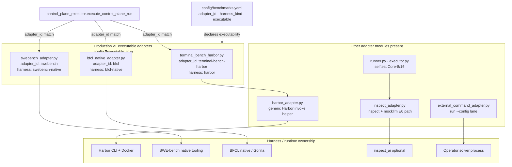

# Adapter Components (C4 L3)

What this shows: adapter families BenchEval ships, which are Production v1 executable, and how they map to harness ownership.

Notes: Executable set is **config-declared**, not hard-coded in Python ([`production-readiness.md`](../context/production-readiness.md) Tier 0 gate: exactly `terminal-bench`, `swe-bench-verified`, `bfcl-v4`). LiveCodeBench/BigCodeBench may carry `adapter_id` metadata while remaining non-executable until admitted. Metadata-only benchmarks (e.g. CyBench) fail before subprocess dispatch on four-axis `run`.
