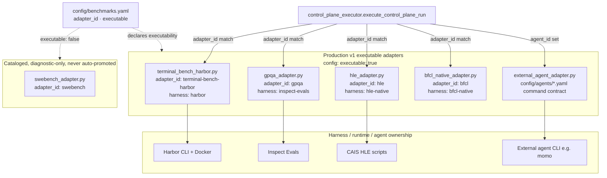

# Adapter Components (C4 L3)

What this shows: Production v1 executable adapters and harness ownership.

```mermaid
flowchart TB
    CPE["control_plane_executor.execute_control_plane_run"]

    subgraph ProdV1["Production v1 executable adapters<br/>config: executable: true"]
        TB["terminal_bench_harbor.py<br/>adapter_id: terminal-bench-harbor<br/>harness: harbor"]
        GPQA["gpqa_adapter.py<br/>adapter_id: gpqa<br/>harness: inspect-evals"]
        HLE["hle_adapter.py<br/>adapter_id: hle<br/>harness: hle-native"]
        BFCL["bfcl_native_adapter.py<br/>adapter_id: bfcl<br/>harness: bfcl-native"]
        Agent["external_agent_adapter.py<br/>config/agents/*.yaml command contract"]
    end

    subgraph Demoted["Cataloged, diagnostic-only, never auto-promoted"]
        SWE["swebench_adapter.py<br/>adapter_id: swebench"]
    end

    subgraph Outside["Harness / runtime / agent ownership"]
        HCLI["Harbor CLI + Docker"]
        Inspect["Inspect Evals"]
        HLEH["CAIS HLE scripts"]
        ExtAgent["External agent CLI e.g. momo"]
    end

    CPE -->|adapter_id match| TB & GPQA & HLE & BFCL
    CPE -->|agent_id set| Agent
    TB --> HCLI
    GPQA --> Inspect
    HLE --> HLEH
    Agent --> ExtAgent

    Cat["config/benchmarks.yaml<br/>adapter_id · executable"]
    Cat -.->|declares executability| ProdV1
    Cat -.->|executable: false| Demoted
```

Notes: Research candidates stay in docs (`external-benchmark-catalog.md`), not product YAML. `harness_kind` is adapter-declared run-plan/evidence metadata, not a benchmark YAML knob. BFCL is executable (official generate → evaluate). SWE is diagnostic-implemented and stays `executable: false`; it never auto-promotes.
