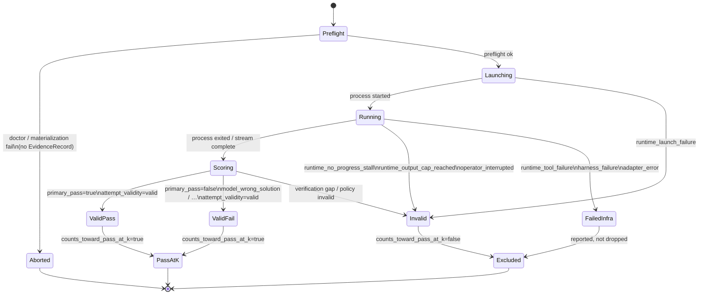

# Attempt Lifecycle State

What this shows: how a physical launch becomes a scored attempt — validity, pass@k eligibility, and distinct failure classes.

Notes: Preflight aborts leave no evidence row; everything after launch should be attributable ([architecture §10](../architecture.md)). Compare/report must not drop failed/invalid attempts when claiming superiority ([§13.3](../architecture.md)). `eligible_for_pass_at_k()` in `evidence.py` is the denominator gate.
