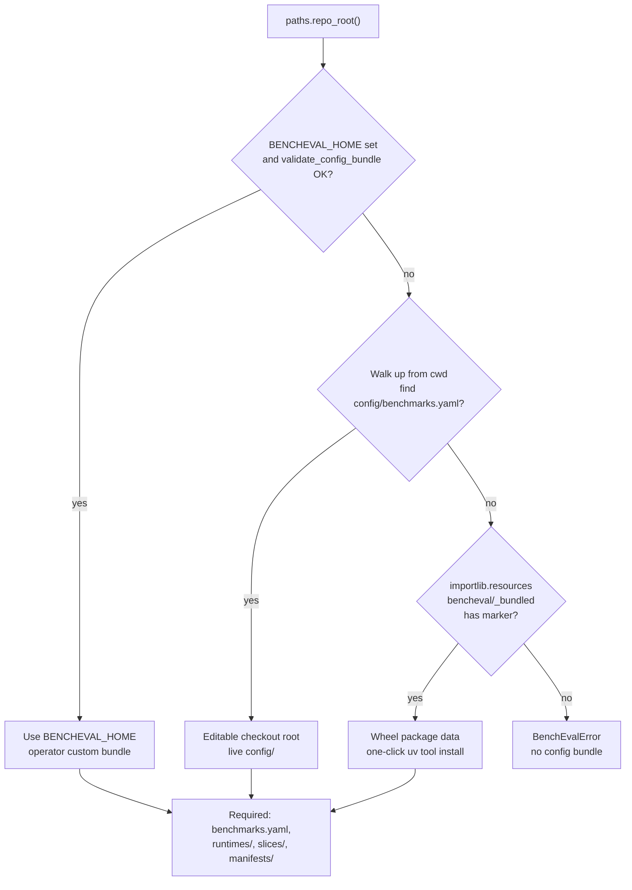

# Config Resolution

What this shows: how BenchEval finds the control-plane config tree for editable checkout, wheel install, and optional override.

Notes: Implemented in [`src/bencheval/paths.py`](../../src/bencheval/paths.py). Wheel contents mirror `scripts/export-config-bundle.sh` subset via hatch `force-include` in [`pyproject.toml`](../../pyproject.toml). `config/pricing/` and `config/selftest/` stay editable-checkout only. First-touch: `uv tool install bencheval` → `bencheval benchmark list` with no `BENCHEVAL_HOME`.
