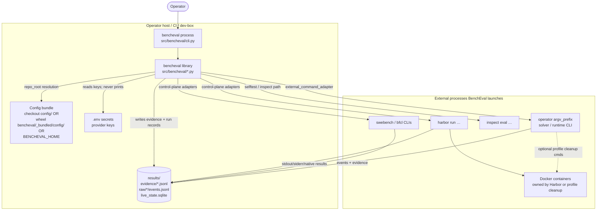

# Container View (C4 L2)

What this shows: deployable/runnable units — the CLI process, library modules, config bundle, external harness processes, and on-disk artifact stores.

Notes: Single-process CLI tool — no microservices, no PostgreSQL. Analytics export (`export` → Parquet/DuckDB) is a **derived** warehouse, not the store of record. Wheel install ships public control-plane YAML via hatch `force-include` ([`pyproject.toml`](../../pyproject.toml)); pricing and selftest fixtures stay checkout-only.
