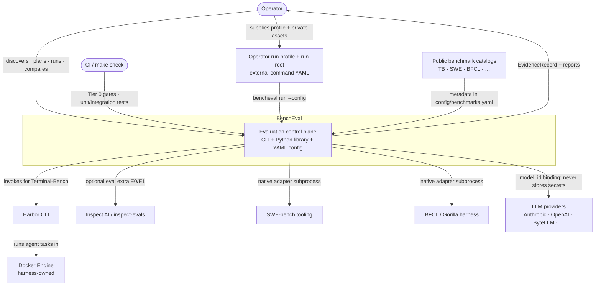

# System Context (C4 L1)

What this shows: BenchEval as one system box, who uses it, and which external systems it depends on — with why each link exists.

Notes: No public HTTP API ([`docs/api/internal-contracts.md`](../api/internal-contracts.md)). Secrets stay in `.env`; `config/models.yaml` is non-secret metadata. External-command profiles are **operator artifacts**, not shipped CyBench product assets.
