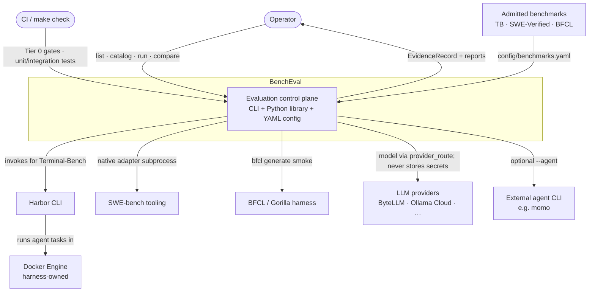

# System Context (C4 L1)

What this shows: BenchEval as one system box, who uses it, and which external systems it depends on.

```mermaid
flowchart TB
    Op([Operator])
    CI([CI / make check])

    subgraph System["BenchEval"]
        BE["Evaluation control plane<br/>CLI + Python library + YAML config"]
    end

    Harbor["Harbor CLI"]
    Docker["Docker Engine<br/>harness-owned"]
    SWE["SWE-bench tooling"]
    BFCL["BFCL / Gorilla harness"]
    Provider["LLM providers<br/>ByteLLM · Ollama Cloud · …"]
    AgentCLI["External agent CLI<br/>e.g. momo"]
    Catalog["Admitted benchmarks<br/>TB · SWE-Verified · BFCL"]

    Op -->|list · catalog · run · compare| BE
    CI -->|Tier 0 gates · unit/integration tests| BE
    BE -->|invokes for Terminal-Bench| Harbor
    Harbor -->|runs agent tasks in| Docker
    BE -->|native adapter subprocess| SWE
    BE -->|bfcl generate smoke| BFCL
    BE -->|model via provider_route; never stores secrets| Provider
    BE -->|optional --agent| AgentCLI
    Catalog -->|config/benchmarks.yaml| BE
    BE -->|EvidenceRecord + reports| Op
```

Notes: No public HTTP API ([`docs/api/internal-contracts.md`](../api/internal-contracts.md)). Secrets stay in `.env`; `config/models.yaml` is non-secret metadata. Product spine: `benchmark → (runtime | agent)? → model via provider → evidence`.
