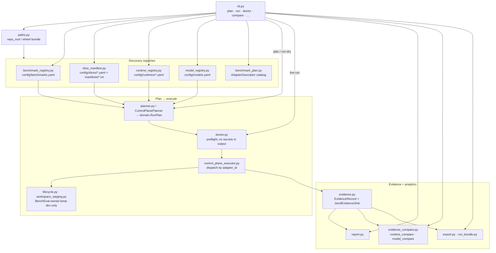

# Control-Plane Components (C4 L3)

What this shows: internal components of the BenchEval library for four-axis discovery, planning, preflight, execution, and evidence/report.

Notes: `executor.py` / `backends.py` / `runner.py` remain the **selftest** dispatch path (`--task`/`--backend`). Production four-axis live runs go through `control_plane_executor.py`. Domain DTOs live in [`domain.py`](../../src/bencheval/domain.py); Protocols in [`contracts.py`](../../src/bencheval/contracts.py).
