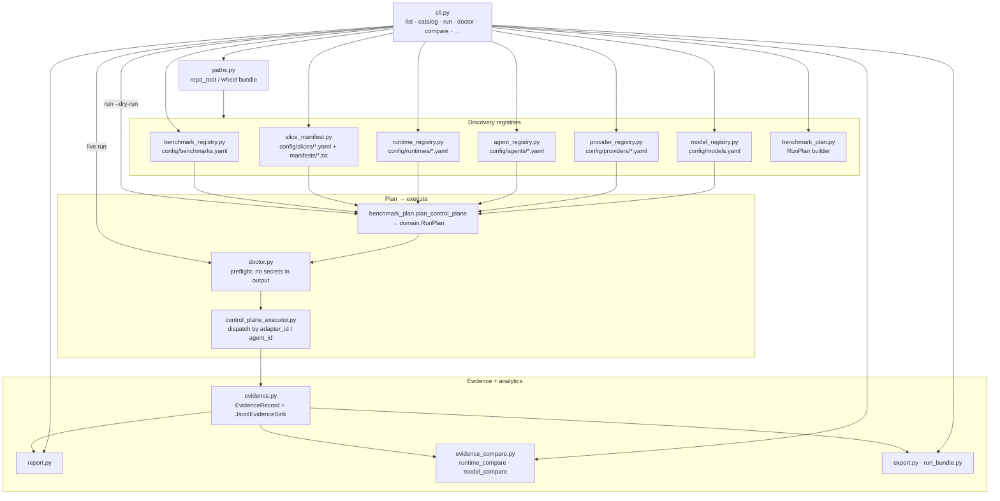

# Control-Plane Components (C4 L3)

What this shows: product-spine discovery, planning, preflight, execution, and evidence/report.

```mermaid
flowchart TB
    CLI["cli.py<br/>list · catalog · run · doctor · compare · …"]

    subgraph Discovery["Discovery registries"]
        BR["benchmark_registry.py<br/>config/benchmarks.yaml"]
        SM["slice_manifest.py<br/>config/slices/*.yaml + manifests/*.txt"]
        RR["runtime_registry.py<br/>config/runtimes/*.yaml"]
        AR["agent_registry.py<br/>config/agents/*.yaml"]
        PR["provider_registry.py<br/>config/providers/*.yaml"]
        MR["model_registry.py<br/>config/models.yaml"]
        BP["benchmark_plan.py<br/>RunPlan builder"]
    end

    subgraph PlanExec["Plan → execute"]
        Plan["benchmark_plan.plan_control_plane<br/>→ domain.RunPlan"]
        Doc["doctor.py<br/>preflight; no secrets in output"]
        CPE["control_plane_executor.py<br/>dispatch by adapter_id / agent_id"]
    end

    subgraph EvidenceOut["Evidence + analytics"]
        Ev["evidence.py<br/>EvidenceRecord + JsonlEvidenceSink"]
        Rep["report.py"]
        Cmp["evidence_compare.py<br/>runtime_compare · model_compare"]
        Exp["export.py · run_bundle.py"]
    end

    Paths["paths.py<br/>repo_root / wheel bundle"]

    CLI --> Paths
    Paths --> Discovery
    CLI --> BR & SM & RR & AR & PR & MR & BP
    CLI -->|run --dry-run| Plan
    BR & SM & RR & AR & PR & MR --> Plan
    CLI -->|live run| Doc
    Plan --> Doc
    Doc --> CPE
    CPE --> Ev
    Ev --> Rep & Cmp & Exp
    CLI --> Rep & Cmp & Exp
```

Notes: Product live runs go through `control_plane_executor.py`. Domain DTOs live in [`domain.py`](../../src/bencheval/domain.py); Protocols in [`contracts.py`](../../src/bencheval/contracts.py). Current CLI contract: [`docs/api/internal-contracts.md`](../api/internal-contracts.md).
