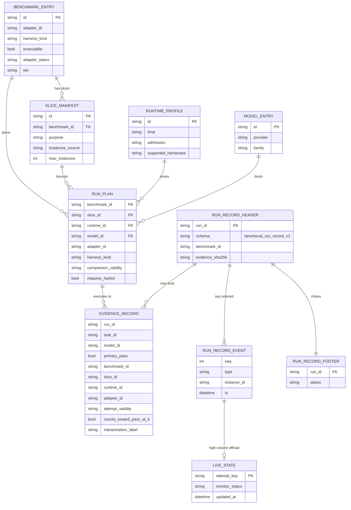

# Data Model (ERD)

What this shows: core persisted and planned entities — catalogs feed RunPlan; adapters emit EvidenceRecord and optional run-record streams.

Notes: `EvidenceRecord` v0.2 fields are a frozen public export; v0.3 fields are additive optional ([`evidence.py`](../../src/bencheval/evidence.py)). No relational DB — JSONL/SQLite files on disk. Legacy `SummaryRow` ([`models.py`](../../src/bencheval/models.py)) remains selftest-only and is not the primary scoring contract.
