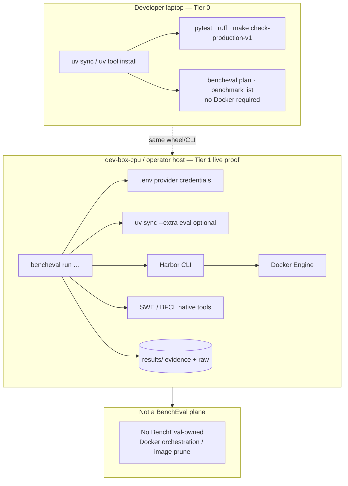

# Deployment Topology

What this shows: where BenchEval runs vs where harness sandboxes live — Tier 0 laptop vs Tier 1 live proof on a operator host.

Notes: See [`docs/ops/dev-box-pilot.md`](../ops/dev-box-pilot.md) and [`production-readiness.md`](../context/production-readiness.md). Green Tier 0 tests are not live benchmark proof. Cleanup policy removes BenchEval-owned temp dirs only; image pruning stays harness/operator-owned.
