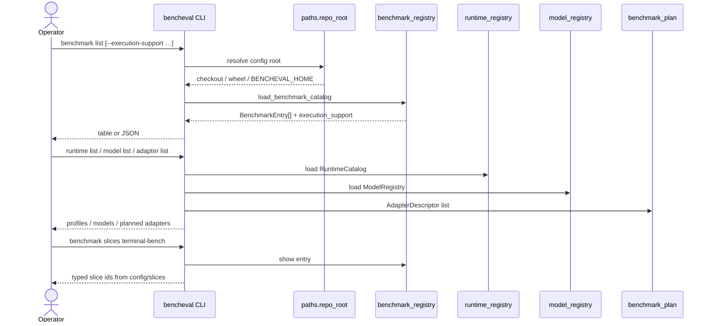

# Discovery Sequence

What this shows: catalog discovery commands that need no credentials and emit JSON/text from the resolved config bundle.

Notes: These commands are Tier 0 / laptop-safe. Filtering `--execution-support executable_adapter` is the Production v1 gate surface used by `make check-production-v1`.
