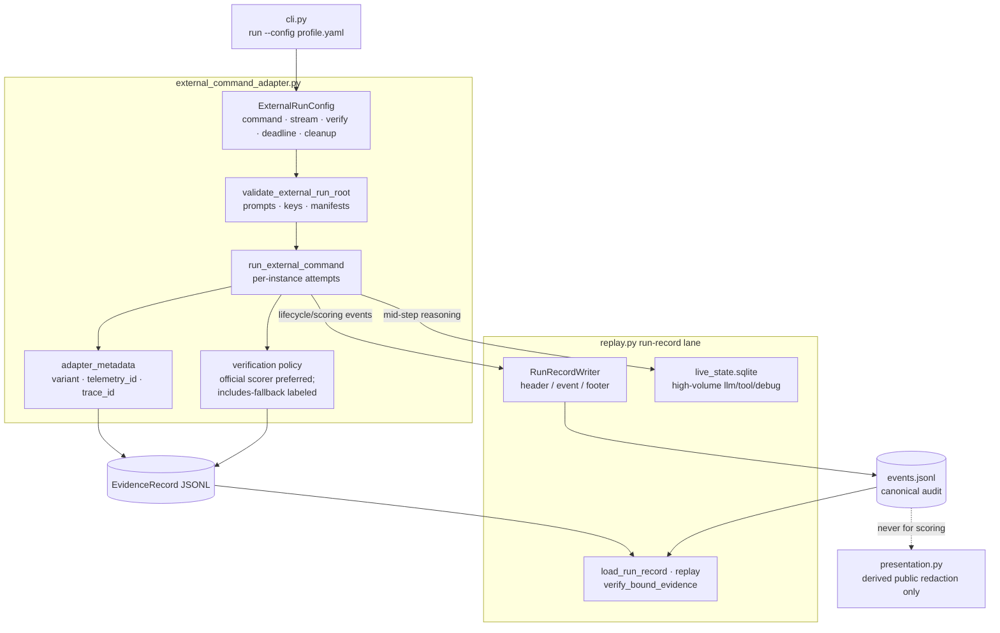

# External-Command Components (C4 L3)

What this shows: the config-driven external project lane — profile → subprocess → run record + evidence — without shipping benchmark-specific CyBench profiles.

Notes: Canonical `events.jsonl` is raw/private; redaction is only for derived public artifacts ([internal-contracts § Replay](../api/internal-contracts.md)). Operator profiles live outside the repo unless they become official reusable adapters. Exit-code policy maps process exits to failure labels without inventing benchmark scores.
