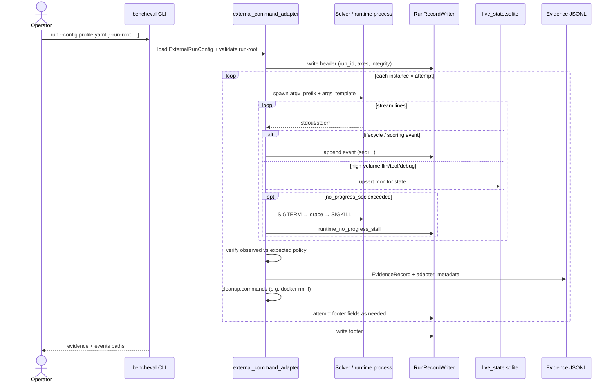

# External-Command Sequence

What this shows: one attempt under `run --config` — progress deadlines, dual write lanes (events vs live_state), verification, and cleanup.

Notes: `events.jsonl` stays the complete un-compacted lifecycle/scoring record; `live_state.sqlite` is a mutable monitor lane only. Stall kills classify `runtime_no_progress_stall` as invalid for pass@k. Profile `cleanup:` is first-class — process-group kill cannot reach dockerd containers.
