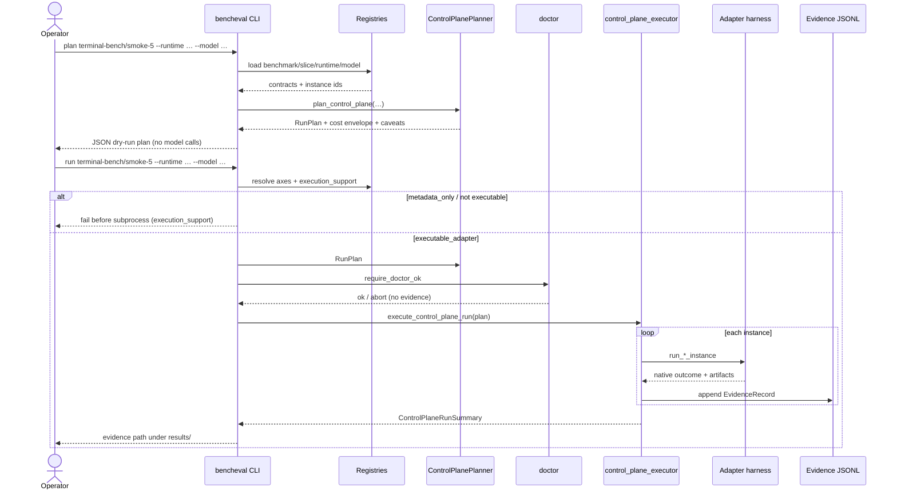

# Four-Axis Run Sequence

What this shows: primary value path — discover axes, plan without model calls, then live execute through an executable adapter into EvidenceRecord JSONL.

Notes: Shorthand `benchmark/slice` and `plan` alias live in [`cli.py`](../../src/bencheval/cli.py). Defaults for `--output` / `--artifacts-dir` land under `results/` when omitted. Doctor failures abort without writing evidence; post-preflight adapter failures still write `primary_pass=false` rows ([architecture §10](../architecture.md)).
