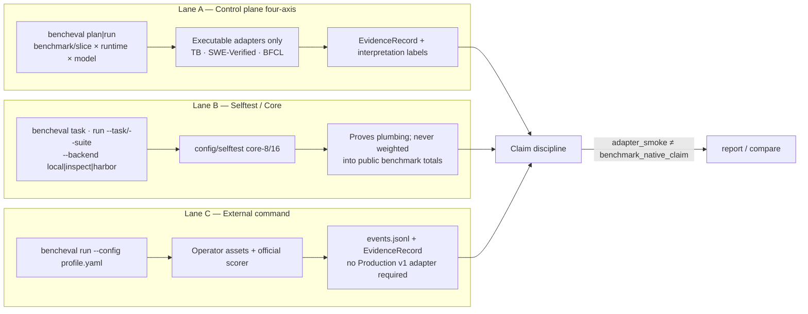

# Execution Lanes Overview

What this shows: three coexisting lanes — public control plane, internal selftest, and operator external-command — and what each may claim.

Notes: Architecture §1 demotes Core to selftest. Architecture §11 interpretation labels gate what reports may assert. Metadata-only catalog entries cannot enter Lane A live execution.
