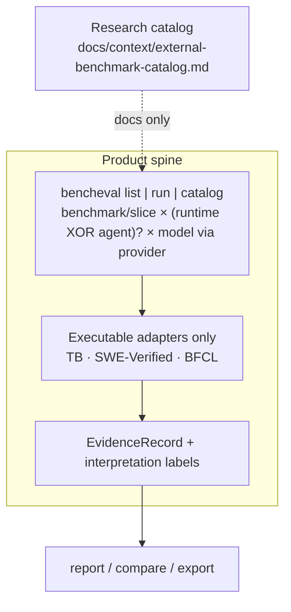

# Product Spine

What this shows: the only product route after the hard-minimal prune. Research catalog is docs-only discovery, not CLI breadth.

```mermaid
flowchart TB
    subgraph Product["Product spine"]
        P1["bencheval list | run | catalog<br/>benchmark/slice × (runtime XOR agent)? × model via provider"]
        P2["Executable adapters only<br/>TB · SWE-Verified · BFCL"]
        P3["EvidenceRecord + interpretation labels"]
        P1 --> P2 --> P3
    end

    Catalog["Research catalog<br/>docs/context/external-benchmark-catalog.md"]
    Catalog -.->|"docs only"| P1

    P3 --> Reports["report / compare / export"]
```

Notes: Runtime and agent are mutually exclusive. Omit both for model-only (BFCL). Do not treat research-catalog row count as product breadth.
