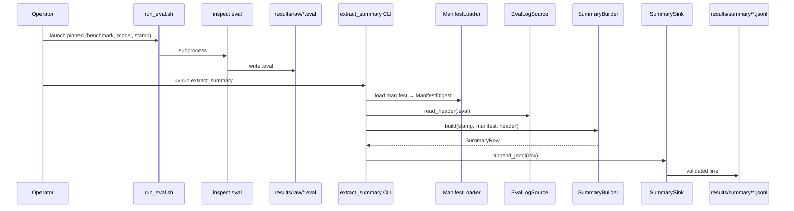

# Summary extraction sequence

End-to-end path from a finished eval run to an append-only summary row.

## Diagram

## Notes

- If `SummaryBuilder` raises `SummaryValidationError`, the CLI must exit non-zero and **not** append a partial row.
- `RunStamp.auth_lane` is set by the wrapper, not inferred from the log.
