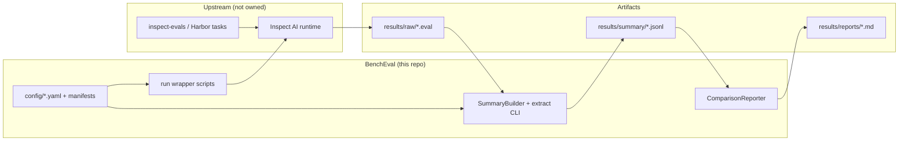
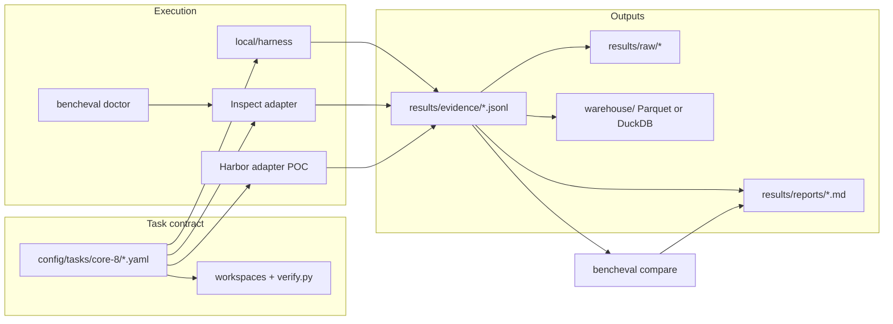

# System overview

High-level data flow: legacy path uses Inspect `.eval` → summary JSONL; vNext path uses task contracts → evidence JSONL → export/compare.

## Legacy summary pipeline (2026-04-15)

## vNext evidence pipeline (2026-05-29)

## Components

### Legacy

- **config + manifests**: Committed task ids + hashes; stamp every run (`task_manifest_hash`).
- **run wrapper**: Sets `RunStamp` / env; invokes `inspect eval`; never writes summary rows directly.
- **extract**: Implements `EvalLogSource` + `SummaryBuilder`; emits validated `SummaryRow` JSONL.
- **compare** (`scripts/compare.py`): Enforces §7 guardrails; emits `ComparisonReport` → Markdown.

### vNext (current)

- **task contract + registry**: YAML v0.2 under `config/tasks/`; `bencheval task lint|validate|audit`.
- **executor**: `local/harness` offline reference path; Inspect/Harbor adapters for live runs.
- **mockllm/model**: Deterministic Inspect E0 stand-in (no `inspect_ai` required); not live provider proof.
- **doctor**: Preflight JSON for Inspect/Harbor; `--profile E0|E1|E2`.
- **evidence + report**: `EvidenceRecord` JSONL; Markdown via `bencheval report`.
- **export + compare**: `bencheval export` (Parquet/DuckDB); `bencheval compare` (vNext evidence deltas).
- **provider smoke**: `scripts/run_provider_smoke.sh` — credential-gated multi-model T1 E0 orchestrator.

## Notes

- Baseline auth lane uses Inspect provider env vars only; experimental lane is isolated at the row level (`auth_lane`, cost XOR).
- Core-8: 8/8 admitted offline (2026-05-29). Live provider, Docker E1, and Harbor jobs blocked on environment.
- Core-16: planned in `docs/context/core-16-expansion-plan.md`; not implemented.
