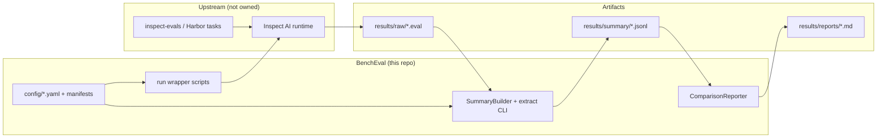

# System overview

High-level data flow: Inspect orchestrates evaluation; BenchEval owns manifests, summaries, and comparisons.

## Diagram

## Components

- **config + manifests**: Committed task ids + hashes; stamp every run (`task_manifest_hash`).
- **run wrapper**: Sets `RunStamp` / env; invokes `inspect eval`; never writes summary rows directly.
- **extract**: Implements `EvalLogSource` + `SummaryBuilder`; emits validated `SummaryRow` JSONL.
- **compare**: Enforces §7 guardrails; emits `ComparisonReport` → Markdown.

## Notes

- Baseline auth lane uses Inspect provider env vars only; experimental lane is isolated at the row level (`auth_lane`, cost XOR).
