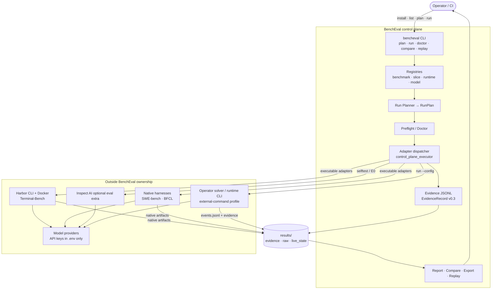

# System Overview

What this shows: BenchEval as a four-axis evaluation control plane — plan, run, normalize evidence, compare — with harness-owned sandboxes outside the product.

Notes: Four-axis identity is `benchmark/slice × model × runtime × adapter/harness` ([architecture §2](../architecture.md)). BenchEval does **not** ship a Docker orchestration plane; Harbor/runtimes own containers. Executable Production v1 adapters today: `terminal-bench`, `swe-bench-verified`, `bfcl-v4` (config-declared `executable: true`). CyBench and other catalog entries stay metadata-only unless an operator supplies an external-command profile.
