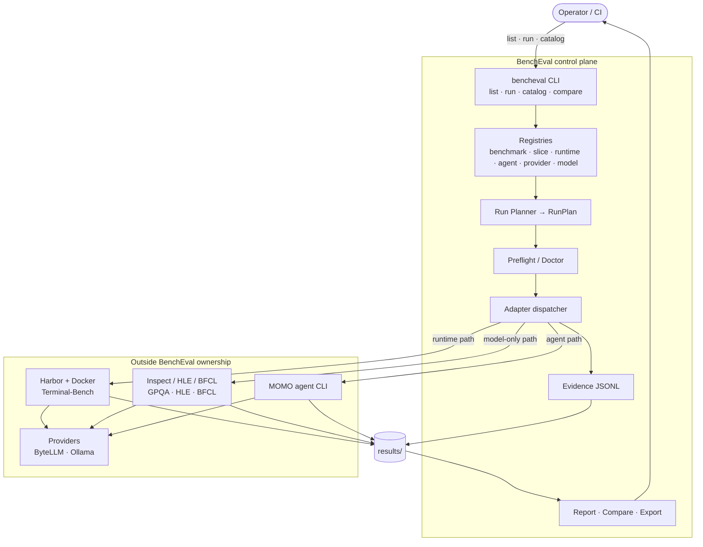

# System Overview

What this shows: BenchEval product spine — defined benchmark → (runtime XOR agent)? → model via provider → evidence — with harness-owned sandboxes outside the product.

```mermaid
flowchart TB
    Op([Operator / CI])

    subgraph BE["BenchEval control plane"]
        CLI["bencheval CLI<br/>list · run · catalog · compare"]
        Reg["Registries<br/>benchmark · slice · runtime · agent · provider · model"]
        Plan["Run Planner → RunPlan"]
        Doc["Preflight / Doctor"]
        Disp["Adapter dispatcher"]
        Ev["Evidence JSONL"]
        Out["Report · Compare · Export"]
    end

    subgraph Ext["Outside BenchEval ownership"]
        Harbor["Harbor + Docker<br/>Terminal-Bench"]
        Inspect["Inspect / HLE / BFCL<br/>GPQA · HLE · BFCL"]
        MOMO["MOMO agent CLI"]
        LLM["Providers<br/>ByteLLM · Ollama"]
    end

    Art[(results/)]

    Op -->|list · run · catalog| CLI
    CLI --> Reg
    Reg --> Plan
    Plan --> Doc
    Doc --> Disp
    Disp -->|runtime path| Harbor
    Disp -->|model-only path| Inspect
    Disp -->|agent path| MOMO
    Harbor --> LLM
    Inspect --> LLM
    MOMO --> LLM
    Harbor --> Art
    Inspect --> Art
    MOMO --> Art
    Disp --> Ev
    Ev --> Art
    Art --> Out
    Out --> Op
```

Notes: Model-only (GPQA/HLE/BFCL) records `runtime_id=null` / `agent_id=null`. Executable adapters: `terminal-bench`, `gpqa-diamond`, `hle`, `bfcl-v4`. No BenchEval-owned Docker plane.
